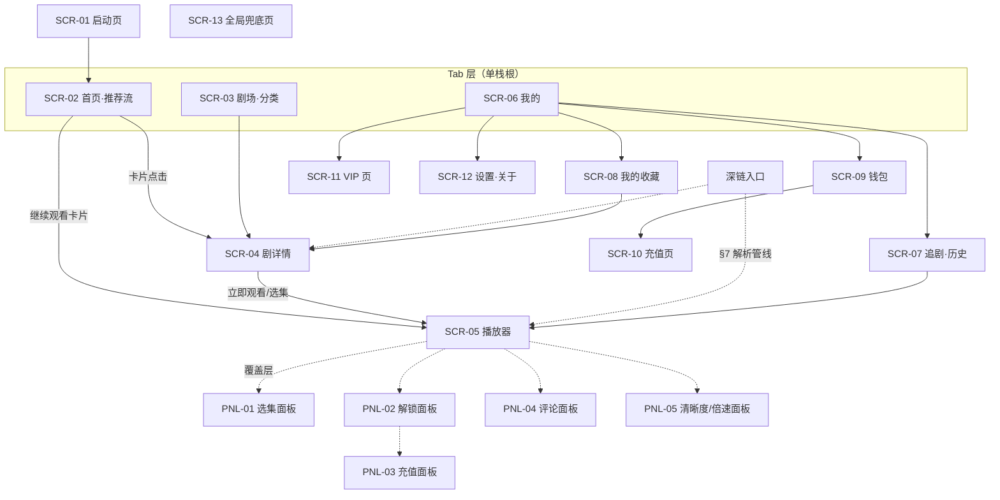

# 02 — 信息架构（Information Architecture）

> Wave 1 · 计划槽 P2（信息架构与用户旅程）。本文档只做架构方案，不含实现代码。
> 配套文档：`docs/02-user-journeys.md`（端到端旅程与异常分支）、`docs/02-screen-inventory.md`(逐屏清单与状态矩阵）。
> 上游依赖：平台约束见 `docs/11-api-and-bridge.md`，接口与错误码见 `docs/12-api-contracts.md`、`docs/12-error-catalog.md`。本文**只引用不复述**上游内容。

## 1. 范围与阅读指引

本文档定义短剧小程序（TikTok Minis H5 形态）的页面地图、导航模型、路由与返回栈规范、深链管线、全局状态框架与权限门槛矩阵。目标是**上架级交互可靠**：任何页面在空态、错误、权限拒绝、支付失败、播放失败、弱网下都有明确定义的表现与恢复路径。

阅读顺序建议：本文 §2–§4（结构）→ §5–§7（路由/返回栈/深链）→ §8–§9（状态与权限框架）→ `02-user-journeys.md`（把框架落到旅程）→ `02-screen-inventory.md`（逐屏核对）。

## 2. 平台前提对 IA 的约束

以下约束来自 `11-api-and-bridge.md` §1–§2 与 `11-official-onboarding-checklist.md`，直接决定信息架构形态：

| # | 平台事实 | 对 IA 的约束 |
|---|---|---|
| P1 | 应用是单 WebView 内的标准 H5 工程（SPA），无原生多页栈 | 导航栈由前端路由自建；"返回"语义必须自己定义（§6） |
| P2 | `TTMinis.init` 先于一切 SDK 调用；加载页由平台展示 ToS/隐私政策（checklist C4/C5） | 必须有启动引导序列（SCR-01），SDK/登录/配置就绪前不得进入业务页面 |
| P3 | 右上角有 TikTok 胶囊按钮（`getMenuButtonBoundingClientRect`，必接） | 所有页面顶部布局须避让胶囊安全区；导航栏颜色随页面切换设置（`setNavigationBarColor`） |
| P4 | 静默登录必接（`TTMinis.login`），显式授权可选且用户可拒绝 | 默认人人有账号（静默）；昵称/头像等资料是**可选增强**，拒绝授权不得阻塞任何主流程（§9） |
| P5 | 激励视频/插屏广告、Beans 支付、订阅均为必接能力 | 解锁面板（PNL-02）必须为四种解锁通道（币/整剧/广告/VIP）预留结构位，按 `/config` 开关显隐 |
| P6 | 应用必须兼容英文（checklist E14） | 文案层走 i18n 键值；本套文档给出的文案均为语义示例而非最终 copy |
| P7 | 运行时请求域名受限（可信域名 ≤20） | IA 不引入第三方跳转页；所有 H5 内跳转均为内部路由 |

## 3. 页面地图（Page Map）



层级只有三种，禁止再造第四种：

1. **Tab 层**：首页 / 剧场 / 我的。互切为 `replace`，不产生历史记录。
2. **页面层（push 栈）**：剧详情、播放器、我的二级页。产生历史记录，可返回。
3. **覆盖层（panel）**：选集、解锁、充值、评论、清晰度面板与全局对话框/Toast。不离开当前页面，返回键优先关闭最上层 panel（§6 规则 B3）。

## 4. 导航模型

### 4.1 Tab 结构

| Tab | 页面 | 定位 |
|---|---|---|
| 首页 | SCR-02 推荐流 | 消费入口：`GET /recommendations/feed?scene=HOME`（契约 §4.8），继续观看卡片置顶 |
| 剧场 | SCR-03 分类浏览 | 目的性查找：`GET /dramas` 的 `category`/`tag`/`sort` 维度（契约 §4.3）。关键词搜索契约缺失，入口预留但默认隐藏（差距 G5，§10） |
| 我的 | SCR-06 个人中心 | 资产与资料：钱包、VIP、追剧、收藏、设置 |

### 4.2 播放器的特殊地位

播放器（SCR-05）是本产品的"第二首页"：短剧消费以竖屏沉浸流为主，多数会话时长发生在播放器内。因此：

- 播放器内可完成**选集、解锁、充值、评论**全部闭环（均为覆盖层，不跳页），避免打断沉浸。
- 集间切换（下一集/上一集/选集）为**路由 replace**（§6 规则 B4），80 集的剧不会把返回栈撑到 80 层。
- 从播放器返回**一律回到进入前的页面**；深链冷启动时合成返回栈（§7.3），保证返回有落点而不是直接退出小程序。

## 5. 路由表

采用 hash 路由（`#/...`），避免 WebView 服务端路由配置依赖。参数命名与契约 ID 前缀一致（`drm_`/`ep_`）。

| 路由 | 页面 | 参数 | 进入方式 | 匿名可访问 |
|---|---|---|---|---|
| `#/home` | SCR-02 | — | replace（Tab） | 是 |
| `#/browse` | SCR-03 | `?category=&tag=&sort=` | replace（Tab） | 是 |
| `#/me` | SCR-06 | — | replace（Tab） | 是（资产区显示登录引导） |
| `#/drama/:dramaId` | SCR-04 | `?autoplay=1` | push | 是 |
| `#/play/:episodeId` | SCR-05 | `?from=`（埋点来源） | push（进入）/ replace（集间切换） | 是（付费集会在换取播放令牌时被拦截，§9） |
| `#/history` | SCR-07 | — | push | 否（`AUTH_REQUIRED` 时先静默登录） |
| `#/favorites` | SCR-08 | — | push | 否 |
| `#/wallet` | SCR-09 | — | push | 否 |
| `#/recharge` | SCR-10 | `?intent=`（解锁意图透传，见旅程 J2/J11） | push | 否 |
| `#/vip` | SCR-11 | — | push | 否 |
| `#/settings` | SCR-12 | — | push | 是 |
| `#/fallback` | SCR-13 | `?reason=NOT_FOUND\|OFFLINE\|MAINTENANCE` | replace | 是 |

约定：

- 面板（PNL-xx）**不占路由**，以页面内状态 + 一条 history state 实现（§6 规则 B3）。
- 未匹配路由一律进 `#/fallback?reason=NOT_FOUND`，兜底页永远给"回首页"出口。
- `:episodeId` 为权威定位参数；`dramaId` 由集详情接口（契约 §4.3 `GET /episodes/{episodeId}`）反查，深链只需一个 ID。

## 6. 返回栈规范

"返回"包含三个来源，行为必须一致：页面内返回按钮、Android 物理/手势返回（WebView history back）、iOS 边缘手势。统一规则：

| # | 规则 | 说明 |
|---|---|---|
| B1 | Tab 互切 replace，栈深恒为 1 | 在任意 Tab 根页按返回 = 退出小程序（交还 TikTok，平台行为，不拦截） |
| B2 | 页面层 push/pop 对称 | 进入二级页 push 一条记录，返回 pop 一条 |
| B3 | 面板优先于页面 | 打开面板时 `history.pushState` 一条面板记录；返回先关最上层面板，面板全关后才 pop 页面。面板叠放最多 2 层（如解锁面板 → 充值面板），超过则以替换处理 |
| B4 | 播放器集间切换 replace | 切集不加栈；从播放器返回直接回到进入前页面 |
| B5 | 深链冷启动合成栈 | 落地页非 Tab 根时，先 replace 到 `#/home` 再 push 落地页，保证返回有落点（§7.3） |
| B6 | 支付进行中拦截返回 | 充值单处于"拉起支付～轮询确认"窗口时，返回触发确认对话框（"支付尚未完成，确定离开？"）；离开后订单可在钱包页继续查看（旅程 J11） |
| B7 | 广告播放中不处理返回 | 激励视频由 TikTok 客户端全屏接管（`11-api-and-bridge.md` §4.3），H5 层不感知也不拦截 |
| B8 | 兜底页返回即回首页 | SCR-13 上的返回等价于"回首页"，不回到导致错误的页面 |

## 7. 深链与外部入口

### 7.1 入口来源

| 入口 | 携带参数 | 期望落点 |
|---|---|---|
| TikTok 视频锚点/挂载 | `episodeId`（+投放追踪参数） | 播放器，直接续播该集 |
| 分享回流 | `episodeId` 或 `dramaId` | 播放器或剧详情 |
| Mini Center / 收藏的小程序 | 无业务参数 | 首页 |
| 运营位（站内 push、活动） | `dramaId` / `episodeId` / 活动路由 | 对应页面 |

> 平台侧启动参数的获取 API（launch options）在 W1A 的官方 API 清单中未见列出，已登记为差距 G6（§10），由桥接层封装为 `getLaunchParams(): { path?, query? }` 抽象，IA 层按该抽象设计。

### 7.2 深链解析管线

所有外部进入统一走同一管线，禁止各入口各写一套：

```text
launch params → 参数合法性校验 → 启动序列完成（SDK init + 静默登录 + /config）
→ 拉取目标资源（GET /episodes/{id} 或 GET /dramas/{id}）
→ 按结果路由：
   ├── 资源正常 → 合成栈（§7.3）→ 落地
   ├── 404 CONTENT_NOT_FOUND → #/home + Toast「内容不存在或已下架」
   ├── 410 CONTENT_OFFLINE   → #/fallback?reason=OFFLINE（页内给推荐位与回首页）
   └── 解析/网络失败          → #/home（静默降级，不阻塞进入）
```

要点：

- **深链失败永不白屏、永不死路**：最坏情况等价于普通冷启动进首页。
- 落地到**付费未解锁集**是合法路径：正常进播放器，播放令牌被 `403 EPISODE_LOCKED` 拦截后进入播放器的"锁定态"（封面 + 解锁面板），见 `02-screen-inventory.md` SCR-05 状态 S6 与旅程 J4。
- 深链参数中的投放追踪字段透传给埋点 `context`（契约 §4.8），IA 层不消费。

### 7.3 冷启动合成栈

深链落地页为播放器或剧详情时，历史栈构造为 `[#/home, 落地页]`：用户按返回回到首页而非退出小程序。这是短剧投放场景的留存关键路径，作为硬性验收项。

## 8. 全局状态与降级框架

### 8.1 页面五态

每个数据页面必须实现五态，缺一不得过验收（逐屏落点见 `02-screen-inventory.md` §2 状态矩阵）：

| 态 | 触发 | 表现 | 恢复 |
|---|---|---|---|
| 加载态 | 首次请求进行中 | 骨架屏（列表页）/ 封面占位（播放器）；≥300ms 才展示，防闪烁 | — |
| 内容态 | 成功且有数据 | 正常渲染 | — |
| 空态 | 成功但零数据 | 插画 + 一句话 + **行动出口**（去首页看看/去充值等，逐屏定义） | 用户操作 |
| 可重试错误态 | 网络失败 / 5xx / 429 | 页内错误组件 + 重试按钮；不弹全局对话框 | 手动重试 + 自动重试（§8.2） |
| 终态错误 | 404 / 410 / 封禁等 | 语义化说明 + 回首页出口；不提供无意义的重试 | 导航离开 |

覆盖层（面板）内的请求失败在**面板内**就地展示错误与重试，不关闭面板、不污染底层页面。

### 8.2 弱网与重试策略

依据错误目录 §11 的客户端处理建议表细化为全局策略：

| 项 | 策略 |
|---|---|
| 请求超时 | 常规请求 10s；播放令牌与解锁/下单等关键路径 15s（宁可慢成功，不要快失败） |
| 自动重试 | 仅幂等操作：GET 失败自动重试 1 次（间隔 1s）；携带 `Idempotency-Key` 的写操作（解锁/下单，契约 §2.4）允许**原键重试**；`429/503` 按 `details.retryAfterSec` 退避 |
| 令牌刷新 | `AUTH_TOKEN_EXPIRED` 静默刷新后重放原请求至多一次（错误目录 §11 原文），全局拦截器实现，业务层无感 |
| 弱网提示 | 连续 2 次请求超时或失败 → 顶部弱网横幅（CMP-06），恢复后自动消失；横幅不阻断操作 |
| 进度心跳 | 按 `/config` 的 `playback.progressHeartbeatSec` 上报；失败**本地入队**（每集仅保留最新一条），网络恢复或下次启动补发——契约侧 LWW 语义（契约 §4.7）天然容忍乱序 |
| 埋点 | `POST /events/batch` 尽力送达（契约 §4.8）：本地队列 ≤200 条，溢出丢弃最旧，永不阻塞 UI |
| 断网播放 | 已缓冲部分继续播放；缓冲耗尽进入播放器"卡顿态"（转圈 + 8s 后出现重试/切清晰度入口），见旅程 J12 |

### 8.3 播放链路专项降级

播放地址是短时效签发（契约 §4.4，防盗链），失败面比普通接口宽，专项规定：

| 失败 | 处理 |
|---|---|
| 令牌接口 `403 EPISODE_LOCKED` / `403 EPISODE_VIP_REQUIRED` | 播放器锁定态 + 解锁面板（携 `details` 的价格与策略直接渲染，不再额外请求） |
| 令牌接口 `410 CONTENT_OFFLINE` | 播放器终态错误 →引导回首页；同步失效本地"继续观看"缓存 |
| 令牌接口 `503 EPISODE_ASSET_UNAVAILABLE` | 可重试错误态，文案「视频准备中」 |
| CDN 加载失败 / 播放器内核错误 | 先静默重签令牌重放一次（覆盖令牌过期/签名失效），再失败才呈现错误态 |
| `playUrl` 过期（长时间暂停后恢复） | 按 `expiresAt` 预判：恢复播放时剩余有效期 <30s 则先静默重签，用户无感 |
| 弱网卡顿 | 自动降清晰度一档（1080p→720p→480p），并 Toast 告知；用户手动锁定清晰度后不再自动降 |

### 8.4 启动序列失败降级

启动序列：`TTMinis.init` → 静默登录（`login` + `POST /auth/login`）→ `GET /config` → 进入首页。任何一步失败的降级：

| 失败步骤 | 降级 |
|---|---|
| SDK init 失败 | 启动页终态错误 + 重试（无 SDK 则一切必接能力不可用，不可带病进入） |
| 静默登录失败 | **匿名模式**进入首页：内容读接口匿名可用（契约 §2.2）；触达资产/付费操作时按 §9 再触发登录。顶部不常驻打扰，仅在"我的"页展示登录引导 |
| `/config` 失败 | 使用内置默认开关（评论关、广告解锁关、心跳 10s——取保守值），进入后台静默重拉 |

## 9. 权限与登录门槛矩阵

平台上的"权限"有三层：我方会话（静默登录）、TikTok 显式授权（昵称头像）、平台能力开通（广告/支付）。矩阵如下：

| 行为 | 所需权限 | 拒绝/缺失时表现 |
|---|---|---|
| 浏览首页/剧场/详情、播放免费集 | 无（匿名可用） | — |
| 播放已解锁集/付费集、解锁、收藏、进度云同步、评论 | 我方会话 | 静默登录对用户无打扰，正常情况下感知不到门槛；静默登录失败时操作点触发**重试登录**，再失败 Toast「登录失败，请稍后重试」并保持当前页面 |
| 展示真实昵称/头像（我的页、评论区） | TikTok 显式授权（`TTMinis.authorize`，可选能力） | 用户拒绝 → 使用默认昵称（如「剧友_8271」）与默认头像，**一切功能不受影响**；"我的"页保留「完善资料」入口可再次发起，被拒后本会话不再主动弹出 |
| 充值/解锁（币）、VIP/订阅 | 我方会话 + 平台 IAP 已开通 | IAP 未开通（灰度/审核期）：充值入口整体隐藏，付费集解锁面板只展示可用通道；全部通道不可用时文案「暂不可购买，敬请期待」 |
| 广告解锁 | `/config` 的 `features.adUnlock` + 平台 IAA 可用（`canIUse` 探测，`11-api-and-bridge.md` §5.1） | 任一不满足则解锁面板不渲染广告通道；广告拉取失败见旅程 J5 |
| 被封禁用户（`AUTH_USER_BANNED`）/ 钱包冻结（`WALLET_FROZEN`） | — | 封禁：清会话、全局只读浏览 + 顶部说明条；冻结：仅资金操作被拦，展示错误目录文案与客服邮箱（checklist C11） |

原则：**门槛后置**——永远让用户先看到内容，在动作发生点才校验权限；校验失败的表现必须是"就地、可解释、可恢复"，禁止无差别跳登录页（本产品没有登录页，只有静默登录与就地重试）。

## 10. 与 11/12 文档的差距登记（本槽发现，供上游文档槽回写）

交叉核对 `11-api-and-bridge.md` 与 `12-api-contracts.md` 时发现以下缺口。IA/旅程已按"缺口将被补齐"设计，**不自行发明契约**，仅登记：

| # | 差距 | 影响 | 建议归属 |
|---|---|---|---|
| G1 | `POST /auth/login` 的 provider 枚举（PHONE/WECHAT/DEVICE）缺 `TIKTOK`：TikTok 静默登录 code 换会话无契约位 | 启动序列 J1 无法落地 | W1B 契约补 `{ "provider": "TIKTOK", "authCode": "..." }`，语义对应 `11-api-and-bridge.md` §4.1 |
| G2 | `paymentChannel` 枚举（WECHAT/ALIPAY/APPLE_IAP）缺 `TIKTOK_BEANS`；`paymentPayload` 需约定携带 `tradeOrderId` 供 `TTMinis.pay` | 充值旅程 J2/J11 无法落地 | W1B 契约扩枚举并约定 payload 结构 |
| G3 | 广告解锁无端点：领域模型留了 `Unlock.method=AD` 与 `features.adUnlock`，契约无「看广告发解锁」接口（`isEnded=true` 后的服务端发放 + 风控日志，见 `11-api-and-bridge.md` §4.3/§5.3） | 旅程 J5 依赖 | W1B 补端点（建议含服务端次数上限校验，呼应领域模型 §12 开放问题 2） |
| G4 | VIP 购买通道错位：契约以 `RechargeOrder(productType=VIP)` 建模，但平台侧订阅必须走 `TTMinis.createSubscription` + 订阅创建端点（必接能力） | 旅程 J6 依赖 | W1B 增订阅端点或在充值单上定义订阅型分支；与 W1A 的 Q3（订阅 webhook）联动 |
| G5 | 无关键词搜索端点 | 剧场页搜索入口默认隐藏，Wave 2 决定是否补 | 产品决策后 W1B 补 |
| G6 | 平台启动参数（launch options/深链参数获取）API 未在官方清单中确认 | 深链管线 §7.2 依赖桥接抽象 | W1A 开放问题清单追加（同 Q4 一起随 CLI 实测确认） |
| G7 | 分享能力（拉起 TikTok 分享面板）官方 API 未确认 | 分享入口暂不进 IA；确认后补充覆盖层 | W1A 追加确认 |
| G8 | 币价与区域口径：契约金额字段按人民币分（契约 §2.1），而发行区域为 TikTok Minis 区域集（checklist §4.3），Beans 有官方档位表（`11-api-and-bridge.md` §4.2） | 充值页档位展示与货币文案 | W1B 与商务确认后统一（建议档位表直接以 Beans 定价 + 服务端下发展示文案） |

> 以上差距不阻塞本槽产出：旅程与页面按语义设计，接口字段名以 W1B 回写后的契约为准。
