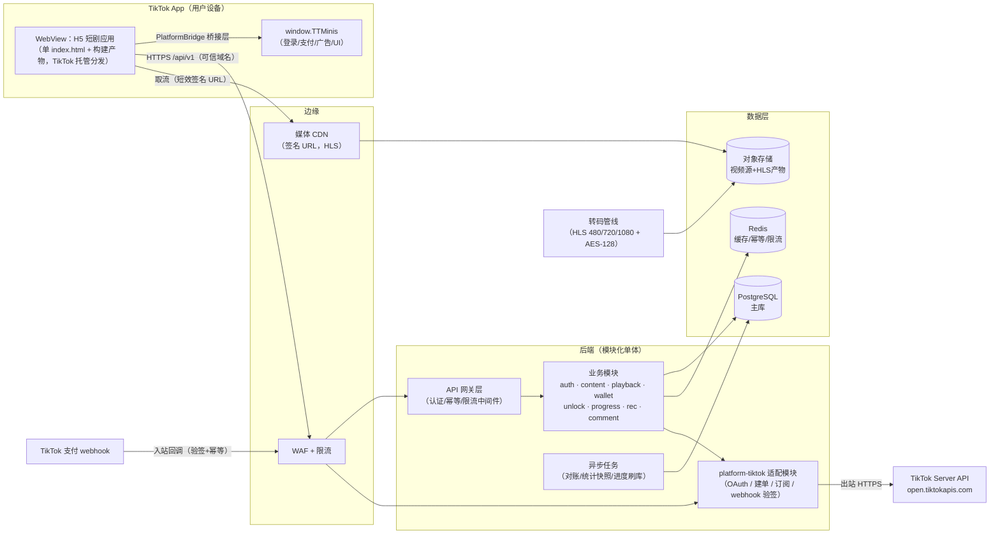

# 03. 技术架构（Tech Architecture）

> Wave 1 · 计划槽 P3（技术架构与技术选型）。本文为架构视图与组件设计，**具体选型与理由见 `docs/03-stack-decision.md`，非功能约束见 `docs/03-nonfunctional.md`**。
> 输入基线（本文与之保持一致，不覆盖）：
> - `docs/00-wave-plan.md` / `docs/01-product-scope.md` / `docs/01-tiktok-minis-requirements.md`（P1：交付计划、产品范围与入驻要求）
> - `docs/02-information-architecture.md` / `docs/02-user-journeys.md` / `docs/02-screen-inventory.md`（P2：信息架构与旅程；其 §10 契约差距 G1–G8 与本槽冲突登记同源）
> - `docs/11-api-and-bridge.md` / `docs/11-official-onboarding-checklist.md`（官方运行时模型、7 项必接能力、发布红线）
> - `docs/12-domain-model.md` / `docs/12-api-contracts.md` / `docs/12-error-catalog.md`（领域模型、REST 契约、错误码）
> - `docs/14-quality-gates.md` / `docs/14-security.md` / `docs/14-test-plan.md`（门禁、安全、测试）
>
> 与上述文档的冲突不在本文擅自改写，统一登记于 `docs/handoff/w1-p3.md` §3 并附裁决建议。

## 1. 架构定位

TikTok Minis 短剧应用 = **TikTok App 内 WebView 运行的标准 H5 工程 + 自建后端**（见 11-api-and-bridge §1）。整体采用：

- **客户端**：单页 H5 应用（单 `index.html`，官方 CLI `minis build` 打包上传），平台能力全部经桥接层（`PlatformBridge`，契约见 11 §5.2）访问 `window.TTMinis`，业务代码不直接触碰平台 API。
- **后端**：**模块化单体（Modular Monolith）**，模块边界与 12-domain-model 的 7 个限界上下文一一对应，加一个 TikTok 平台适配模块。Wave 1 明确不做微服务拆分（团队规模与一致性要求——钱包/解锁为单库事务，见 12 §11）。
- **数据**：PostgreSQL 单主库（强一致资金事务）+ Redis（缓存/限流/幂等/进度缓冲）+ 对象存储 + CDN（媒体分发）。
- **对外依赖**：TikTok 客户端 SDK（`connect.tiktok-minis.com`）、TikTok Server API（`open.tiktokapis.com`，仅后端出站调用）、TikTok 支付 webhook（入站回调）。

## 2. 总体架构图



要点：

1. **H5 静态包由 TikTok 托管**（ZIP 上传 Developer Portal），我方 CDN 只服务**媒体流**；前端出网仅两类域名——API 域与媒体 CDN 域，全部登记可信域名（≤20 限额预算见 03-nonfunctional §5）。
2. **`client_secret`、TikTok token 只存在于后端**（11 §5.3 红线）；webhook 回调走「验签 → 幂等 → 发货」三步（11 §4.2）。
3. 播放地址**不直出**：客户端凭 `POST /episodes/{id}/playback-token` 换短效签名 URL（12 契约 §4.4，14-security §5.1）。

## 3. 客户端架构（H5 in TikTok WebView）

### 3.1 分层

```text
┌─────────────────────────────────────────────┐
│ features/（页面与业务流：feed·剧集·播放·钱包·我的）│
├───────────────┬─────────────────────────────┤
│ player/        │ stores/（Zustand，含播放器状态机）│
│ 播放器组件      ├─────────────────────────────┤
│ (video+hls.js) │ api/（TanStack Query + OpenAPI 生成客户端）│
├───────────────┴─────────────────────────────┤
│ platform/（PlatformBridge：TikTokMinisBridge│MockBridge）│
└─────────────────────────────────────────────┘
```

- **桥接层**：按 11 §5.2 契约实现两套 —— `TikTokMinisBridge`（生产，薄封装 `TTMinis`，每方法先 `canIUse`）与 `MockBridge`（本地浏览器/单测）。业务层唯一入口，保障三环境（本地浏览器 / Playground / 真机）可切换。
- **路由**：hash 路由（包内单 `index.html` 静态分发，无服务端重写能力，hash 最稳）。
- **状态**：服务端状态归 TanStack Query（缓存/去重/重试），客户端状态归 Zustand；播放器用显式 reducer 状态机（`idle→loading→playing→stalled→ended→error`），对应 14-test-plan §1.1 的「播放器状态机」单测要求。
- **i18n**：react-i18next；英文为必备语言（官方过审要求 E14），首发区域语言由产品槽定；沙特市场需 RTL 预留。
- **错误处理**：按 12-error-catalog §11 客户端处理建议表实现统一错误拦截器（`AUTH_TOKEN_EXPIRED` 静默重登、`WALLET_INSUFFICIENT_BALANCE` 弹充值面板等）。

### 3.2 播放器设计

- `<video>` 元素 + **原生 HLS 优先、hls.js（MSE）兜底**：iOS WKWebView 走 Safari 原生 HLS（`canPlayType('application/vnd.apple.mpegurl')` 探测），Android WebView（Chromium 内核）走 hls.js。
- 竖屏沉浸流：虚拟列表 + 至多 3 个 video 实例（当前/前/后），下一集 m3u8 预取（对齐 E-11 连播、G3.3 首帧预算）。
- 付费内容 HLS **AES-128 加密**，密钥接口鉴权（与播放令牌同一权益校验链，14-security §5.1）；WebView 内 DRM（EME）可用性存疑，列为风险 RK-2（见 handoff）。
- 进度心跳：每 10s + 暂停/退出上报（`GET /config` 的 `playback.progressHeartbeatSec` 控制，12 契约 §4.10）。

### 3.3 CSP 与包约束

- 官方硬约束：动态脚本来源受限（E8）、运行时请求仅限声明域名（E9）、ZIP ≤200MB、无空文件（E5–E7）。
- CSP 基线按 14-security §2.1，但必须为官方 SDK 开例外：`script-src 'self' https://connect.tiktok-minis.com` + `TTMinis.init` 内联脚本用 nonce/hash——此差异已登记 handoff C7 待 W1D 认可。
- 构建产物预算（ZIP ≤20MB、首屏 JS ≤300KB gzip）见 03-nonfunctional §2。

## 4. 后端架构（模块化单体）

### 4.1 模块划分（对应 12-domain-model 限界上下文）

| 模块 | 对应上下文 | 职责 | 关键依赖 |
|---|---|---|---|
| `auth` | 用户域 | TikTok code 换 token、会话签发（JWT）、用户档案 | platform-tiktok |
| `content` | 内容域 | 剧/季/集读模型、`viewerAccess` 计算、上下架状态机 | — |
| `playback` | 内容域+解锁域 | 播放令牌签发（权益校验 → CDN 签名 URL）、密钥接口 | unlock、CDN 签名 |
| `wallet` | 钱包域 | 双账户余额、流水、充值订单状态机 | platform-tiktok |
| `unlock` | 解锁域 | 单集/整剧解锁事务编排（单库事务，12 §6.1） | wallet |
| `progress` | 进度域 | 进度 upsert（LWW）、观看历史联动 | Redis 缓冲 |
| `rec` | 推荐域 | Feed 规则混排、埋点接收（append-only） | — |
| `comment` | 评论域 | 评论 CRUD + 审核状态机（功能开关） | 审核服务适配 |
| `platform-tiktok` | 适配层 | OAuth、建单、订阅、订单查询、**webhook 验签+幂等分发** | open.tiktokapis.com |

- 模块间**只经模块公开接口调用**（进程内），禁止跨模块直查他模块表——这是未来若需拆分的低成本保险，但 Wave 1/2 不拆。
- `platform-tiktok` 是 14-test-plan §4.1 所称「第三方契约适配层」，用官方沙箱真实响应做录制回放夹具。

### 4.2 请求处理管线

```text
WAF/限流(边缘) → TLS 终止 → Fastify 管线：
  traceId 注入(OTel) → 认证(JWT 校验，可选匿名) → 限流桶(Redis)
  → Idempotency-Key 中间件(资金/解锁写操作强制，12 §2.4)
  → JSON Schema 校验(TypeBox，与 OpenAPI 同源) → 业务模块 → 统一错误映射(12-error-catalog)
```

- 错误响应结构与 `traceId` 直接实现 12 契约 §2.5；`traceId` 即 OTel trace id，贯通日志/链路。
- 幂等实现：`Idempotency-Key` + 请求体哈希落 Redis（24h TTL）+ 关键表唯一索引兜底（双保险，对应 12 §5.2/§6.1 不变式）。

### 4.3 异步任务与一致性

- **BullMQ（Redis）** 承载：每日钱包对账（12 §5.2 不变式校验）、订单主动查单补偿（未收到 webhook 的订单向 TikTok 查单，14-security §4.1）、剧统计快照聚合、进度缓冲刷库（Redis → PG 批量，写峰值削平，12 §7.2）。
- 发货（webhook → 入账/解锁）在**单库事务**内完成状态迁移 `PAID→CREDITED`，以 `trade_order_id` 幂等（11 §4.2 + 12 §5.3 一致）。
- Wave 1 不引入 Kafka；若后续埋点量级需要，`rec` 模块事件表可平迁 ClickHouse（已留 append-only 结构）。

## 5. 数据架构

| 存储 | 用途 | 关键约束 |
|---|---|---|
| PostgreSQL（主） | 全部领域实体；钱包/解锁/订单强一致事务 | 乐观锁 `version`（钱包）；唯一索引兜底幂等；迁移可正向+可回滚（G2.7） |
| Redis | 会话吊销名单、限流桶、幂等键、进度写缓冲、热点内容缓存 | 全部数据可丢弃重建（不做唯一事实源） |
| 对象存储（S3） | 视频源片 + HLS 转码产物 + 封面图 | 桶不公开；仅经 CDN 签名访问 |
| PG 分区表（events） | 埋点事件 append-only（12 §8.2） | 按月分区；供后续推荐/BI 消费 |

- ID 策略：ULID + 类型前缀（`usr_`/`drm_`/…），与 12 §2.1 一致；PG 内部另有自增主键。
- 备份：PITR（RPO ≤5min）+ 每日快照；恢复演练纳入 14-security §9 应急演练。

## 6. 媒体管道（上传 → 播放）

```text
运营上传源片 → 对象存储(源片桶)
  → 转码任务：HLS ladder(480p/720p/1080p，2s 切片) + AES-128 加密（付费内容）
  → 产物桶（assetKey 落库，播放地址不落库，12 §3.3）
播放时：客户端 POST /episodes/{id}/playback-token
  → playback 模块：权益校验(viewerAccess) → 生成 CDN 签名 URL(TTL ≤10min) + resumePositionSec
  → 客户端拉 m3u8/分片；AES 密钥经鉴权接口下发
```

- 防盗链三重：短效签名 URL + 密钥接口鉴权 + 取址限流/风控（单用户并发播放数、取址频率），逐条对应 14-security §5.1。
- 一键下架：内容状态置 `OFFLINE` + CDN 缓存失效 + 播放令牌签发拒绝（`CONTENT_OFFLINE`），满足 14-security §7.3「5 分钟全端下架」。

## 7. 关键时序的架构落点

登录、Beans 支付、激励广告、订阅四条官方时序以 11 §4 为准，本文只补架构职责映射：

| 时序 | 客户端落点 | 后端落点 |
|---|---|---|
| 静默登录 | `bridge.auth.login()` → `POST /api/v1/auth/login`（provider=TIKTOK，见 handoff C1） | `auth` 模块经 `platform-tiktok` 换 `open_id`/token；`open_id` 为用户唯一主键；签发自建 JWT |
| Beans 支付 | 选档位 → `POST /wallet/recharge-orders` → `bridge.payment.pay({tradeOrderId})` | `wallet` 建本地订单 + `platform-tiktok` 建 TikTok 单；webhook 验签→幂等→`PAID→CREDITED` 入账 |
| 激励广告解锁 | `bridge.ads.showRewardedVideo()`，`isEnded===true` 才请求发奖 | 发奖接口服务端二次校验 + 发奖日志（11 §4.3 风控双轨）；`Unlock(method=AD)` |
| 订阅（VIP） | `POST /subscriptions` → `bridge.payment.createSubscription` | `platform-tiktok` 建订阅；定时同步活跃订阅状态 → `user.vip` |

## 8. 部署拓扑与环境

| 环境 | 用途（对齐 14-test-plan §7） | 形态 |
|---|---|---|
| dev（本地） | 业务开发：浏览器 + MockBridge；`docker compose` 拉起 PG/Redis | 本机 |
| playground | 官方 `minis dev` 三层联动调试（本地页面 ↔ Playground ↔ 真机） | 本机 + TikTok 客户端 |
| staging（预发） | E2E、性能基线；接 TikTok 沙箱（D14）；配置与生产同构 | 云上独立栈 |
| production | 灰度/全量；金丝雀发布，错误率/延迟超 SLO 自动回滚（14 §5.3） | 云上，单区域起步 |

- **区域**：origin 单区域起步（建议新加坡 ap-southeast-1，居中覆盖首发候选区 ID/TH/PH/MY/JP；见 03-stack-decision D11）；CDN 全球边缘覆盖发行区。US 上线依赖 USDS/TPRM 审批（11-checklist §3.3），架构上不需改动，域名与数据驻留策略届时专项评估。
- **发布**：后端容器化金丝雀；客户端 ZIP 走 TikTok Portal 上传-预览-送审-放量（首发必须全量，E13），客户端灰度能力以 TikTok 平台灰度为准，14 §5.3 的放量档位映射到 Portal Gray release 配置。

## 9. 仓库结构（W2 落地，兼容 11 §5.4 占位）

```text
minidrama/                       # pnpm workspaces + Turborepo
├── docs/                        # 本 Wave 产出
├── contracts/                   # OpenAPI 3.1 —— 契约唯一事实源（G1.6 的被检对象）
├── app/                         # H5 前端（Vite + React + TS）
│   ├── index.html               # 引 SDK + TTMinis.init（nonce 内联）
│   ├── minis.config.json        # CLI 配置（域名声明与 Portal 可信域名一致，E9）
│   └── src/{platform,player,features,stores,api,i18n}/
├── server/                      # Fastify 模块化单体
│   └── src/modules/{auth,content,playback,wallet,unlock,progress,rec,comment,platform-tiktok}/
├── packages/
│   ├── shared/                  # 错误码枚举、DTO 类型、常量（由 contracts 生成）
│   └── config/                  # 共享 eslint/tsconfig/prettier
├── infra/                       # Terraform + docker compose（CI 环境即代码，14 §7.2）
└── .github/workflows/           # CI —— 随首个代码 PR 同步落地 L1 门禁（W1D §4 顺序）
```

## 10. 一致性声明

- 本文不修改 11/12/14 任何结论；实现层面的 9 项差异（登录/支付渠道枚举、合规基线、兼容矩阵、CSP 例外、refresh token 存储等）全部登记于 `docs/handoff/w1-p3.md` §3，附裁决建议，由对应槽位回写各自文档。
- W1D 请求架构槽确认的三项（测试工具默认项、核心模块清单、许可证白名单）已在 `docs/03-stack-decision.md` D16/§3/§4 给出结论，请 W1D 按需回填引用。
