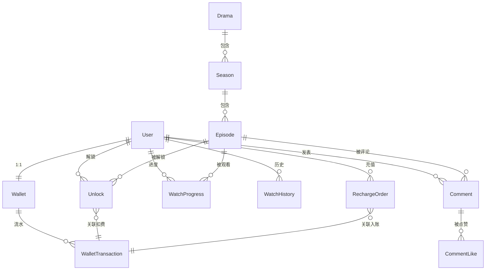

# 12 — 短剧平台领域模型（Domain Model）

> Wave 1 · 工作槽 W1B（领域模型与契约）。本文档只做架构方案，不含实现代码。
> 配套文档：`docs/12-api-contracts.md`（REST/JSON 契约）、`docs/12-error-catalog.md`（错误码目录）。

## 1. 范围与目标

本文档定义短剧（竖屏微短剧）平台的核心领域模型，覆盖以下限界上下文（Bounded Context）：

| 上下文 | 核心实体 | 职责 |
|---|---|---|
| 内容域 Content | 剧 Drama、季 Season、集 Episode | 内容元数据、上下架状态机、解锁策略配置 |
| 用户域 User | 用户 User、设备 Device | 账号、资料、VIP 身份 |
| 钱包域 Wallet | 钱包 Wallet、流水 WalletTransaction、充值订单 RechargeOrder | 虚拟币账务、充值、幂等与对账 |
| 解锁域 Unlock | 解锁记录 Unlock | 付费集的解锁凭证与扣费编排 |
| 进度域 Progress | 观看进度 WatchProgress、观看历史 WatchHistory | 断点续播、追剧列表 |
| 推荐域 Recommendation | 推荐流 RecFeed、行为事件 RecEvent | 首页/信息流推荐、埋点事件模型 |
| 评论域 Comment | 评论 Comment、点赞 CommentLike | UGC 评论与审核状态机（可通过功能开关整体关闭） |

**非目标（Wave 1 明确不做）**：管理后台（CMS）模型细化、优惠券/活动系统、分销/裂变、多语言字幕模型、直播。这些在模型中仅留扩展位。

## 2. 全局约定

### 2.1 标识符（ID）

- 全部实体使用**全局唯一、可排序的字符串 ID**（建议 ULID/KSUID），对外暴露时带类型前缀，防遍历、便于日志排查：
  - `usr_` 用户、`drm_` 剧、`ssn_` 季、`ep_` 集、`ulk_` 解锁、`wal_` 钱包、`txn_` 流水、`ord_` 充值订单、`cmt_` 评论。
- 数据库内部可另用自增主键，但 API 层只暴露前缀 ID。

### 2.2 时间与货币

- 时间一律 **UTC ISO-8601 毫秒精度**（`2026-08-27T10:00:00.000Z`）。
- 法币金额一律**最小货币单位整数**（人民币=分），字段名以 `amountCents` 结尾。
- 虚拟币（"看点/金币"）为**整数**，不允许小数。

### 2.3 删除与状态机

- 核心实体不做物理删除，统一通过 `status` 状态机管理生命周期（详见各实体）。
- 所有实体带 `createdAt` / `updatedAt` 审计字段（下文实体定义中不再重复列出）。

### 2.4 并发与幂等

- 钱包为强一致聚合根，采用**乐观锁 `version` 字段**，扣费/入账必须在单事务内完成"校验余额 → 写流水 → 更新余额"。
- 所有资金类与解锁类写操作要求客户端携带 **`Idempotency-Key`**（见 API 契约 §2.4）。

## 3. 内容域

### 3.1 Drama（剧）

聚合根。一部短剧作品，包含若干季。

| 字段 | 类型 | 说明 |
|---|---|---|
| id | string (`drm_`) | 主键 |
| title | string | 剧名，≤50 字 |
| description | string | 简介，≤500 字 |
| coverUrl | string | 竖版封面图 |
| horizontalCoverUrl | string? | 横版封面（列表/分享用） |
| category | string | 单一主分类（枚举：`ROMANCE`/`REVENGE`/`FAMILY`/`SUSPENSE`/`COMEDY`/`FANTASY`/`OTHER`） |
| tags | string[] | 标签，≤10 个（如"逆袭""穿越""霸总"） |
| status | enum | `DRAFT` → `PUBLISHED` → `OFFLINE`（可 `PUBLISHED` ↔ `OFFLINE` 双向） |
| totalSeasons | number | 冗余计数 |
| totalEpisodes | number | 冗余计数（全季总集数） |
| freeEpisodes | number | **剧级免费策略**：前 N 集免费（默认 5，可被集级策略覆盖） |
| isCompleted | boolean | 是否完结（追剧提示用） |
| releaseAt | datetime? | 定时上架时间 |
| statSnapshot | object | 冗余统计：`playCount`、`favoriteCount`、`score`（推荐与列表展示用，异步更新，允许最终一致） |

**状态机**：`DRAFT`（仅后台可见）→ `PUBLISHED`（对外可见可播）→ `OFFLINE`（下架，已解锁用户仍可回看的策略由产品定，Wave 1 默认下架后不可播，返回 `CONTENT_OFFLINE`）。

### 3.2 Season（季）

| 字段 | 类型 | 说明 |
|---|---|---|
| id | string (`ssn_`) | 主键 |
| dramaId | string | 所属剧 |
| seasonNumber | number | 季序号，从 1 起，剧内唯一 |
| title | string? | 季标题（可空，默认"第 N 季"） |
| episodeCount | number | 冗余计数 |
| status | enum | 同 Drama 状态机；季不可见时其下所有集不可见 |

> 说明：多数短剧只有一季。模型仍保留季层级以支持"续作/分季付费"，但 API 契约对单季剧提供扁平化便捷读取（见契约 §4.3）。

### 3.3 Episode（集）

| 字段 | 类型 | 说明 |
|---|---|---|
| id | string (`ep_`) | 主键 |
| seasonId | string | 所属季 |
| dramaId | string | 冗余，便于按剧查询 |
| episodeNumber | number | 集序号，从 1 起，季内唯一 |
| title | string? | 集标题（可空） |
| durationSec | number | 时长（秒） |
| coverUrl | string? | 集封面（默认取剧封面） |
| unlockPolicy | enum | `FREE` / `COIN` / `VIP_ONLY` / `COIN_OR_VIP`（见 §3.4） |
| priceCoins | number | 单集解锁价（`unlockPolicy` 含 COIN 时必填，>0） |
| status | enum | `DRAFT` / `PUBLISHED` / `OFFLINE` |
| videoAssets | VideoAsset[] | 多清晰度视频资源（内嵌值对象） |

**VideoAsset（值对象）**：`{ quality: "480p"|"720p"|"1080p", format: "hls"|"mp4", assetKey: string }`。
`assetKey` 是存储侧引用，**播放地址不落库、不直出**——由播放令牌接口按需签发短时效 URL（见契约 §4.4），这是防盗链的关键决策。

### 3.4 解锁策略（跨内容域与解锁域的规则）

集的**有效解锁策略**按以下优先级归一：

1. 集自身 `unlockPolicy = FREE` → 免费。
2. `episodeNumber ≤ drama.freeEpisodes` → 免费（剧级前 N 集免费覆盖集级付费设置）。
3. 否则按集 `unlockPolicy` 执行：
   - `COIN`：仅可用虚拟币解锁；
   - `VIP_ONLY`：仅 VIP 可看，不可用币解锁；
   - `COIN_OR_VIP`：VIP 直接可看，非 VIP 可用币解锁（**默认推荐值**）。

服务端在返回集详情时计算并附带 `viewerAccess` 视图（见契约 §3.3），客户端**不得**自行推导可看性。

## 4. 用户域

### 4.1 User（用户）

| 字段 | 类型 | 说明 |
|---|---|---|
| id | string (`usr_`) | 主键 |
| nickname | string | 昵称，≤24 字 |
| avatarUrl | string? | 头像 |
| phone | string? | 手机号（脱敏返回，登录凭证之一） |
| authProviders | object[] | 第三方绑定：`{ provider: "wechat"|"apple"|"device", externalId }` |
| status | enum | `ACTIVE` / `BANNED`（封禁后拒绝登录与写操作） |
| vip | object? | `{ active: boolean, expiresAt: datetime }`；VIP 到期判断以服务端时间为准 |

- 支持**游客模式**：以设备号注册影子账号（`provider=device`），后续可绑定手机号升级，钱包/进度/解锁随账号迁移。
- VIP 的购买与续费走充值订单同一支付通道（`RechargeOrder.productType=VIP`），Wave 1 不单独建 VIP 订单模型。

## 5. 钱包域

### 5.1 Wallet（钱包，聚合根）

每用户恰好一个钱包，注册时惰性创建。

| 字段 | 类型 | 说明 |
|---|---|---|
| id | string (`wal_`) | 主键 |
| userId | string | 唯一索引 |
| coinBalance | number | 充值币余额（付费购得，≥0） |
| bonusBalance | number | 赠币余额（活动/签到赠送，≥0） |
| version | number | 乐观锁版本号 |

**双账户设计理由**：充值币与赠币在退款、对账、财务口径上必须分离。**消耗顺序：先赠币、后充值币**（对用户有利，且减少退款争议）。

### 5.2 WalletTransaction（流水，不可变）

| 字段 | 类型 | 说明 |
|---|---|---|
| id | string (`txn_`) | 主键 |
| walletId / userId | string | 归属 |
| type | enum | `RECHARGE`（充值入账）/ `CONSUME`（解锁扣费）/ `REWARD`（活动赠币）/ `REFUND`（退款回冲） |
| coinDelta | number | 充值币变动（正负） |
| bonusDelta | number | 赠币变动（正负） |
| coinBalanceAfter / bonusBalanceAfter | number | 变动后余额快照（对账关键） |
| refType / refId | string | 业务引用：`UNLOCK`/`RECHARGE_ORDER`/`CAMPAIGN` + 对应 ID |
| idempotencyKey | string | 唯一索引，防重复入账/扣费 |

**不变式**：任意时刻 `wallet.coinBalance == 初始 0 + Σ(coinDelta)`，赠币同理；对账任务每日校验。

### 5.3 RechargeOrder（充值订单）

| 字段 | 类型 | 说明 |
|---|---|---|
| id | string (`ord_`) | 主键 |
| userId | string | 下单用户 |
| productId | string | 充值档位 ID（档位表：`{ productId, productType: COIN\|VIP, amountCents, coins, bonusCoins, vipDays }`，后台配置） |
| amountCents | number | 应付金额（分） |
| coins / bonusCoins | number | 到账充值币 / 赠币 |
| paymentChannel | enum | `WECHAT` / `ALIPAY` / `APPLE_IAP` |
| channelOrderId | string? | 渠道侧订单号 |
| status | enum | `PENDING` → `PAID` → `CREDITED`；`PENDING` → `CLOSED`（超时/取消）；`PAID/CREDITED` → `REFUNDED` |
| idempotencyKey | string | 客户端下单幂等键 |

**关键决策**：支付回调（渠道 → 服务端）驱动 `PENDING→PAID`；入账（写流水 + 加余额）是独立步骤 `PAID→CREDITED`，以回调通知的 `channelOrderId` 做幂等，保证"回调重放不重复入账"。

## 6. 解锁域

### 6.1 Unlock（解锁记录）

用户对某一集的永久观看凭证（Wave 1 不做限时解锁，模型留 `expiresAt` 扩展位）。

| 字段 | 类型 | 说明 |
|---|---|---|
| id | string (`ulk_`) | 主键 |
| userId + episodeId | string | 联合唯一索引（一人一集至多一条） |
| dramaId | string | 冗余，便于"整剧已解锁数"查询 |
| method | enum | `COIN`（币解锁）/ `VIP`（VIP 观看时落的凭证，可选记录）/ `AD`（激励视频，预留）/ `GRANT`（运营赠送） |
| costCoins / costBonus | number | 实际扣的充值币/赠币数（`method=COIN` 时有值） |
| transactionId | string? | 关联钱包流水 |
| expiresAt | datetime? | 预留：限时解锁；null=永久 |

**解锁事务编排（单库事务或 Saga 皆可，Wave 1 建议单库事务）**：
1. 校验集有效解锁策略允许 COIN；校验未重复解锁（唯一索引兜底）。
2. 钱包扣费（先赠币后充值币，乐观锁重试 ≤3 次）→ 写 `WalletTransaction(type=CONSUME)`。
3. 写 `Unlock` 记录。
4. 任一步失败整体回滚；重复请求由 `Idempotency-Key` 返回首次结果。

**整剧/整季解锁**：Wave 1 契约支持"一键解锁全剧剩余付费集"（打包价 = 剩余集单价之和 × 折扣系数，折扣后台配置），落库为多条 Unlock + 一条流水。

## 7. 进度域

### 7.1 WatchProgress（观看进度）

以 `(userId, episodeId)` 为业务主键的 **upsert 模型**。

| 字段 | 类型 | 说明 |
|---|---|---|
| userId + episodeId | string | 联合唯一 |
| dramaId | string | 冗余 |
| positionSec | number | 播放位置（秒） |
| durationSec | number | 上报时的总时长（容错：转码后时长变化） |
| completed | boolean | 观看完成（position/duration ≥ 0.9 时服务端置真） |
| clientUpdatedAt | datetime | 客户端时间戳，**Last-Write-Wins 冲突解决依据**（多端同时播放时取 clientUpdatedAt 较新者） |

### 7.2 WatchHistory（观看历史 / 追剧列表）

以 `(userId, dramaId)` 为业务主键，由进度上报**联动更新**（非独立写入口）：

| 字段 | 类型 | 说明 |
|---|---|---|
| userId + dramaId | string | 联合唯一 |
| lastEpisodeId / lastEpisodeNumber | — | 最近观看的集 |
| lastPositionSec | number | 断点 |
| watchedAt | datetime | 最近观看时间（列表排序键） |

> 决策：进度写入是高频操作（客户端每 5–10 秒心跳 + 暂停/退出时上报），服务端可先写缓存、异步刷库；契约层面接口保持同步语义、允许最终一致读。

## 8. 推荐域

Wave 1 只定义**契约与事件模型**，策略实现留给后续 Wave；首版策略为规则混排（继续观看 > 热门榜 > 新剧），无个性化模型依赖。

### 8.1 RecFeed（推荐流，只读视图）

推荐流返回**卡片列表**，卡片是视图对象而非存储实体：

```
FeedCard {
  cardType: "CONTINUE_WATCHING" | "DRAMA",
  drama: DramaSummary,          // 剧摘要（复用内容域视图）
  continueEpisode?: { episodeId, episodeNumber, positionSec },  // 仅 CONTINUE_WATCHING
  recReason?: string,           // 展示用推荐理由（如"热播榜 Top3"）
  trackingId: string            // 本次曝光追踪 ID，埋点回传用
}
```

### 8.2 RecEvent（行为事件，埋点）

客户端批量上报，服务端 append-only 存储（后续供推荐/BI 消费）：

| 字段 | 类型 | 说明 |
|---|---|---|
| eventType | enum | `IMPRESSION` / `CLICK` / `PLAY_START` / `PLAY_COMPLETE` / `UNLOCK` / `FAVORITE` |
| userId | string | 服务端从令牌注入，客户端不传 |
| dramaId / episodeId | string? | 事件对象 |
| trackingId | string? | 关联推荐曝光 |
| clientTs | datetime | 客户端事件时间 |
| context | object? | 场景：`{ page, position }` |

## 9. 评论域（受功能开关控制）

**合规前提**：UGC 评论需先审后发（或先发后审 + 快速下线），域内建审核状态机；若运营/合规不允许，通过服务端功能开关 `features.comments=false` 整体关闭，契约保留、接口返回 `COMMENT_FEATURE_DISABLED`。

### 9.1 Comment（评论）

评论挂在**集**维度（短剧的讨论强绑定剧情进度），剧维度评论数为聚合视图。

| 字段 | 类型 | 说明 |
|---|---|---|
| id | string (`cmt_`) | 主键 |
| episodeId / dramaId | string | 归属 |
| userId | string | 作者 |
| content | string | ≤300 字，纯文本（Wave 1 不支持图片/表情包资源） |
| parentId | string? | 一级回复（仅两层：根评论 + 回复，回复不再嵌套） |
| status | enum | `PENDING`（机审中）→ `APPROVED` / `REJECTED`；`APPROVED` → `HIDDEN`（用户删除或运营下线） |
| likeCount | number | 冗余计数 |

- **可见性规则**：作者本人可见自己 `PENDING` 的评论（标注"审核中"）；他人仅见 `APPROVED`。
- **CommentLike**：`(userId, commentId)` 联合唯一，点赞/取消为幂等 PUT/DELETE 语义。

## 10. 实体关系总览



## 11. 跨域一致性与事务边界

| 场景 | 边界 | 一致性要求 |
|---|---|---|
| 币解锁单集/整剧 | 钱包 + 解锁 单事务 | 强一致（资金安全） |
| 充值回调入账 | 订单 + 钱包 单事务，回调幂等 | 强一致 |
| 进度上报 → 观看历史 | 同请求内联动或异步 | 最终一致（秒级） |
| 剧统计快照（播放/收藏数） | 异步任务聚合 | 最终一致（分钟级） |
| 评论计数 / 点赞计数 | 异步或事务内冗余更新 | 最终一致 |

## 12. 开放问题（交由后续 Wave / 产品决策）

1. 剧下架后已解锁用户是否保留回看权（当前默认不可看，建议产品复核）。
2. 激励视频广告解锁（`method=AD`）的次数上限与风控策略。
3. VIP 观看付费集是否落 `Unlock(method=VIP)` 凭证（影响"VIP 到期后是否保留已看集权限"）。
4. 评论是否开放剧维度独立评论区。
5. 多端进度冲突是否需要比 LWW 更细的策略（如"取更大 positionSec"）。
