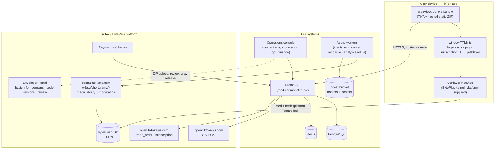
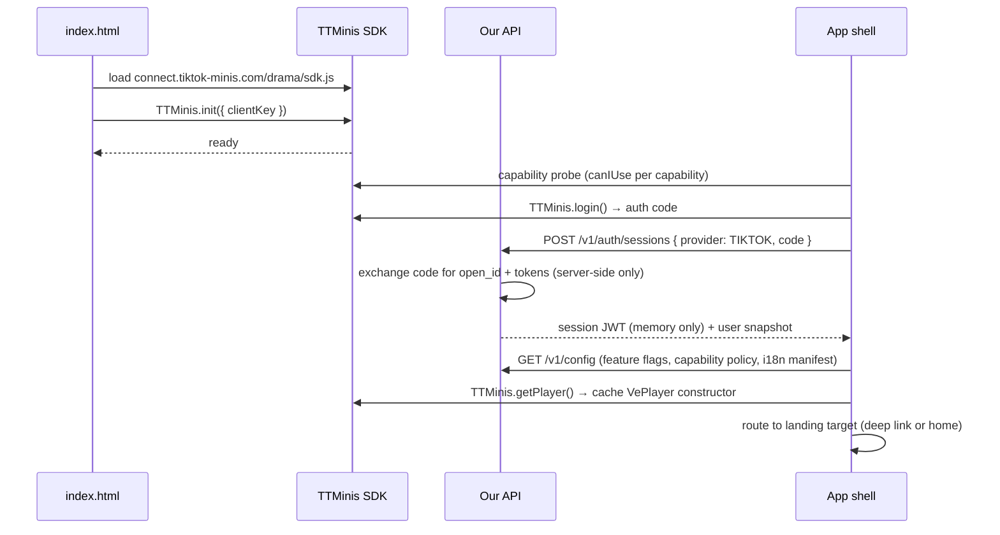
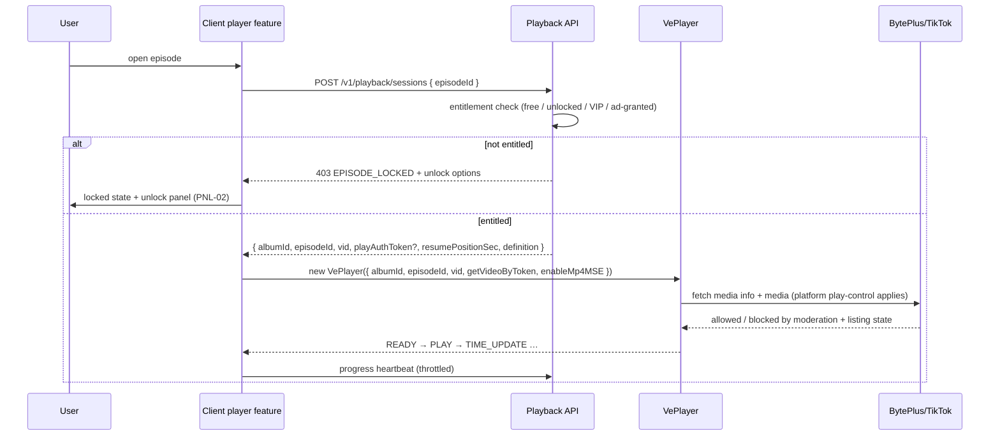
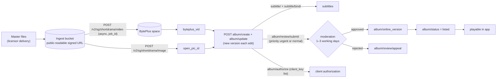
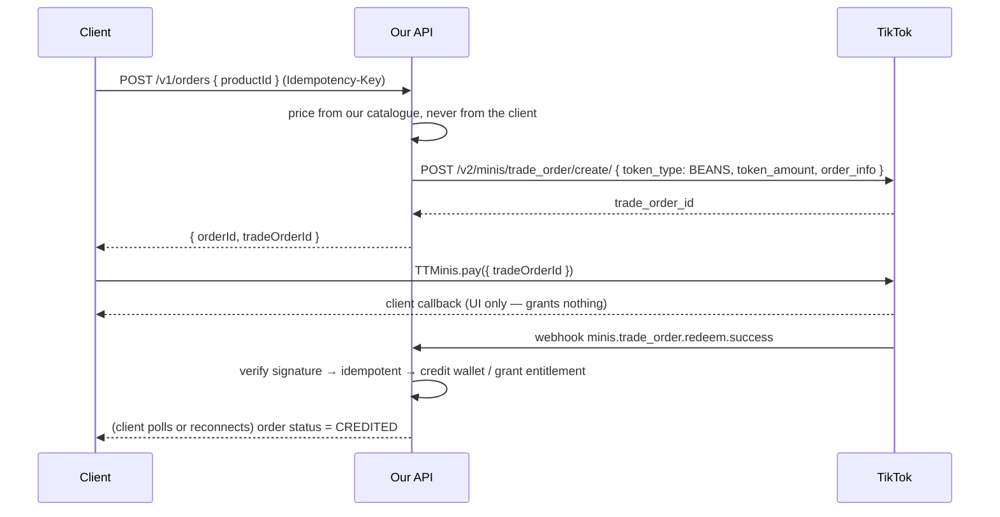

# System Overview — TikTok Minis Mini-Drama App

> **Slot:** Wave 1 · architecture (W1 A-slot, branch `cursor/w1-architecture-bed5`).
> **Status:** canonical architecture baseline. This document is the entry point for the architecture set:
> `docs/architecture/system-overview.md` (this file) → `docs/architecture/tech-stack.md` → `docs/architecture/risks.md`.
> **Scope:** architecture and scheme only. No application code is produced in this slot.
> **Language note:** the earlier Wave 1 slots wrote `docs/00-*` … `docs/14-*` in Chinese. The `docs/architecture/`
> set is written in English because it is the set that gets checked against the English-language platform
> documentation and, later, against reviewer feedback. Terminology maps 1:1 to the Chinese docs; see §14.

---

## 1. What we are building, and what the platform actually is

A TikTok Mini Drama app is **not** a mini-program in the WeChat/Douyin sense. Per the official
[Develop Your Mini Drama](https://developers.tiktok.com/docs/en/tiktok-minis-develop-your-mini-app) guide, the
correct mental model is:

> **Web App + client-side JSAPI + CLI toolchain.**

Concretely:

| Fact | Architectural consequence |
|---|---|
| The app is a standard web project (`index.html` + framework code + build artifacts) rendered in the TikTok app's WebView | We build a normal SPA. No proprietary DSL, no platform component framework, no server-side rendering (the artifact is a static ZIP) |
| Client capabilities are exposed on the global `window.TTMinis`, injected by `https://connect.tiktok-minis.com/drama/sdk.js` | All platform access goes through one adapter (`PlatformBridge`, §4.2). Business code never touches `TTMinis` directly |
| The static bundle is uploaded as a ZIP (≤200 MB) and hosted/distributed by TikTok | We host **no** frontend origin. Our only owned runtime surfaces are the API domain and the operations/CMS backend |
| Local development is three-layered: local page ↔ Playground/debug page ↔ TikTok mobile app | Every platform-dependent capability needs a mock path, or it is undevelopable and untestable off-device (§11) |
| Episode video **must** be played through the official VePlayer, and must be hosted in BytePlus and moderated by TikTok | The media plane is largely **not ours**. This is the single biggest architectural difference from a standalone short-drama app (§5, §6) |

### 1.1 Correction registry — where this supersedes earlier Wave 1 docs

The earlier architecture pass (`docs/03-tech-architecture.md`, `docs/03-stack-decision.md`) was written before the
mini-drama player and media-asset documentation was located. It designed a self-hosted media plane. That design is
**not shippable on this platform**. The following corrections are authoritative; the owning slots should back-port
them into their own documents rather than keeping two conflicting versions.

| # | Superseded statement | Correct statement | Source |
|---|---|---|---|
| A1 | Playback via `<video>` + native HLS / hls.js fallback (`D3`, `03-tech-architecture` §3.2) | **VePlayer only**, obtained via `TTMinis.getPlayer()`. Third-party players and native HTML video are not allowed; TikTok replaces them with a blocked-UI element | [TikTok Minis Player](https://developers.tiktok.com/docs/en/minis-player) |
| A2 | Own media pipeline: S3 + CloudFront signed URLs + MediaConvert, HLS ladder, AES-128 (`D11`, `03-tech-architecture` §6) | Episode masters are uploaded into **BytePlus** through TikTok's mini-drama media-asset APIs. Transcoding, storage, CDN and playback authorization are platform-side. We keep only an ingest staging bucket for masters/posters awaiting upload | [Media Asset Management](https://developers.tiktok.com/docs/en/media-asset-management) |
| A3 | Our backend decides whether an episode may be played (signed URL issuance is the enforcement point) | The **platform** enforces playability from moderation status, online version, listing status and album↔client_key authorization. Our entitlement check is a *commercial* gate layered on top; it can deny, but it cannot grant | [Media Asset Management](https://developers.tiktok.com/docs/en/media-asset-management) |
| A4 | `POST /episodes/{id}/playback-token` returns a short-lived signed `playUrl` + quality ladder (`docs/12-api-contracts.md` §4.4) | It returns a **playback descriptor**: `{ albumId, episodeId, vid, playAuthToken? }`. Definition/quality selection is a VePlayer concern, not an API concern | [TikTok Minis Player](https://developers.tiktok.com/docs/en/minis-player) |
| A5 | Rewarded video is the required ad capability | **Both** rewarded (`TTMinis.createRewardedVideoAd`) **and** interstitial (`TTMinis.createInterstitialAd`) ads are listed as required capabilities, alongside silent login, Beans IAP, subscriptions and the navigation bar | [Develop Your Mini Drama](https://developers.tiktok.com/docs/en/tiktok-minis-develop-your-mini-app) |
| A6 | Client-side CSP is the primary bundle-safety control (`docs/14-security.md` §2.1) | The platform enforces its own runtime restrictions that are stricter and non-negotiable: no `eval`, no `Function` constructor, no string-form `setTimeout`/`setInterval`, no `iframe`, script/CSS `src` from self only (fonts excepted), blocked web APIs (clipboard, geolocation, vibration), and requests only to registered trusted domains (≤20, `https://`/`wss://`, no wildcards or paths) | [Development Stage](https://developers.tiktok.com/docs/en/minis-development-stage), [Set Up Development Configuration](https://developers.tiktok.com/docs/en/set-up-development-configuration) |

Everything else in the earlier docs — the information architecture, journeys, screen inventory, domain model,
error catalogue, quality gates and test strategy — survives these corrections and is still the working baseline.

---

## 2. Context



Two things are worth stating explicitly because they drive most of the design:

1. **We own the merchandising plane, not the media plane.** Discovery, entitlement, wallet, pricing, retention,
   analytics — ours. Encoding, storage, delivery, playback UI, and playability enforcement — the platform's.
2. **Every client→network edge is constrained.** The 20-domain trusted-domain budget and the "requests only to
   declared domains" rule mean each additional third-party client SDK is an architectural decision, not a library
   choice. Our default is: the client talks to exactly one of our domains, and everything else is proxied.

---

## 3. Runtime and lifecycle

### 3.1 Boot sequence

The boot sequence is a hard serial pipeline; a page must never render business content on a half-initialized runtime.



Failure handling, per step, follows `docs/02-information-architecture.md` §8.4 with one change: **`getPlayer()`
failure is not fatal at boot**. It degrades to a retry at first playback attempt, because a user who never opens the
player should not be blocked by it.

| Step | Failure | Degradation |
|---|---|---|
| SDK load / `init` | Network, or app opened outside TikTok | Terminal error screen with retry. Nothing downstream is usable |
| Capability probe | A capability is missing on this client version | Feature-flag it off for the session and record it; never call an unprobed API (§3.3) |
| Silent login | Platform or our API failure | Anonymous browsing mode. Login is retried at the first action that needs identity |
| `GET /config` | Our API failure | Conservative built-in defaults (paid features off, comments off, heartbeat 10 s), silent background refetch |
| `getPlayer()` | SDK/network failure | Retry lazily on first play; player surface shows a retryable error, the rest of the app is unaffected |

### 3.2 Runtime constraints the client code must respect

These are platform-enforced and are checked by the code scanner at upload time, so they are build-time gates for us
(see `docs/architecture/tech-stack.md` §6 for how each is enforced in CI):

- No `eval`, no `Function` constructor, no string-form `setTimeout`/`setInterval`.
- No `iframe`.
- `script` and CSS `src` must come from self resources (fonts excepted); the platform SDK script is the sanctioned
  exception. Dynamically imported script sources must be restricted.
- Blocked web APIs include clipboard, geolocation and vibration.
- Runtime requests only to trusted domains registered in the Developer Portal **and** listed in
  `minis.config.json` (`domain.trustedDomains` / `domain.allowList`). The two lists must be generated from one source.
- ZIP ≤ 200 MB, no zero-byte files, TikTok Login must be implemented.

### 3.3 Capability policy

Every platform capability is wrapped in a three-state policy: `available` / `unavailable-this-client` /
`disabled-by-config`. The bridge probes with `canIUse` once at boot, merges the result with `GET /config`, and
publishes an immutable `capabilities` object for the session. UI never asks "does this SDK method exist"; it asks
the capability object. This is what makes the "minimum supported library version" setting in the Developer Portal
safe to raise or lower without a client rewrite, and it is what prevents the classic mini-app crash of calling an
API that does not exist on an older client build.

---

## 4. Client architecture

### 4.1 Layers

```text
┌──────────────────────────────────────────────────────────────┐
│ routes/          hash routes, guards, deep-link resolver      │
├──────────────────────────────────────────────────────────────┤
│ features/        feed · drama · player · unlock · wallet ·    │
│                  vip · profile · history · settings           │
├───────────────┬──────────────────────────────────────────────┤
│ player/        │ stores/    session, capabilities, playback   │
│ VePlayer       │            queue, unlock intent (Zustand)    │
│ facade +       ├──────────────────────────────────────────────┤
│ playlist/      │ api/       typed client generated from the   │
│ preload mgr    │            OpenAPI contract + query cache    │
├───────────────┴──────────────────────────────────────────────┤
│ platform/      PlatformBridge: TikTokBridge | MockBridge      │
├──────────────────────────────────────────────────────────────┤
│ core/          i18n · analytics · error mapping · logging     │
└──────────────────────────────────────────────────────────────┘
```

### 4.2 PlatformBridge

One interface, two implementations (`TikTokBridge` for the real client, `MockBridge` for browser development, unit
tests and E2E). The bridge is the only module allowed to reference `window.TTMinis`. Its surface, grouped by the
platform's required-capability list:

| Group | Bridge methods | Backed by |
|---|---|---|
| Lifecycle | `init`, `isReady`, `canIUse`, `onShow`/`offShow`, `getLaunchParams` | `TTMinis.init`, `canIUse`, lifecycle hooks |
| Identity | `login()`, `authorize(scopes)` | `TTMinis.login`, `TTMinis.authorize` |
| Player | `getPlayerCtor()`, `createPlayer(cfg)`, `preload(list)` | `TTMinis.getPlayer`, `VePlayer`, `VePlayer.prepare`/`setPreloadList` |
| Ads | `showRewarded(adUnitId)`, `showInterstitial(adUnitId)` | `TTMinis.createRewardedVideoAd`, `TTMinis.createInterstitialAd` |
| Commerce | `pay(tradeOrderId)`, `createSubscription(...)`, `checkBalance(...)`, `openBalance()` | `TTMinis.pay`, `TTMinis.createSubscription`, balance JSAPIs |
| UI | `setNavigationBarColor(...)`, `getMenuButtonRect()` | `TTMinis.setNavigationBarColor`, `TTMinis.getMenuButtonBoundingClientRect` |

Two conventions that prevent whole classes of bugs:

- **Every bridge method returns a `Promise<Result<T, BridgeError>>`,** never throws, and never resolves with a raw
  SDK payload. Callback-style SDK APIs (`success`/`fail`/`complete`) are normalized here once.
- **Ad instances are single-use.** `showRewarded` creates the ad object, registers `onClose`/`onError`, shows,
  then unregisters and drops the instance. Reusing a rewarded-ad instance is a known platform footgun.

> **Open item (O-1):** the mini-drama documentation uses the bare `TTMinis.*` namespace, while the mini-**games**
> documentation and one IAP sample use `TTMinis.game.*`. The bridge resolves the namespace once at init
> (`TTMinis.getPlayer ? TTMinis : TTMinis.game`) and logs which one it bound to, so a namespace difference is a
> one-line fix rather than a rewrite. To be confirmed on-device in Wave 2.

### 4.3 Routing and navigation

Hash routing, three navigation levels (tab / page / overlay panel), and the back-stack rules B1–B8 defined in
`docs/02-information-architecture.md` §5–§7 are adopted unchanged, with two amendments from the player correction:

- **PNL-05 (quality / playback-rate panel) is removed from our UI.** Definition and rate are VePlayer plugins. Two
  competing controls for the same state is a guaranteed product bug. We either enable the player's plugin or hide
  it via `ignores`, and we never render our own.
- **Episode switching uses `playNext()` on a single retained player instance**, not a new route or a new player.
  This is also what the preload module expects (§5.3).

### 4.4 Page inventory

Reconciled with `docs/02-screen-inventory.md`; the ownership column is the addition that matters.

| ID | Route | Purpose | Anonymous | Notes |
|---|---|---|---|---|
| SCR-01 | — | Boot / splash | yes | Owns the §3.1 sequence; ToS and privacy are shown by the platform loading page |
| SCR-02 | `#/home` | Recommendation feed, "continue watching" pinned | yes | Our ranking, our data |
| SCR-03 | `#/browse` | Catalog by category/tag/sort | yes | Search entry hidden until a search contract exists (IA gap G5) |
| SCR-04 | `#/drama/:dramaId` | Drama detail, episode grid, unlock state | yes | Reads `viewerAccess` per episode |
| SCR-05 | `#/play/:episodeId` | Immersive player | yes (free episodes) | **VePlayer-hosted surface**; our chrome is an overlay only (§5) |
| SCR-06 | `#/me` | Profile hub | yes (assets show sign-in nudge) | Real nickname/avatar only after explicit authorization |
| SCR-07 | `#/history` | Watch history / following | no | |
| SCR-08 | `#/favorites` | Favourites | no | |
| SCR-09 | `#/wallet` | Coin balance, ledger, orders | no | |
| SCR-10 | `#/recharge` | Beans recharge tiers | no | Tier price/currency/symbol come from the platform tier API, never hard-coded |
| SCR-11 | `#/vip` | Subscription | no | Platform subscription flow |
| SCR-12 | `#/settings` | Settings, legal, support | yes | |
| SCR-13 | `#/fallback` | Global terminal error | yes | Always offers "back to home" |
| PNL-01 | overlay | Episode picker | yes | |
| PNL-02 | overlay | Unlock panel (coins / whole drama / ad / VIP) | no | Channels rendered from `capabilities` + `/config` |
| PNL-03 | overlay | Recharge sheet | no | |
| PNL-04 | overlay | Comments | no | Behind a feature flag |
| ~~PNL-05~~ | — | ~~Quality / speed~~ | — | **Removed** — owned by VePlayer (§4.3) |

---

## 5. Playback architecture

This is the section that most differs from a conventional short-drama app, and it is where "no known product bugs"
is won or lost.

### 5.1 The rule

> The app **must** use the official TikTok Minis player (VePlayer) to play moderated mini-drama episodes.
> Third-party players and native HTML `video` are not allowed; if used, TikTok replaces them with a default blocked
> UI. ([TikTok Minis Player](https://developers.tiktok.com/docs/en/minis-player))

This applies to our own promotional/trailer content too, so **there is no `<video>` element anywhere in the
bundle** — a trailer is just another episode-like asset played through VePlayer, or it is a poster image. During any
migration or exemption period, `TTMinis.setValidateVideoReplaceElement` can customize the replacement element, but
that is a mitigation, not a design.

### 5.2 Playback sequence



Notes that are easy to get wrong:

- `playAuthToken` is only needed for **TikTok app versions below 44.5.0**, is short-lived, and is fetched from
  `GET https://open.tiktokapis.com/v2/sg/shortdrama/play_token/`. Our backend fetches it lazily, only when playback
  is actually about to happen, and never caches it beyond its validity. Newer clients play from
  `albumId`/`episodeId`/`vid` alone.
- **Two authorization systems are in series.** Ours answers "has this user paid?"; the platform's answers "is this
  content moderated, online, listed and authorized to this `client_key`?". A user can be fully entitled and still be
  unable to play. The player error path must distinguish these, because the user-facing message and the operational
  alert are completely different (a locked episode is a conversion opportunity; a platform-blocked episode is an
  incident). See §6.3.
- Progress is derived from the player's `TIME_UPDATE` event, throttled client-side to the `/config` heartbeat
  interval, plus a flush on pause/hide/episode-switch. `onShow`/page-hide is the reliable flush hook in a WebView.

### 5.3 Feed continuity and first-frame budget

Time-to-first-frame is the retention metric for short drama. VePlayer ships a preload module and we use it rather
than inventing one:

| Concern | Mechanism |
|---|---|
| First frame on episode switch | `VePlayer.prepare({ strategies: { preload: true } })` with feed mode `setPreloadScene(1, { prevCount: 1, nextCount: 2 })` |
| Playlist | `setPreloadList(orderedEpisodes)` / `addPreloadList` when the user pages further into a series |
| Media-info round trip | `VePlayer.setMediaInfoCacheConfig({ enable: true })` so the preloaded media info is reused at play time |
| Bandwidth safety | Preload yields to active playback by design; we do not add our own parallel prefetching that would compete |
| Requirement | Preload needs MP4 + MSE: the player is constructed with `enableMp4MSE: true`; supported on Android WebView and iOS 17.1+ (`ManagedMediaSource`) |
| Measurement | `player.preLoadData` and the `PRELOAD_INFO` event are reported as analytics so hit-rate is a tracked number, not a belief |
| Instance discipline | One player instance per feed page; switch with `playNext()` |

Devices below the MSE bar simply do not preload; playback still works. That degradation is silent to the user and
visible in analytics.

### 5.4 Subtitles

Subtitles are platform assets, not app assets: they are uploaded through the media-asset subtitle APIs, bound to a
video, and VePlayer picks them up automatically with `autoSubtitle: true` plus a registered `Subtitle` plugin.
The app's job is limited to choosing the default track (device/app language first, then English) via
`formatAutoSubtitleItem`. Formats supported are WebVTT, SRT, ASS and SSA (text only). One upload per language.

---

## 6. Content and media supply chain

### 6.1 Pipeline



Key properties our content service must model faithfully:

- **Albums are versioned.** `album/update` creates a new version rather than mutating in place. Moderation,
  online-version selection and listing all operate on version numbers. Our catalogue therefore stores
  `(album_id, version)` with `current_version`, `online_version`, `review_status` and `publish_status` mirrored from
  `album/query`, and our storefront only ever serves the **online** version.
- **`review_status` is a real state machine** with 8 states (not submitted, under moderation, approved, rejected,
  withdrawn, appealing, appeal approved, appeal rejected). Content operations needs all of them surfaced; collapsing
  them into "pending/live" is how you get an episode that looks live in the CMS and is unplayable in the app.
- **Uploads are asynchronous.** `POST .../video` returns `job_id`; a worker polls `GET .../video` until
  `byteplus_vid` appears. Same pattern for subtitles. These are durable jobs with backoff and dead-lettering, not
  request-scoped waits.
- **Server-to-server auth is `client_credentials`** against `POST /v2/oauth/token/`, and the token is valid for
  ~2 hours. A single cached-token provider with pre-expiry refresh and 401-triggered invalidation serves all
  media/commerce calls.
- **The urgent moderation lane is a scarce resource:** priority `1` is capped at 35 submissions per organization per
  day. Release planning must treat it as a quota, and the CMS must show remaining quota.

### 6.2 Kill switch

Taking content down has to be fast and cannot depend on a client release:

1. `album/status = 2` (delisted) at the platform — stops playback platform-wide.
2. Our catalogue marks the drama offline — removes it from feed, detail, deep links.
3. Cache invalidation on the feed/detail read models.
4. Active players receive a terminal error and route to `#/fallback?reason=OFFLINE`.

Steps 2–4 are ours and must complete within the incident SLO in `docs/14-security.md` §7.3; step 1 is the
authoritative one.

### 6.3 Playability observability

Because playability depends on platform state we do not control, a scheduled reconciler compares, per online
episode, our catalogue state against `album/query`, and alerts on any drift (approved-but-not-online,
listed-but-rejected, missing `byteplus_vid`, deleted BytePlus account binding). This job is the difference between
"a user reports a black screen" and "we knew before the user did".

---

## 7. Backend architecture

### 7.1 Shape

A **modular monolith** in one deployable, with module boundaries drawn on the domain contexts in
`docs/12-domain-model.md`. Rationale is unchanged from the earlier pass and still holds: wallet, unlock and order
fulfilment must be a single-database transaction, and the team size does not justify distributed transactions. What
changes is the module list, because the media plane moved.

| Module | Responsibility | Talks to |
|---|---|---|
| `identity` | Silent-login code exchange, session issuance, optional explicit-authorization profile enrichment, ban state | `platform-tiktok` |
| `catalog` | Dramas, episodes, merchandising metadata, `viewerAccess` computation, storefront read models | `media-ops` (mirrored platform state) |
| `media-ops` | Ingest jobs, BytePlus upload/poll, album versioning, subtitle bind, moderation submit/appeal/withdraw, online-version and listing control, drift reconciliation | `platform-tiktok`, ingest bucket |
| `playback` | Playback-session issuance (entitlement → playback descriptor), lazy `play_auth_token` fetch, playback error classification | `entitlement`, `platform-tiktok` |
| `entitlement` | Episode/whole-drama unlocks, VIP-derived access, ad-granted access, unlock transactions | `wallet` |
| `wallet` | Coin ledger (double-entry), balances with optimistic locking, recharge orders | `billing` |
| `billing` | Beans trade orders, subscriptions, webhook verification/idempotency/fulfilment, order reconciliation | `platform-tiktok` |
| `ads` | Ad-unit config, server-side reward grants, per-user/per-day quotas, anti-abuse log | `entitlement` |
| `progress` | Watch progress (last-write-wins), history, following | Redis buffer → PostgreSQL |
| `discovery` | Feed composition, ranking rules, continue-watching | `catalog`, `progress` |
| `engagement` | Comments and moderation state (feature-flagged) | — |
| `analytics` | Event ingestion (append-only), funnel rollups | partitioned event tables |
| `config` | Remote config, feature flags, capability policy, kill switches | — |
| `platform-tiktok` | Sole outbound adapter to `open.tiktokapis.com` (OAuth, media, trade order, subscription) + inbound webhook verification | TikTok |

Modules call each other only through published module interfaces; no cross-module table reads. `platform-tiktok` is
the only module allowed to hold `client_secret` or platform tokens.

### 7.2 Request pipeline

```text
edge (WAF + rate limit + TLS)
  → trace context (OpenTelemetry)
  → authentication (session JWT; anonymous allowed on read paths)
  → per-user + per-IP rate limiting (Redis)
  → Idempotency-Key enforcement (all money/entitlement writes)
  → schema validation (single source: OpenAPI contract)
  → module handler
  → error mapping (docs/12-error-catalog.md) with traceId echoed to the client
```

Idempotency is doubled: an `Idempotency-Key` + request-hash record in Redis (24 h) **and** a unique index on the
underlying table. The Redis layer makes retries cheap; the unique index makes correctness independent of Redis.

### 7.3 Money and entitlement flows

**Beans purchase (one-time).** The only valid basis for fulfilment is the server-side webhook — never the client
success callback.



- The client callback moves the UI to "confirming", not to "unlocked".
- A **sweeper job** queries `POST /v2/minis/trade_order/query/` for orders stuck in `PENDING` past a threshold, so a
  lost webhook becomes a delayed fulfilment instead of a support ticket.
- `is_sandbox` in the webhook payload is respected: sandbox orders never touch production ledgers.
- Refund events (`refund_success`, `refund_traceback`) are modelled now even though the platform lists some as
  currently unavailable — a partial claw-back that arrives against an unmodelled event type is a data-integrity
  incident. `refund_traceback` reduces the balance by `refund_amount` and is recorded as its own ledger entry.

**Subscription (VIP).** Created via `POST /v2/minis/subscription/create/` + `TTMinis.createSubscription`; validity is
derived from the platform's subscription state (`is_subscription_rights_valid`, `end_time`, renewal status), synced
on a schedule and on demand at entitlement-check time. VIP is never stored as a local boolean that can drift.

**Ad-based unlock.** The reward is granted server-side. The client reports the ad close event with `isEnded === true`
plus the ad unit and a session nonce; the server enforces per-user/per-day/per-drama quotas and writes an audit
record. The client cannot mint entitlement.

### 7.4 Pricing and currency

Coin/Beans amounts are integers. Display prices for recharge tiers come from the platform tier API
(`tier_id`, `token_amount`, `price`, `currency`, `symbol`) and are rendered as returned; we never hard-code a
currency or a conversion. Our internal wallet unit is a coin, and the coin↔Beans mapping lives in server-side
product configuration, so a pricing change is a config change, not a release.

---

## 8. Data architecture

| Store | Contents | Notes |
|---|---|---|
| PostgreSQL (primary) | Users, catalogue + mirrored platform album/episode state, entitlements, wallet ledger, orders, subscriptions, progress, comments, media jobs | Money and entitlement in one transaction; optimistic locking on wallet; unique indexes as the idempotency backstop; PITR backups |
| Redis | Session revocation, rate-limit buckets, idempotency keys, progress write buffer, hot read-model cache, platform-token cache | Fully reconstructible; never a source of truth |
| PostgreSQL partitioned tables | Analytics events (append-only, monthly partitions) | Migration path to a column store if volume demands it |
| Object storage (ingest) | Masters and posters awaiting platform upload, appeal attachments | Not a delivery path. Objects are exposed only long enough for the platform to pull them |

Identifiers keep the prefixed-ULID convention from `docs/12-domain-model.md` §2.1 for our own entities, and store
platform identifiers (`album_id`, `episode_id`, `byteplus_vid`, `trade_order_id`, `open_id`) verbatim as separate
columns with unique constraints. Mapping tables — never overloading one ID column with two ID spaces.

---

## 9. Analytics

Two streams, one destination:

1. **Product events** — impressions, feed interactions, detail views, unlock funnel steps, order lifecycle, ad
   funnel, retention markers. Sent from the client to our own API (`POST /v1/events:batch`), batched, capped local
   queue, best-effort, never blocking UI.
2. **Playback quality events** — derived from VePlayer events (`READY`, `PLAY`, `ERROR`, `TIME_UPDATE`,
   `PRELOAD_INFO`): time-to-first-frame, stall count/duration, error codes, preload hit rate, completion rate per
   episode position.

Design constraints worth restating: **no third-party analytics SDK in the client.** Each one would consume a
trusted-domain slot, load a remote script (against the self-source rule), and add an unreviewable code path to a
bundle that gets scanned. Server-side, events land in the partitioned event tables and roll up nightly.

The two metrics that gate release quality are drama-level *first-frame p95* and *episode-1 → episode-2 continuation
rate*; both are defined here so the analytics contract and the quality gates in `docs/14-quality-gates.md` measure
the same thing.

---

## 10. Internationalization

| Layer | Mechanism |
|---|---|
| Review requirement | **The app must be compatible with English to pass review.** English is the default language and is never a fallback-to-key situation |
| App copy | `react-i18next`, namespaced by feature, English bundled and the rest lazily loaded; a CI check fails the build on any missing key in any shipped locale |
| Store listing | Developer Portal localization: name, description, ToS and privacy URLs per language, per launch region |
| Content | Titles/descriptions carry a language enum in the album payload; subtitles are per-language platform assets (§5.4) |
| Player UI | VePlayer `lang` (documented: `en`, `zh-cn`, `jp`) is set from app locale, with English as fallback |
| Formatting | `Intl` for numbers/dates; prices rendered from the platform's `currency` + `symbol` |
| RTL | Saudi Arabia is a listed launch region, so Arabic implies RTL. Layout uses logical CSS properties from day one — retrofitting RTL is far more expensive than starting with it |

Launch regions with no extra requirement: Brazil, Indonesia, Japan, Malaysia, Philippines, Saudi Arabia, Thailand,
Turkey. The United States requires separate TikTok launch approval. Vietnam requires a G1 Online Game License from
the Ministry of Information and Communications. Region selection is a product/business decision (blocker B-4) but
costs no rework: the architecture is region-agnostic apart from the domain allowlist and legal URLs.

---

## 11. Environments, build and release

| Environment | Client | Backend | Purpose |
|---|---|---|---|
| local | Browser + `MockBridge` + player stub | Docker Compose | Everything that is not platform-dependent |
| debug | `minis dev` / `minis debug` with client key, three-layer local ↔ playground ↔ device | staging | Login, ads, payment, subscription, real VePlayer |
| preview | ZIP uploaded to Portal, QR-code preview to test users (up to 30 preview versions) | staging + platform sandbox | On-device verification before review |
| production | Reviewed version, production + optional gray release | production | Live |

Release notes that shape the plan:

- The **first** release must be a full production release; gray release is only available once a production version
  exists. There is no "ship to 1% first" for launch, so the first version has to be right — which is the reason for
  the preview and sandbox discipline above.
- After that, exactly two versions can be live: one production and one gray, sharing 100% of traffic, and a gray
  percentage must be greater than the current one. Rollback is therefore "promote the previous package", not
  "reduce the percentage".
- Basic information is reviewed separately from code and is cross-referenced during code review. Mismatch between
  the listing and the app is a rejection cause, so listing copy is version-controlled alongside the code.
- Android device testing needs a TikTok **test client** obtained from the TikTok contact; iOS testing goes through
  the Portal QR preview. This asymmetry is a scheduling constraint for the test plan.

Backend deploys are independent of client review: containerized, canary, automatic rollback on SLO breach. Because a
client fix takes a review cycle and a server fix does not, **any behaviour that might need an emergency change lives
behind server-side config**, including pricing, unlock policy, ad quotas, feature flags and content availability.

---

## 12. Cross-cutting concerns

| Concern | Position |
|---|---|
| Secrets | `client_secret` and platform tokens exist only server-side. The client bundle is public: it holds the client key and nothing else |
| Session | Access token in memory only; re-authenticate by silent login on expiry. No long-lived refresh token in WebView storage |
| Transport | HTTPS only, HSTS. Certificate pinning is not implementable in a WebView H5 app and is explicitly out of scope (compensated by short-lived credentials and server-side risk controls) |
| Webhooks | Signature verification, timestamp window, replay rejection, idempotency by `trade_order_id`, then fulfilment. The verifier is behind an interface because the exact algorithm is still unconfirmed (blocker B-2) |
| Observability | OpenTelemetry traces with the same `traceId` returned in client error payloads, so a user report maps to a trace |
| Abuse | Rate limits on playback-session issuance, unlock and ad-grant endpoints; anomaly detection on ad-grant frequency |
| Compliance | Data minimization by default; `open_id` is the user key; explicit-authorization profile data is optional and separable. Region-specific requirements are tracked in `docs/03-nonfunctional.md` §7 |

---

## 13. Assumptions and open items

| # | Item | Working assumption | Resolution |
|---|---|---|---|
| O-1 | SDK namespace `TTMinis.*` vs `TTMinis.game.*` | Drama apps use bare `TTMinis.*`; bridge resolves at runtime | On-device, Wave 2 |
| O-2 | Webhook signature algorithm and field list | HMAC-SHA256 over the raw body with a timestamp header; verifier behind an interface | Portal docs / TikTok contact (blocker B-2) |
| O-3 | Launch-parameter/deep-link API | Bridge exposes `getLaunchParams()`; deep-link pipeline built against that abstraction | CLI + on-device probe |
| O-4 | `minis.config.json` full field set | Generated from one source shared with the Portal domain list | `minis init` on a real project |
| O-5 | Whether album/episode metadata should be authored in our CMS or the Portal | CMS is the system of record, platform APIs are the publishing target | Wave 2 content-ops design |
| O-6 | Ad unit inventory and fill rates per region | Ad unlock is feature-flagged and always has a coin alternative | After IAA enablement |
| O-7 | Coin↔Beans pricing ladder | Server-side product config, tiers read from the platform tier API | Business |

---

## 14. Terminology map to the Chinese Wave 1 documents

| This document | Chinese docs |
|---|---|
| System overview | `docs/03-tech-architecture.md` (superseded where §1.1 says so) |
| Tech stack | `docs/03-stack-decision.md` (D1–D16) |
| Risks | new — no prior equivalent; blockers were only in `docs/handoff/w1-p3.md` §5 |
| Information architecture / journeys / screens | `docs/02-*.md` (adopted, amended in §4.3–§4.4) |
| Domain model / API contracts / error catalogue | `docs/12-*.md` (adopted; §4.4 playback contract change registered as A4) |
| Onboarding checklist / bridge | `docs/11-*.md` (adopted; A5 adds interstitial ads) |
| Quality gates / security / test plan | `docs/14-*.md` (adopted; A6 supersedes the CSP-first framing) |

---

## 15. Sources

All primary sources are TikTok for Developers documentation, retrieved 2026-08-27:

- [Mini Dramas Integration Workflow](https://developers.tiktok.com/docs/en/tiktok-minis-integration-workflow)
- [Develop Your Mini Drama](https://developers.tiktok.com/docs/en/tiktok-minis-develop-your-mini-app)
- [Release Your Mini Drama](https://developers.tiktok.com/docs/en/tiktok-minis-release-your-mini-app)
- [TikTok Minis Player (VePlayer)](https://developers.tiktok.com/docs/en/minis-player)
- [Media Asset Management](https://developers.tiktok.com/docs/en/media-asset-management) and its [API Reference](https://developers.tiktok.com/docs/en/media-asset-api-reference)
- [In-App Purchases](https://developers.tiktok.com/docs/en/in-app-purchases) and [Payment APIs](https://developers.tiktok.com/docs/en/minis-payment-apis)
- [Basic Information Specifications](https://developers.tiktok.com/doc/tiktok-minis-basic-information-specifications)
- [Set Up Development Configuration](https://developers.tiktok.com/docs/en/set-up-development-configuration)
- [Development Stage](https://developers.tiktok.com/docs/en/minis-development-stage)
- [Industry Qualification Review](https://developers.tiktok.com/doc/industry-qualification-review)
- [Prepare Your Developer Account](https://developers.tiktok.com/docs/en/perpare-your-developer-account)
- [Minis SDK Get Started](https://developers.tiktok.com/docs/en/minis-sdk-get-started)

**The official One Page PDF referenced in the task brief was not available in the workspace and could not be
located publicly.** Everything above is reconstructed from public documentation. This is registered as blocker
**B-1** in `docs/architecture/risks.md` §5, with a defined diff procedure for when the PDF arrives.
