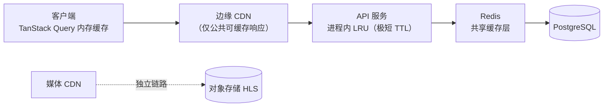

# 技术设计 — API 契约、缓存与错误分类学（API Contracts, Caching & Error Taxonomy）

> Wave 1 · 工作槽 **W1 WORK SLOT 2**（技术设计文档）。分支：`cursor/w1-technical-design-docs-8a32`。
> 文档定位、基线来源、不确定性标注约定见 `docs/design/domain-model.md` §0。

## 0. 与 `docs/12-api-contracts.md` 的关系

`docs/12-api-contracts.md`（W1B）是**端点、字段、枚举的唯一权威**。本文不重复它已定义的内容，也不改写它。本文补齐它未覆盖、而实现必须回答的四类问题：

| 本文章节 | 补齐的缺口 | 为什么必须在 Wave 1 定 |
|---|---|---|
| §2 契约治理 | OpenAPI 单一事实源、生成物、兼容性门禁的具体机制 | 前后端并行开发的前提；`docs/03-tech-architecture.md` §9 已规划 `contracts/` 目录但未定义治理规则 |
| §4 缓存与新鲜度契约 | **全仓无任何缓存设计文档** —— 分层、TTL、失效、防击穿、个性化隔离 | 缓存错误直接导致越权观看与错误计费（`docs/design/domain-model.md` §7 已标出哪些视图不可公共缓存） |
| §5 错误分类学 | `docs/12-error-catalog.md` 是**平铺清单**，无分类轴 | 客户端拦截器需要按"类别"而非逐码写分支；否则每加一个码就要改客户端 |
| §6 缺口端点草案 | P2 差距 `G1`–`G4` / P3 冲突 `C1`/`C2`/`C10` 对应的端点尚不存在 | 广告解锁与订阅是官方**必接能力**，无端点则无法过审 |
| §7 Mock 契约 | 前端脱离后端开发的假数据规格 | `docs/00-wave-plan.md` 的并行波次依赖 mock |

本文提出的端点与字段一律标注为**「提案（PROPOSAL）」**，须经 W1B 裁决后并入 `docs/12-api-contracts.md` 才生效。差异登记于 §10，编号前缀 `AC-`。

---

## 1. 沿用的全局约定（不复述，仅列指针）

| 主题 | 权威位置 |
|---|---|
| Base URL、内容类型、camelCase、UTC ISO-8601、`null` 不省略 | `docs/12-api-contracts.md` §2.1 |
| 认证（Bearer JWT，匿名可读） | 同上 §2.2（Minis 端会话形态见 P3 冲突 `C8`） |
| 游标分页信封 `{ items, pageInfo }` | 同上 §2.3 |
| 幂等（`Idempotency-Key`，24h） | 同上 §2.4 |
| 错误信封 `{ error: { code, message, details, traceId } }` | 同上 §2.5 |
| HTTP 状态码使用约定 | 同上 §5 |
| 错误码目录 | `docs/12-error-catalog.md` |

---

## 2. 契约治理

### 2.1 单一事实源

```text
contracts/openapi.yaml        ← OpenAPI 3.1，人工维护，评审对象
        │
        ├─ 生成 → packages/shared/src/types/api.d.ts   （前后端共享 DTO 类型）
        ├─ 生成 → packages/shared/src/errors.ts        （错误码枚举，由 error-catalog 表生成）
        ├─ 生成 → app/src/api/client.ts                （类型安全的请求客户端）
        ├─ 生成 → mocks/handlers.generated.ts          （MSW 基础桩，见 §7）
        └─ 校验 → server 路由的 TypeBox schema         （运行时校验与 OpenAPI 同源，D5）
```

规则：

1. **生成物入库但禁止手改**，CI 校验「重新生成后 `git diff` 为空」。这是把"文档与实现漂移"变成机器可检测问题的唯一办法。
2. 服务端 schema 与 OpenAPI 同源（TypeBox → OpenAPI 导出），而非各写一份。
3. `docs/12-api-contracts.md` 与 `contracts/openapi.yaml` 的关系：**Markdown 是设计意图与理由，YAML 是机器契约**。二者不一致时以 YAML 为准并回写 Markdown；CI 无法自动校验散文与 YAML 的一致性，故在 PR 模板中设检查项。

### 2.2 兼容性门禁

| 变更类型 | 判定 | 处置 |
|---|---|---|
| 新增可选字段 / 新增端点 / 新增枚举值（响应侧） | 兼容 | 直接放行 |
| 新增枚举值（**请求侧**） | 兼容（服务端接受更多） | 放行，但客户端需能忽略未知值 |
| 删除字段 / 改字段类型 / 收窄枚举 / 改必填性 | **破坏性** | CI（`oasdiff`）红灯；须走 §2.3 弃用流程或升 `/api/v2` |
| 新增错误码 | 兼容 | 必须先登记 `docs/12-error-catalog.md`（该目录规定"只增不改不删"） |
| 改错误码的 HTTP 映射 | **破坏性** | 客户端可能按状态码分支，等同改契约 |

门禁工具按 P3 `C11` 裁决建议：Wave 1–2 用 **OpenAPI 兼容 diff（oasdiff）+ provider schema 校验**，Pact 式 CDC 推迟到出现第二类客户端。**此为工具裁剪，不降低门禁强度**。

### 2.3 弃用流程

「先加后删 + ≥2 发布周期弃用窗口」（`docs/03-nonfunctional.md` §8）的可执行形式：

1. 新字段上线，旧字段标 `deprecated: true` 并在 `description` 注明替代者与移除版本。
2. 服务端为旧字段的读取埋点计数（按客户端版本聚合）。
3. 计数归零且已过 2 个发布周期 → 移除。

**Minis 形态的特殊性**：客户端版本由 TikTok 平台分发，同时在线最多 2 个版本（生产 + 灰度，`docs/11-official-onboarding-checklist.md` E15），且灰度回滚由平台控制。这意味着**旧客户端的存活窗口比自有 App 短且可控**，但也意味着服务端**不能假设所有用户都已升级** —— 弃用窗口按发布周期而非按用户比例计算。

---

## 3. 客户端配置端点的扩展（提案）

`GET /config`（`docs/12-api-contracts.md` §4.10）是所有运行期开关的下发点。本文设计中若干决策依赖新增字段，汇总为一次提案：

```jsonc
// PROPOSAL：GET /config 扩展（新增项已注明来源）
{
  "features": {
    "comments": true,
    "adUnlock": true,          // C10 裁决建议：首发 true
    "subscription": true,      // G4：订阅为必接能力，需开关以应对 IAP 未开通
    "search": false            // G5：搜索未定，先留开关位
  },
  "playback": {
    "progressHeartbeatSec": 10,
    "defaultQuality": "720p",          // PS-4：起播档由服务端控制
    "freeEpisodeMaxQuality": "720p",   // PS-4：成本护栏（03-nonfunctional §9）
    "autoNextEpisode": true,           // PS-5
    "stallDegradeAfterMs": 8000,       // CN-6，避免客户端硬编码
    "startTimeoutMs": 15000            // CN-10
  },
  "wallet": { "coinName": "看点", "currency": "USD" },   // DM-4/C9：币种随区域
  "limits": { "eventBatchSize": 50, "commentMaxLength": 300 }
}
```

设计理由：**凡是"可能被运营调整"或"随区域变化"的数值，都不应硬编码在客户端**。Minis 客户端的发版要经平台审核（`docs/11-official-onboarding-checklist.md` E12），改一个超时常量也要走完整送审流程 —— 把这些数值放进 `/config` 是应对平台发版成本的直接措施。

`/config` 自身的失败降级已由 `docs/02-information-architecture.md` §8.4 定义（用内置保守默认值）。**内置默认值必须与上表取值一致或更保守**，作为代码评审检查项。

---

## 4. 缓存与新鲜度契约

### 4.1 分层拓扑



四条纪律，全部是**红线**：

| # | 纪律 | 违反后果 |
|---|---|---|
| CA-1 | **任何带个性化字段的响应禁止进入 CDN 或任何共享缓存**（`Cache-Control: private, no-store`） | `viewerAccess` 被跨用户复用 = 越权观看付费内容（资损 + 版权） |
| CA-2 | 缓存键必须包含所有影响结果的维度（区域、语言、内容版本），**并且用户维度的缓存只放 Redis 且键含 `userId`** | 串号 |
| CA-3 | 资金类响应（钱包、订单、流水）**永不缓存**，包括客户端 | 用户看到过期余额后发起解锁，产生可预期的失败与客诉 |
| CA-4 | 缓存不是唯一事实源；Redis 全量可丢弃重建（`docs/03-tech-architecture.md` §5） | 缓存故障升级为业务不可用 |

### 4.2 端点缓存策略表（规范性）

`可公共缓存` 一栏直接继承 `docs/design/domain-model.md` §7 的视图对象分析。

| 端点 | 公共可缓存 | `Cache-Control` | 服务端缓存 | TTL | 备注 |
|---|---|---|---|---|---|
| `GET /config` | 是 | `public, max-age=60, stale-while-revalidate=300` | Redis | 60s | 功能开关；`stale-while-revalidate` 让开关变更最迟 5 分钟全量生效 |
| `GET /dramas`（列表） | 是 | `public, max-age=60` | Redis | 60s | 与 `docs/03-nonfunctional.md` §4「feed/详情 Redis 缓存 TTL 60s」一致 |
| `GET /dramas/{id}` | **视登录态而定** | 匿名 `public, max-age=60`；登录 `private, no-store` | Redis 缓存**公共部分** | 60s | `DramaDetail.viewer` 是个性化字段（CA-1）。设计：Redis 只缓存 `DramaDetail` 去掉 `viewer` 的部分，`viewer` 每次实时查后拼装 |
| `GET /dramas/{id}/episodes` | 同上 | 同上 | 同上 | 60s | `EpisodeItem.viewerAccess` 个性化，拼装策略同上；`viewerAccessBatch` 见 `docs/design/domain-model.md` §3.7 |
| `GET /episodes/{id}` | 同上 | 同上 | 同上 | 60s | |
| `POST /episodes/{id}/playback-token` | **否** | `no-store` | 否 | — | 权益判定 + 短时效签名；缓存即防盗链失效 |
| `GET /recommendations/feed?scene=` | 部分 | `private, no-store` | Redis（按 `scene` + 分桶） | 30s | `CONTINUE_WATCHING` 卡个性化。**首版为规则混排**（`docs/12-domain-model.md` §8），公共部分（热门榜）可缓存，个性化卡实时拼装 |
| `GET /wallet` / `/wallet/transactions` / `/wallet/recharge-orders/{id}` | 否 | `no-store` | 否 | — | CA-3 |
| `GET /wallet/products` | 是 | `public, max-age=300` | Redis | 300s | 档位表变更低频；**但价格变更需可主动失效**（见 §4.5） |
| `GET /users/me` / `/users/me/*` | 否 | `private, no-store` | 否 | — | |
| `GET /progress/dramas/{id}` | 否 | `private, no-store` | Redis（进度缓冲，键含 `userId`） | 见 §4.4 | 读优先命中进度缓冲 |
| `GET /episodes/{id}/comments` | 是（`sort=HOT`） | `public, max-age=30` | Redis | 30s | `viewerLiked` 是个性化字段 → 与 §4.3 同样的"公共体 + 个性化拼装"处理 |
| `POST /events/batch` | 否 | `no-store` | — | — | 写接口 |

**"公共体 + 个性化拼装"是本设计的核心模式**：把响应拆成"内容部分（所有人相同）"与"视角部分（每人不同）"，只缓存前者。这让内容读接口在热剧突发（平峰 5 倍，`docs/03-nonfunctional.md` §4）下仍能靠缓存扛住，同时结构性地杜绝了 CA-1 类越权。代价是每个读端点要做一次拼装，属可接受的实现复杂度。

### 4.3 HTTP 缓存头与条件请求

| 头 | 使用 |
|---|---|
| `ETag` | 内容读接口返回**弱 ETag**，值 = 内容版本哈希（`drama.updated_at` + 集列表版本）。客户端 `If-None-Match` 命中返回 `304`，省掉列表 body（首屏总传输 ≤800KB 预算的直接支撑，`docs/03-nonfunctional.md` §2） |
| `Vary` | `Accept-Language`（C9：`message` 与展示文案按语言下发）、`Authorization`（防匿名/登录响应互串 —— 但由于登录态一律 `private, no-store`，`Vary: Authorization` 是纵深防御而非主要手段） |
| `Cache-Control` | 按 §4.2 表；**默认值为 `no-store`**，需要缓存的端点显式声明。默认不缓存而非默认缓存，是 CA-1 的工程化保障 |
| `Age` / `Date` | 由 CDN 维护，用于排障 |

### 4.4 Redis 键规范与 TTL

统一前缀便于按前缀清理与容量分析：

| 键模式 | 值 | TTL | 用途 |
|---|---|---|---|
| `c:drama:{dramaId}:v{contentVer}` | `DramaDetail` 公共体（JSON） | 60s | 详情读 |
| `c:eplist:{dramaId}:{cursor}:v{contentVer}` | `EpisodeItem[]` 公共体 | 60s | 集列表读 |
| `c:dramalist:{sort}:{category}:{tag}:{cursor}` | `DramaSummary[]` | 60s | 列表读 |
| `c:config:{region}:{lang}` | `/config` 响应 | 60s | 配置读 |
| `c:products:{region}` | 充值档位 | 300s | 档位读 |
| `p:{userId}` (Hash, field=`episodeId`) | 进度缓冲 | 7d（滑动） | 进度写缓冲 + 读加速（`docs/design/domain-model.md` §4.5） |
| `idem:{userId}:{key}` | 幂等结果（状态码 + body 哈希 + body） | 24h | `docs/12-api-contracts.md` §2.4 |
| `rl:{bucket}:{subject}` | 限流计数 | 窗口长度 | 限流桶 |
| `sess:revoked:{jti}` | 吊销标记 | 至令牌自然过期 | 会话吊销名单 |
| `lock:{resource}` | 单飞锁 | 5s | 防击穿（§4.6） |

`contentVer` 是**内容全局版本号**（Redis 单调计数器），内容发布/下架时自增。把版本嵌进键，使失效变成"换键"而非"删键" —— 无需遍历，且天然避免删除失败导致的脏读。

### 4.5 失效策略

| 触发 | 失效动作 | 时限要求 |
|---|---|---|
| 内容上下架（`status` 变更） | `contentVer++`（全局换键） + CDN 按 URL 前缀刷新 + 播放令牌签发拒绝 | **≤5 分钟全端生效**（`docs/14-security.md` §7.3）。三者缺一不可：只清缓存而 CDN 仍有旧副本 = 下架无效 |
| 单剧元数据编辑 | 删 `c:drama:{dramaId}:*` 与相关列表键 | 分钟级 |
| 充值档位变更 | 删 `c:products:*` | 立即（价格是资金相关，不接受最终一致） |
| 功能开关变更 | 删 `c:config:*` | ≤5 分钟（`stale-while-revalidate` 窗口内） |
| 用户解锁成功 | **无需失效公共缓存**（个性化部分本就不缓存） | — |
| 用户进度上报 | 直接更新 `p:{userId}` | 立即 |

**下架失效是全链路动作**，本表把它写成一个原子的运维动作而非三个独立步骤，是因为 `docs/14-security.md` 的 5 分钟要求只有三者同时完成才成立。实现上应封装为单个 `takedown(contentId)` 用例并纳入应急演练（`docs/03-nonfunctional.md` §6）。

### 4.6 击穿 / 雪崩 / 穿透防护

| 问题 | 场景 | 措施 |
|---|---|---|
| 缓存击穿 | 热剧上线，单个热键过期瞬间大量请求打到 PG | **单飞（single-flight）**：`lock:{key}` 抢锁，抢到的回源，其余等待 ≤200ms 后读缓存；超时则降级直接回源（宁可多打几次库，不阻塞用户） |
| 缓存雪崩 | 大量键同时过期 | TTL 加 ±10% 随机抖动 |
| 缓存穿透 | 恶意请求不存在的 `dramaId`（ULID 空间大，但可枚举日志泄漏的 ID） | **负缓存**：`404` 结果缓存 10s（短 TTL，避免新内容上线延迟可见）；叠加限流 |
| 热点倾斜 | 单剧占据大部分流量 | 进程内 LRU（TTL 1–2s）吸收同一实例内的重复请求，作为 Redis 之前的一层；容量小（≤2000 条），只为削尖峰 |

### 4.7 客户端缓存策略（TanStack Query）

`docs/03-stack-decision.md` D4 选定 TanStack Query 管服务端状态，但未定义缓存参数。规范如下：

| 查询 | `staleTime` | `gcTime` | 刷新触发 |
|---|---|---|---|
| `/config` | 5min | 会话期 | 启动、回前台 |
| 剧列表 / 推荐流 | 60s | 5min | 下拉刷新、回前台超过 5min |
| 剧详情 / 集列表 | 60s | 5min | 解锁成功后**主动 invalidate**（`viewerAccess` 变了） |
| `/wallet` | **0**（总是过期） | 0 | 每次打开钱包/解锁面板必拉；充值到账后 invalidate |
| `/users/me` | 60s | 会话期 | 登录、VIP 变更后 invalidate |
| 进度 | 30s | 5min | 本地乐观更新为主，服务端为准 |
| 播放令牌 | **不走 Query 缓存** | — | 由播放器状态机的 `TokenRegion` 管理（`docs/design/player-state-machine.md` §4.1） |

**写操作后的失效映射**（避免"解锁了但列表还显示锁"这类经典 bug）：

| 成功的写操作 | 需 invalidate 的查询 |
|---|---|
| 单集/整剧解锁 | 该剧详情、该剧集列表、`/wallet`、`/users/me/unlocks` |
| 充值到账（轮询到 `CREDITED`） | `/wallet`、`/wallet/transactions`；若有待执行解锁意图则自动执行（J2 步 9） |
| 收藏/取消收藏 | 该剧详情（乐观更新，失败回滚）、`/users/me/favorites` |
| 发表评论 | 该集评论列表（乐观插入，标注"审核中"） |
| VIP 开通 | `/users/me`、当前剧详情与集列表（`viewerAccess` 全变） |

---

## 5. 错误分类学（Error Taxonomy）

### 5.1 为什么需要分类轴

`docs/12-error-catalog.md` 定义了约 40 个错误码并给出"客户端处理建议"表（§11），但那是**逐码枚举**。客户端拦截器若按码写分支，则：每新增一个错误码，所有客户端必须同步发版才能正确处理它 —— 而 Minis 客户端发版要过平台审核。

因此本文定义**正交分类轴**，让客户端按类别而非按码决策，未知错误码也能落入正确的默认行为。

### 5.2 分类轴

| 轴 | 取值 | 客户端语义 |
|---|---|---|
| `category` | `VALIDATION` / `AUTH` / `ENTITLEMENT` / `FUNDS` / `RESOURCE` / `RATE_LIMIT` / `DEPENDENCY` / `INTERNAL` | 决定 UI 呈现形态 |
| `retryable` | `NONE` / `MANUAL` / `AUTO` | `NONE`=终态错误（不给重试按钮）；`MANUAL`=给重试按钮；`AUTO`=拦截器自动退避重试 |
| `actionable` | `NONE` / `RECHARGE` / `UNLOCK` / `LOGIN` / `CONTACT_SUPPORT` / `NAVIGATE_AWAY` | 决定主行动按钮 |
| `fundsSensitive` | `true` / `false` | `true` 时**禁止自动重试**（即使 `retryable=AUTO`），必须用户显式确认 |

**分类轴与错误码的关系**：分类是码的属性，由服务端在错误目录中静态标注，**并在错误响应中下发**。这是本文的核心提案 `AC-1`：

```jsonc
// PROPOSAL AC-1：错误信封扩展（在 12-api-contracts §2.5 基础上新增三个字段）
{
  "error": {
    "code": "WALLET_INSUFFICIENT_BALANCE",
    "message": "余额不足，无法解锁本集",
    "details": { "requiredCoins": 300, "coinBalance": 100, "bonusBalance": 20 },
    "traceId": "01J6...",

    "category": "FUNDS",         // 新增
    "retryable": "NONE",         // 新增
    "actionable": "RECHARGE"     // 新增
  }
}
```

新增字段是**纯增量、向后兼容**的：现有客户端忽略即可。收益是客户端拦截器可以写成十几行的通用逻辑，而不是四十条 `switch` 分支；且服务端新增错误码时，老客户端因为拿到了 `category`/`retryable`，仍能给出合理行为而非白屏。

### 5.3 全码分类表（对 `docs/12-error-catalog.md` 的标注，不改写原表）

| 错误码 | HTTP | category | retryable | actionable | fundsSensitive |
|---|---|---|---|---|---|
| `COMMON_VALIDATION_FAILED` | 400 | VALIDATION | NONE | NONE | false |
| `COMMON_MALFORMED_REQUEST` | 400 | VALIDATION | NONE | NONE | false |
| `COMMON_IDEMPOTENCY_KEY_REQUIRED` | 400 | VALIDATION | NONE | NONE | false |
| `COMMON_IDEMPOTENCY_CONFLICT` | 409 | VALIDATION | NONE | CONTACT_SUPPORT | **true** |
| `COMMON_RESOURCE_NOT_FOUND` | 404 | RESOURCE | NONE | NAVIGATE_AWAY | false |
| `COMMON_RATE_LIMITED` | 429 | RATE_LIMIT | AUTO | NONE | false |
| `COMMON_INTERNAL_ERROR` | 500 | INTERNAL | MANUAL | NONE | false |
| `COMMON_SERVICE_UNAVAILABLE` | 503 | DEPENDENCY | AUTO | NONE | false |
| `AUTH_REQUIRED` | 401 | AUTH | MANUAL | LOGIN | false |
| `AUTH_TOKEN_INVALID` | 401 | AUTH | NONE | LOGIN | false |
| `AUTH_TOKEN_EXPIRED` | 401 | AUTH | AUTO | NONE | false |
| `AUTH_REFRESH_TOKEN_INVALID` | 401 | AUTH | NONE | LOGIN | false |
| `AUTH_SMS_CODE_INVALID` | 400 | VALIDATION | NONE | NONE | false |
| `AUTH_SMS_SEND_TOO_FREQUENT` | 429 | RATE_LIMIT | AUTO | NONE | false |
| `AUTH_PROVIDER_ERROR` | 502 | DEPENDENCY | MANUAL | LOGIN | false |
| `AUTH_USER_BANNED` | 403 | AUTH | NONE | CONTACT_SUPPORT | false |
| `USER_NOT_FOUND` | 404 | RESOURCE | NONE | NONE | false |
| `USER_NICKNAME_INVALID` | 400 | VALIDATION | NONE | NONE | false |
| `USER_PHONE_ALREADY_BOUND` | 409 | VALIDATION | NONE | CONTACT_SUPPORT | false |
| `USER_ALREADY_HAS_PHONE` | 409 | VALIDATION | NONE | NONE | false |
| `CONTENT_NOT_FOUND` | 404 | RESOURCE | NONE | NAVIGATE_AWAY | false |
| `CONTENT_OFFLINE` | 410 | RESOURCE | NONE | NAVIGATE_AWAY | false |
| `EPISODE_LOCKED` | 403 | ENTITLEMENT | NONE | UNLOCK | false |
| `EPISODE_VIP_REQUIRED` | 403 | ENTITLEMENT | NONE | UNLOCK | false |
| `EPISODE_ASSET_UNAVAILABLE` | 503 | DEPENDENCY | MANUAL | NONE | false |
| `UNLOCK_ALREADY_UNLOCKED` | 409 | ENTITLEMENT | NONE | NONE | false（视为成功） |
| `UNLOCK_POLICY_NOT_ALLOWED` | 422 | ENTITLEMENT | NONE | NONE | false |
| `UNLOCK_NOTHING_TO_UNLOCK` | 422 | ENTITLEMENT | NONE | NONE | false |
| `UNLOCK_PRICE_CHANGED` | 409 | FUNDS | MANUAL | UNLOCK | **true** |
| `WALLET_INSUFFICIENT_BALANCE` | 402 | FUNDS | NONE | RECHARGE | **true** |
| `WALLET_FROZEN` | 403 | FUNDS | NONE | CONTACT_SUPPORT | **true** |
| `WALLET_CONCURRENT_MODIFICATION` | 409 | FUNDS | MANUAL | NONE | **true**（原幂等键重试） |
| `PAYMENT_PRODUCT_NOT_FOUND` | 404 | RESOURCE | MANUAL | NONE | **true** |
| `PAYMENT_CHANNEL_UNAVAILABLE` | 503 | DEPENDENCY | MANUAL | NONE | **true** |
| `PAYMENT_ORDER_NOT_FOUND` | 404 | RESOURCE | NONE | CONTACT_SUPPORT | **true** |
| `PAYMENT_ORDER_CLOSED` | 409 | FUNDS | NONE | RECHARGE | **true** |
| `PAYMENT_CALLBACK_INVALID_SIGN` | 400 | AUTH | NONE | NONE | **true**（服务端间，不面向客户端） |
| `PROGRESS_INVALID_POSITION` | 400 | VALIDATION | NONE | NONE | false |
| `REC_SCENE_INVALID` | 400 | VALIDATION | NONE | NONE | false |
| `REC_EVENTS_BATCH_TOO_LARGE` | 400 | VALIDATION | NONE | NONE | false |
| `COMMENT_FEATURE_DISABLED` | 403 | ENTITLEMENT | NONE | NONE | false |
| `COMMENT_NOT_FOUND` | 404 | RESOURCE | NONE | NONE | false |
| `COMMENT_CONTENT_INVALID` | 400 | VALIDATION | NONE | NONE | false |
| `COMMENT_REJECTED` | 422 | VALIDATION | NONE | NONE | false |
| `COMMENT_NOT_OWNER` | 403 | ENTITLEMENT | NONE | NONE | false |
| `COMMENT_REPLY_DEPTH_EXCEEDED` | 422 | VALIDATION | NONE | NONE | false |
| `COMMENT_USER_MUTED` | 403 | ENTITLEMENT | NONE | CONTACT_SUPPORT | false |

`fundsSensitive=true` 的码共 11 个。它们的共同约束：**拦截器绝不自动重试，绝不静默吞掉，必须留下可追溯的 `traceId` 展示入口**（`docs/12-api-contracts.md` §2.5 的 `traceId` 就是为此存在）。

### 5.4 平台/桥接错误类（契约外，客户端内部）

TikTok SDK 调用失败不产生 HTTP 错误响应，`docs/12-error-catalog.md` 也未覆盖。但它们必须与业务错误共用同一套 UI 处理，否则平台失败会以裸异常形式白屏。定义客户端内部错误族（**不进 API 契约**）：

| 内部码 | 触发 | category | retryable | actionable |
|---|---|---|---|---|
| `BRIDGE_NOT_AVAILABLE` | `window.TTMinis` 不存在（非 TikTok 宿主 / SDK 加载失败） | DEPENDENCY | MANUAL | NONE |
| `BRIDGE_NOT_INITIALIZED` | 在 `TTMinis.init` 之前调用（官方硬约束，S5） | INTERNAL | NONE | NONE |
| `BRIDGE_CAPABILITY_UNSUPPORTED` | `canIUse` 返回 false（宿主版本低于最低 SDK 版本，C7 配置项） | DEPENDENCY | NONE | NONE（隐藏入口） |
| `BRIDGE_USER_CANCELLED` | 用户取消支付/关闭广告 | VALIDATION | MANUAL | NONE（**不报错，不打扰**） |
| `BRIDGE_AD_NOT_COMPLETED` | 激励视频 `isEnded !== true` | ENTITLEMENT | MANUAL | NONE |
| `BRIDGE_TIMEOUT` | SDK 调用超时未回调 | DEPENDENCY | MANUAL | NONE |
| `BRIDGE_UNKNOWN` | SDK 返回未文档化的错误 `[未知]` | DEPENDENCY | MANUAL | CONTACT_SUPPORT |

`BRIDGE_USER_CANCELLED` 的 `actionable=NONE` 且不弹错误提示，是刻意的：用户主动取消支付不是错误，弹"支付失败"是本类产品最常见的体验缺陷之一。

**`BRIDGE_UNKNOWN` 是不确定性的兜底**：官方 SDK 的错误码全集 `[未知]`（官方公开文档未列出完整错误枚举），因此桥接层必须把任何未识别的失败归一化到此码，**绝不允许原始异常穿透到 UI**。这是 `docs/design/minis-integration.md` §5.2 的错误归一化要求在错误分类学侧的对应项。

### 5.5 客户端处理决策树

```text
收到错误
 ├─ 是桥接错误？ → 用 §5.4 表 → 按 category/retryable/actionable 处理
 └─ 是 HTTP 错误
     ├─ code == AUTH_TOKEN_EXPIRED → 静默刷新 + 重放（至多 1 次），业务层无感
     ├─ fundsSensitive == true → 绝不自动重试；展示 message + traceId 入口 + actionable 按钮
     ├─ retryable == AUTO → 按 details.retryAfterSec（缺省指数退避）自动重试，上限 3 次
     ├─ retryable == MANUAL → 渲染"可重试错误态"（IA §8.1）+ 重试按钮
     └─ retryable == NONE
         ├─ category == ENTITLEMENT → 就地渲染解锁/VIP 面板（不导航）
         ├─ category == RESOURCE   → 渲染"终态错误"+ 回首页出口
         └─ 其他                    → 渲染 message + actionable 按钮
未知 code（新服务端 + 老客户端）→ 完全依赖 category/retryable/actionable 三字段（AC-1 的核心价值）
```

该决策树与 `docs/12-error-catalog.md` §11 的逐码建议**完全一致**，本文只是把它从"码表"重构为"规则"，行为不变。

---

## 6. 缺口端点草案（PROPOSAL，待 W1B 裁决）

以下端点对应 P2 差距 `G1`–`G4` 与 P3 冲突 `C1`/`C2`/`C10`。**本文只给草案与理由，不视为已生效契约。**

### 6.1 登录：新增 TIKTOK provider（对应 C1 / G1）

```jsonc
// POST /auth/login
{ "provider": "TIKTOK", "authCode": "<TTMinis.login 返回的临时 code>" }
```

- 响应结构不变（`docs/12-api-contracts.md` §4.1）。
- Minis 首发**仅启用 `TIKTOK`**；`PHONE`/`WECHAT`/`DEVICE` 标注"非 Minis 端预留"，`POST /auth/sms-codes` 同标注。
- 与 P3 `C8` 的会话形态联动：Minis 端 accessToken 仅内存态，失效走 `TTMinis.login` 静默重登，**客户端不存 refreshToken**。因此 `POST /auth/refresh` 在 Minis 端不被调用（契约保留给未来端）。

### 6.2 支付：新增 TIKTOK_BEANS 渠道（对应 C2 / G2）

```jsonc
// POST /wallet/recharge-orders  →  201
{
  "orderId": "ord_01J6...",
  "status": "PENDING",
  "amountCents": 990,
  "currency": "USD",                      // DM-4 / C9
  "paymentChannel": "TIKTOK_BEANS",
  "paymentPayload": {
    "tradeOrderId": "<TikTok trade_order_id>"   // 客户端透传给 TTMinis.pay
  }
}
```

- `paymentPayload` 的结构**按渠道而异**（原契约已如此约定），Beans 渠道下约定必含 `tradeOrderId`。
- **客户端永不以 `TTMinis.pay` 的前端回调作为入账依据**，一律轮询 `GET /wallet/recharge-orders/{orderId}` 至 `CREDITED`（`docs/02-user-journeys.md` J11 已定，此处仅重申，因为它是资损防线）。
- 轮询策略提案：首 5 次间隔 1s，之后 2s，总时长 60s；超时转"到账确认中"横幅（SCR-09），后台继续查询。webhook P95 ≤2s（`docs/03-nonfunctional.md` §3），60s 窗口有充分余量。

### 6.3 广告解锁（对应 C10 / G3）

官方必接能力（`docs/11-official-onboarding-checklist.md` D5），当前无端点。

```jsonc
// POST /episodes/{episodeId}/ad-unlock     要求 Idempotency-Key
// 请求
{ "adUnitId": "<广告位 ID>", "adSessionId": "<客户端广告会话标识>" }

// 200
{
  "unlock": { "id": "ulk_...", "episodeId": "ep_...", "method": "AD", "costCoins": 0, "costBonus": 0 },
  "quota": { "usedToday": 3, "dailyLimit": 5 }
}
```

设计要点（对应官方最佳实践 S9 与 `docs/11-api-and-bridge.md` §4.3 的风控双轨）：

1. **服务端必须二次校验**，不能只信客户端上报的 `isEnded=true`。校验方式 `[未知]` —— 官方公开文档未说明是否提供广告展示的服务端校验接口。**在确认前，实现以「可替换的校验器接口」隔离**，Wave 1 的默认实现为"信任客户端 + 全量发奖日志 + 次数上限 + 异常账号风控"，这与官方"前端发放 + 后端记录双轨"的表述一致（S9），但强度低于真正的服务端校验。登记为 `AC-4`。
2. 次数上限（`dailyLimit`）由 `/config` 或服务端配置下发，对应 `docs/12-domain-model.md` §12 开放问题 2。
3. 新增错误码提案：`AD_QUOTA_EXCEEDED`（429，`details: { usedToday, dailyLimit, resetAt }`，category=ENTITLEMENT/retryable=NONE）、`AD_NOT_COMPLETED`（422，category=ENTITLEMENT）、`AD_UNAVAILABLE`（503，category=DEPENDENCY）。

### 6.4 订阅（对应 G4）

官方必接能力（D8）。当前 VIP 建模为 `RechargeOrder(productType=VIP)`，但平台侧订阅必须走 `TTMinis.createSubscription`。

```jsonc
// GET /subscriptions/plans → 档位（含平台 tier 映射）
// POST /subscriptions   要求 Idempotency-Key
{ "planId": "plan_..." }
// → 201
{
  "subscriptionId": "sub_...",
  "status": "PENDING",
  "paymentPayload": { "tradeOrderId": "..." }
}
// GET /subscriptions/me → { active, plan, currentPeriodEnd, autoRenew, status }
```

- 状态机 `[待验证]`：续费、退订、宽限期（grace period）的事件全集依赖订阅 webhook 明细（`docs/11-api-and-bridge.md` Q3，`[未知]`）。**因此本草案只定义我方对外的最小状态集**（`PENDING`/`ACTIVE`/`CANCELED`/`EXPIRED`），平台侧细粒度状态在适配层映射，映射表待 Q3 澄清后补。
- 与 `user.vip` 的关系：订阅同步任务定期拉取活跃订阅列表（官方 Server API 提供），刷新 `app_user.vip_expires_at`（`docs/design/domain-model.md` §4.3）。**`vip_active` 不由客户端回调驱动。**
- W1 决策不变：首发主线是 Beans 单点解锁 + 广告解锁，订阅按必接要求完成集成但为二期运营重点（`docs/11-api-and-bridge.md` §4.4）。

### 6.5 端点清单增量汇总

| 端点 | 对应差距 | 必要性 |
|---|---|---|
| `POST /auth/login`（+`TIKTOK`） | C1 / G1 | **过审必需**（登录是代码扫描核查项 E6） |
| `POST /wallet/recharge-orders`（+`TIKTOK_BEANS`） | C2 / G2 | **变现必需** |
| `POST /episodes/{id}/ad-unlock` | C10 / G3 | **过审必需**（IAA 必接） |
| `GET /subscriptions/plans`、`POST /subscriptions`、`GET /subscriptions/me` | G4 | **过审必需**（IAP 订阅必接） |
| `POST /payments/callbacks/tiktok`（服务端间） | — | webhook 落点，`docs/design/minis-integration.md` §6.2 |
| 搜索端点 | G5 | 产品未定，不阻塞 |

---

## 7. Mock 契约与假数据规格

### 7.1 三层 Mock

并行开发需要三个层次的假实现，各自边界清晰：

| 层 | 工具 | 替换的东西 | 用于 |
|---|---|---|---|
| L1 平台桥接 Mock | `MockBridge`（`docs/11-api-and-bridge.md` §5.2 已定契约） | `window.TTMinis` | 本地浏览器开发、组件单测 |
| L2 API Mock（进程内） | MSW（Mock Service Worker） | 网络层 | 前端开发、组件/集成测试、E2E 的确定性场景 |
| L3 契约 Mock（独立进程） | Prism（由 `contracts/openapi.yaml` 驱动） | 整个后端 | 前端联调、契约回归 —— **保证 mock 不会偏离契约**，因为它由契约生成 |

L2 与 L3 的分工：L3 保证**结构**正确（字段名、类型、必填性由 OpenAPI 强制），L2 提供**语义**正确的场景数据（黄金路径、错误分支）。只有 L2 会因契约变更而漂移，故 L2 的 handler 基础桩由 OpenAPI 生成（§2.1）。

### 7.2 Fixture 数据集规格

固定种子数据（`fixtures/` 目录，JSON，前后端共用），使 E2E 断言可写死：

**内容集**：

| 剧 ID | 特征 | 用途 |
|---|---|---|
| `drm_fixture_free` | 10 集全免费 | 匿名播放、黄金路径起点 |
| `drm_fixture_paywall` | 80 集，`freeEpisodes=5`，第 6 集起 `COIN_OR_VIP`，`priceCoins=300` | 付费墙、解锁、整剧解锁 |
| `drm_fixture_viponly` | 20 集，第 3 集起 `VIP_ONLY` | `NEED_VIP` 分支 |
| `drm_fixture_multiseason` | 2 季 × 40 集 | `globalEpisodeNumber`（DM-1）与扁平化列表 |
| `drm_fixture_offline` | 状态 `OFFLINE` | `410 CONTENT_OFFLINE`（J13 全触点） |
| `drm_fixture_draft` | 状态 `DRAFT` | `404`（DM-2：草稿等价不存在） |
| `drm_fixture_transcoding` | 集有资源但 `ready=false` | `503 EPISODE_ASSET_UNAVAILABLE` |
| `drm_fixture_longtail` × 50 | 用于列表分页与推荐流 | 游标分页、feed |

**账户矩阵**：

| 账户 | 余额 | VIP | 解锁 | 状态 | 用途 |
|---|---|---|---|---|---|
| `usr_fx_anon` | — | — | — | 匿名 | 匿名可读、`AUTH_REQUIRED` |
| `usr_fx_poor` | 0 币 / 0 赠币 | 否 | 无 | ACTIVE | `WALLET_INSUFFICIENT_BALANCE` |
| `usr_fx_rich` | 100000 币 | 否 | 无 | ACTIVE | 解锁黄金路径、整剧解锁 |
| `usr_fx_mixed` | 100 币 / 20 赠币 | 否 | 第 6 集已解锁 | ACTIVE | 先赠币后充值币的扣费顺序断言 |
| `usr_fx_vip` | 0 | 是（未到期） | 无 | ACTIVE | VIP 可看路径 |
| `usr_fx_vip_expired` | 0 | 是（已到期） | 第 6 集曾用币解锁 | ACTIVE | **DM-3 的关键用例**：VIP 到期后已购集仍可看 |
| `usr_fx_banned` | — | — | — | BANNED | `AUTH_USER_BANNED`（J14） |
| `usr_fx_frozen` | 500 币 | 否 | 无 | 钱包冻结 | `WALLET_FROZEN` |

`usr_fx_vip_expired` 这条 fixture 存在的意义：它是 `docs/design/domain-model.md` §3.6 中"Unlock 凭证优先于 VIP 身份"这条设计决策的唯一可执行验证，没有它该决策就只是散文。

### 7.3 场景开关（错误分支的确定性触发）

E2E 需要可靠触发错误分支（超时、429、5xx、支付失败），不能靠碰运气。约定 mock 层识别请求头：

```http
X-Mock-Scenario: payment.webhook_delayed
X-Mock-Scenario: playback.token_expires_in_5s
X-Mock-Scenario: network.timeout
X-Mock-Scenario: unlock.price_changed
```

| 场景键 | 效果 | 覆盖的旅程/状态 |
|---|---|---|
| `network.timeout` | 请求挂起超过客户端超时 | J12-2、`errorRetryable` |
| `network.flaky` | 50% 失败 | 弱网横幅、重试逻辑 |
| `playback.token_expires_in_5s` | 令牌 `expiresAt` 极短 | `TokenRegion` 的 `nearExpiry`/`refreshing`（CN-8） |
| `playback.locked` | 令牌返回 `403 EPISODE_LOCKED` | `locked` 状态 + 解锁面板 |
| `playback.offline` | 返回 `410` | `errorTerminal`、J13 |
| `payment.webhook_delayed` | 订单停在 `PAID` 30s 后才 `CREDITED` | J11「到账确认中」横幅 |
| `payment.channel_down` | `503 PAYMENT_CHANNEL_UNAVAILABLE` | 通道置灰 |
| `unlock.price_changed` | `409 UNLOCK_PRICE_CHANGED` | 重新报价确认 |
| `unlock.concurrent` | `409 WALLET_CONCURRENT_MODIFICATION` | 原幂等键重试 |
| `ad.not_completed` | 广告解锁返回 `AD_NOT_COMPLETED` | J5 分支 |
| `rate_limit` | `429` + `Retry-After` | 退避逻辑 |

**该头仅在 mock 层与 staging 生效，生产环境必须忽略并告警**——这是安全检查项，纳入 `docs/14-security.md` 的评审范围。

### 7.4 Mock 与真实实现的一致性门禁

Mock 最大的风险是"前端对着 mock 开发得很顺，接真后端全挂"。三道门禁：

| # | 门禁 | 机制 |
|---|---|---|
| MG-1 | Mock 响应必须通过 OpenAPI schema 校验 | CI 中用契约校验 MSW handler 的所有响应样本 |
| MG-2 | 真实后端必须通过同一 schema 校验 | provider schema 校验（§2.2） |
| MG-3 | 每个 fixture 场景在 staging 有对应的真实数据 | staging 种子脚本与 `fixtures/` 同源，E2E 同一套用例既跑 mock 又跑 staging |

MG-3 是关键：**同一份 E2E 用例在 mock 与 staging 两处运行**，二者行为不一致时立即暴露。

---

## 8. 限流与配额（设计规格）

`docs/12-api-contracts.md` §2.6 规定限流返回 `429 + COMMON_RATE_LIMITED + Retry-After`，但未定义桶。规格如下（数值为**建议初值**，上线后按实际调整）：

| 桶 | 主体 | 限额 | 理由 |
|---|---|---|---|
| 全局读 | userId 或 IP | 300 req/min | 保护读链路 |
| 播放令牌签发 | userId | 60 req/min + **并发播放数 ≤3** | 防盗链风控（`docs/14-security.md` §5.1「取址限流」） |
| 解锁 / 下单 | userId | 20 req/min | 资金操作，宽松即可（正常用户远低于此） |
| 进度心跳 | userId | 30 req/min | 独立宽松桶（`docs/12-api-contracts.md` §2.6） |
| 埋点批量 | userId | 60 req/min（每批 ≤50 条） | 独立宽松桶 |
| 短信验证码 | phone + IP | 1/min，5/天 | 非 Minis 端预留 |
| 评论发表 | userId | 10 req/min | 反刷屏 |
| webhook 入站 | 源 IP + 签名 | 不限流，但**验签失败计数触发告警** | 平台回调不可限流（丢回调 = 丢钱） |

**并发播放数 ≤3** 是防盗链的重要一环（一个账号同时取址播放多路 = 典型的账号共享/盗链特征），落点在播放令牌签发，与 `docs/design/player-state-machine.md` §7 的"至多 3 个 video 实例"数值一致但**目的不同**：前者是风控，后者是内存。二者恰好同值属巧合，不应在实现中共用常量。

---

## 9. 与官方约束的契约级映射

| 官方约束 | 契约层落点 |
|---|---|
| 运行时请求仅限声明域名（E9）、可信域名 ≤20（C13） | 所有 API 收敛到 `https://api.<domain>` 单域，媒体 `https://media.<domain>` 单域（`docs/03-nonfunctional.md` §5）。**契约层纪律：禁止引入第三方直连域名**（如前端直传审核服务），一律经后端代理 |
| 应用必须兼容英文（E14） | `Accept-Language` 驱动 `message` 与展示文案，`en` 为必备（C9）；`Vary: Accept-Language` |
| 首发必须全量发布（E13）、同时在线 ≤2 个版本（E15） | 契约演进必须假设"老客户端在一段时间内持续存在"，强化 §2.3 弃用流程；且**服务端不能靠强制升级解决兼容问题** |
| webhook 验签 + 幂等 + 发货（S10） | `POST /payments/callbacks/tiktok`，实现见 `docs/design/minis-integration.md` §6.2 |
| `client_secret` 仅存后端 | 契约层无任何字段承载 secret；`paymentPayload` 只含 `tradeOrderId` |

---

## 10. 差异登记与开放问题

### 10.1 差异登记（提案，待裁决）

| # | 事项 | 涉及文档 | 建议 | 建议裁决人 |
|---|---|---|---|---|
| AC-1 | 错误信封缺分类字段，客户端只能按码写分支；老客户端遇新码无合理默认行为 | `docs/12-api-contracts.md` §2.5、`docs/12-error-catalog.md` | 信封增 `category` / `retryable` / `actionable` 三字段（纯增量兼容），目录表增三列（本文 §5.3 已给全量标注） | W1B |
| AC-2 | 无缓存契约：端点未声明可缓存性，`Cache-Control` 默认值未定义 | `docs/12-api-contracts.md` | 采纳本文 §4.2 策略表；契约层为每个端点声明缓存语义，**默认 `no-store`** | W1B |
| AC-3 | `GET /config` 字段不足以覆盖需服务端控制的运行期参数 | `docs/12-api-contracts.md` §4.10 | 采纳本文 §3 扩展（含 PS-4/PS-5 所需字段） | W1B |
| AC-4 | 广告解锁的服务端校验方式未知，可能只能做到"信任客户端 + 日志" | `docs/11-api-and-bridge.md` §4.3、本文 §6.3 | 以可替换校验器接口隔离；向 TikTok 对接人确认是否有服务端校验能力 `[未知]` | W1A + W1B |
| AC-5 | 限流桶未定义具体限额 | `docs/12-api-contracts.md` §2.6 | 采纳本文 §8 建议初值 | W1B + P3 |
| AC-6 | 幂等键作用域未明确是全局唯一还是用户内唯一 | `docs/12-api-contracts.md` §2.4 | 明确为**用户内唯一**（`(userId, idempotencyKey)`，见 `docs/design/domain-model.md` §4.1），避免跨用户 UUID 碰撞互拒 | W1B |
| AC-7 | 分页游标的内部结构未定义，同分并列时可能漏行/重复行 | `docs/12-api-contracts.md` §2.3 | 明确游标为"排序键 + ID"二元组的不透明编码（`docs/design/domain-model.md` §3.3） | W1B |

### 10.2 开放问题

| # | 问题 | 状态 | 影响 |
|---|---|---|---|
| Q-AC-1 | 订阅 webhook 事件全集（续费/退订/宽限期） | `[未知]`（`docs/11-api-and-bridge.md` Q3） | §6.4 订阅状态机只能定最小集，平台侧映射表待补 |
| Q-AC-2 | 支付 webhook 的验签算法与字段表 | `[未知]`（Q1，P3 阻塞 B-2） | 契约层不受影响（webhook 是服务端间接口），但适配层实现阻塞 |
| Q-AC-3 | Beans 定价档位表当前值与是否整数计价 | `[待验证]`（Q2） | `GET /wallet/products` 的 `amountCents`/`beansAmount` 语义 |
| Q-AC-4 | 首发区域 → 默认 `currency` 与语言集 | 待商务（P3 阻塞 B-4） | `/config` 的 `wallet.currency`、`Accept-Language` 支持集 |
| Q-AC-5 | CDN 是否支持按前缀批量刷新（下架 5 分钟要求的前提） | `[待验证]` | §4.5 的下架失效链路；若不支持需改用短 TTL + 版本化 URL |

---

## 11. 交叉引用

| 主题 | 文档 |
|---|---|
| 视图对象的数据来源与可缓存性判定 | `docs/design/domain-model.md` §7 |
| 播放令牌的客户端生命周期管理 | `docs/design/player-state-machine.md` §4.1 |
| 桥接错误的产生源与归一化 | `docs/design/minis-integration.md` §5.2 |
| 端点与字段权威定义 | `docs/12-api-contracts.md` |
| 错误码权威目录 | `docs/12-error-catalog.md` |
