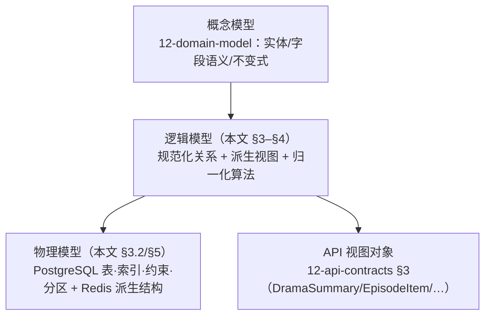

# 技术设计 — 领域模型与剧集 Schema（Domain Model & Episode Schema）

> Wave 1 · 工作槽 **W1 WORK SLOT 2**（技术设计文档）。分支：`cursor/w1-technical-design-docs-8a32`。
> 本文只做技术设计，不含实现代码，不创建工程目录。

## 0. 文档定位（先读这一节）

本仓库在 Wave 1 已有一套编号文档（`docs/00-*` … `docs/14-*`），由其他工作槽产出。**本文不是它们的替代品，而是它们之上的「设计落地层」**：

| 层 | 文档 | 权威范围 |
|---|---|---|
| 概念层（Conceptual） | `docs/12-domain-model.md`（W1B） | 实体、字段语义、限界上下文、业务不变式 —— **本文不覆盖、不改写** |
| 架构层（Architectural） | `docs/03-tech-architecture.md`（P3） | 模块划分、存储选型、事务边界 |
| **设计层（Logical/Physical）— 本文** | `docs/design/domain-model.md` | 概念模型 → 关系型物理模型的映射：表结构、索引、约束、级联可见性算法、解锁策略归一化算法、迁移策略 |

冲突处理纪律与 P3 一致：**发现与上游文档的差异一律登记于 §8，不在本文擅自改写上游结论**。本文新增的差异编号前缀为 `DM-`。

### 0.1 基线来源（本文写作时的仓库状态）

`main` 仅含 `README.md`。以下基线文档位于兄弟分支，尚未合流到 `main`：

| 文档 | 分支 | SHA |
|---|---|---|
| `docs/12-domain-model.md` / `12-api-contracts.md` / `12-error-catalog.md` | `cursor/w1-work-b-1d0f` | `71d27fe` |
| `docs/11-api-and-bridge.md` / `11-official-onboarding-checklist.md` | `cursor/w1-work-a-1d0f` | `f42a67f` |
| `docs/14-quality-gates.md` / `14-security.md` / `14-test-plan.md` | `cursor/w1-work-d-1d0f` | `ef9fba5` |
| `docs/03-tech-architecture.md` / `03-stack-decision.md` / `03-nonfunctional.md` | `cursor/w1-plan-p3-1d0f` | `ef266db` |
| `docs/02-*`（IA / 旅程 / 页面清单） | `cursor/w1-plan-p2-1d0f` | `07cd250` |
| `docs/00-*` / `docs/01-*`（波次计划 / 产品范围 / 入驻要求） | `cursor/w1-plan-p1-1d0f` | `2eedf89` |

`cursor/w1-plan-p3-1d0f`（`3c2b296`）是当前包含全部上述文件的收口分支。本文的所有交叉引用按**合流后的最终路径**书写（即 `docs/12-domain-model.md`），在合流前需切到上表分支查阅。

### 0.2 不确定性标注约定（全 `docs/design/` 通用）

官方 PDF 缺失（`docs/11-official-onboarding-checklist.md` §0.1 记为阻塞 R1/B-1）。凡涉及 TikTok 平台侧的字段、限额、枚举、回调结构，本系列文档统一使用以下标记：

| 标记 | 含义 | 处置 |
|---|---|---|
| `[已验证]` | 有官方公开文档明确出处（S1–S13 编号） | 可直接作为设计依据 |
| `[待验证]` | 依据官方公开网页推断，或文档表述含糊 | 可开工，但需在 Portal / 沙箱实测确认后回写 |
| `[未知]` | 官方公开文档完全未覆盖，需 PDF 或 TikTok 对接人提供 | **不得写死**，必须以可替换抽象隔离（见 `docs/design/minis-integration.md` §5.1） |

本文（领域模型）绝大部分为自有业务模型，平台不确定性集中在 §4.2（支付渠道字段）与 §4.3（用户身份主键），已逐条标注。

---

## 1. 建模总原则

1. **概念模型不因存储让步**：`docs/12-domain-model.md` 的 7 个限界上下文一一映射为后端模块（`docs/03-tech-architecture.md` §4.1），模块间**禁止跨模块直查他模块表**；本文的物理表按模块分组，跨模块引用只保存 ID，不建跨模块外键（保留未来拆库选项）。
2. **可看性只有一个计算点**：`viewerAccess` 由服务端 `content` 模块唯一计算（`docs/12-domain-model.md` §3.4）。本文 §3.6 给出该计算的规范化伪代码，作为该唯一实现点的规格说明；客户端与其他模块**不得**复制这段逻辑。
3. **资金强一致，其余最终一致**：钱包/解锁/订单为单库事务强一致；进度、统计、计数走缓冲与异步聚合（`docs/12-domain-model.md` §11）。
4. **只增不改的演进**：字段与枚举遵循「先加后删 + ≥2 发布周期弃用窗口」（`docs/03-nonfunctional.md` §8）。
5. **软删除**：核心实体无物理删除，全部走 `status` 状态机。

---

## 2. 三层模型映射



**关键区分**：`EpisodeItem.viewerAccess`、`DramaDetail.viewer`、`FeedCard` 是**视图对象（read model）**，不是存储实体，不落库。凡是视图对象，本文只定义其**推导规则**（§3.6），字段形状以 `docs/12-api-contracts.md` §3 为准。

### 2.1 全局字段与类型约定（物理层）

| 概念约定（12 §2） | 物理落地 |
|---|---|
| ULID + 类型前缀（`drm_`/`ep_`/…） | PG 列类型 `text`，`CHECK (id ~ '^drm_[0-9A-HJKMNP-TV-Z]{26}$')`；ULID 字典序即时间序，可直接做游标 |
| 时间 UTC ISO-8601 毫秒 | `timestamptz`（PG 内部微秒精度，序列化时截断到毫秒）；**禁止 `timestamp without time zone`** |
| 法币最小单位整数 | `integer`（分）；字段名以 `_cents` 结尾 |
| 虚拟币整数 | `integer`，`CHECK (>= 0)` 于余额列，流水列允许负 |
| `createdAt` / `updatedAt` | 所有表默认列 `created_at timestamptz not null default now()`、`updated_at timestamptz not null default now()`（触发器维护） |

命名：数据库层 `snake_case`，API 层 `camelCase`，映射在 ORM（Drizzle，选型 D6）一处完成，不在业务代码手工转换。

---

## 3. 内容域：剧 / 季 / 集 Schema（本文核心）

### 3.1 内容树与结构不变式

```
Drama (drm_)  1 ── n  Season (ssn_)  1 ── n  Episode (ep_)  1 ── n  VideoAsset
   │                                              │
   └── DramaStat（1:1 冗余统计，异步更新）           └── EpisodeUnlockConfig（策略，内联于 Episode）
```

结构不变式（数据库约束或对账任务保证，逐条对应测试项）：

| # | 不变式 | 保证手段 |
|---|---|---|
| INV-C1 | `season.season_number` 在剧内唯一且从 1 连续 | 唯一索引保证唯一；**连续性**由后台写入流程保证，对账任务校验（不建 DB 约束，避免中间态卡死） |
| INV-C2 | `episode.episode_number` 在季内唯一且从 1 连续 | 同上 |
| INV-C3 | `episode.drama_id` 必须等于其 `season.drama_id` | 复合外键 `(season_id, drama_id)` 引用 `season(id, drama_id)` —— 用复合外键消灭冗余列写错的可能 |
| INV-C4 | `drama.total_episodes` = 该剧全部 `PUBLISHED` 季下 `PUBLISHED` 集数 | 冗余计数，写入流程维护 + 每日对账任务校验并告警 |
| INV-C5 | `unlock_policy` 含 `COIN` 时 `price_coins > 0` | `CHECK` 约束（见 DDL） |
| INV-C6 | 每个 `PUBLISHED` 集至少有一个可用 `VideoAsset` | 上架流程前置校验；缺失时上架接口拒绝，运行时降级为 `EPISODE_ASSET_UNAVAILABLE` |
| INV-C7 | 播放地址不落库 | `video_asset` 只存 `asset_key`（存储侧引用），无 URL 列（`docs/12-domain-model.md` §3.3 防盗链决策） |

### 3.2 物理 Schema（PostgreSQL 草案）

> 以下 DDL 是**设计规格**，不是迁移脚本；Wave 2 用 Drizzle schema 表达并生成迁移（正向 + 可回滚，`docs/14-quality-gates.md` G2.7）。

```sql
-- ---------- 枚举 ----------
CREATE TYPE content_status   AS ENUM ('DRAFT', 'PUBLISHED', 'OFFLINE');
CREATE TYPE drama_category   AS ENUM ('ROMANCE','REVENGE','FAMILY','SUSPENSE','COMEDY','FANTASY','OTHER');
CREATE TYPE unlock_policy    AS ENUM ('FREE','COIN','VIP_ONLY','COIN_OR_VIP');
CREATE TYPE video_quality    AS ENUM ('480p','720p','1080p');
CREATE TYPE video_format     AS ENUM ('hls','mp4');

-- ---------- 剧 ----------
CREATE TABLE drama (
  id                    text PRIMARY KEY CHECK (id ~ '^drm_[0-9A-HJKMNP-TV-Z]{26}$'),
  title                 text        NOT NULL CHECK (char_length(title) BETWEEN 1 AND 50),
  description           text        NOT NULL DEFAULT '' CHECK (char_length(description) <= 500),
  cover_url             text        NOT NULL,
  horizontal_cover_url  text,
  category              drama_category NOT NULL,
  tags                  text[]      NOT NULL DEFAULT '{}' CHECK (array_length(tags,1) IS NULL OR array_length(tags,1) <= 10),
  status                content_status NOT NULL DEFAULT 'DRAFT',
  total_seasons         integer     NOT NULL DEFAULT 0 CHECK (total_seasons >= 0),
  total_episodes        integer     NOT NULL DEFAULT 0 CHECK (total_episodes >= 0),
  free_episodes         integer     NOT NULL DEFAULT 5 CHECK (free_episodes >= 0),
  is_completed          boolean     NOT NULL DEFAULT false,
  release_at            timestamptz,
  published_at          timestamptz,                    -- 首次进入 PUBLISHED 的时间，NEW 排序键
  offline_reason        text,                           -- 下架原因（运营/版权/合规），审计用
  created_at            timestamptz NOT NULL DEFAULT now(),
  updated_at            timestamptz NOT NULL DEFAULT now(),
  UNIQUE (id, status)                                   -- 供 season 复合外键做级联可见性引用（见 §3.5 备选方案）
);

-- ---------- 剧统计（1:1 拆表：写热点与读热点分离） ----------
CREATE TABLE drama_stat (
  drama_id        text PRIMARY KEY REFERENCES drama(id),
  play_count      bigint  NOT NULL DEFAULT 0,
  favorite_count  bigint  NOT NULL DEFAULT 0,
  score           numeric(3,1) NOT NULL DEFAULT 0 CHECK (score BETWEEN 0 AND 10),
  hot_rank_score  double precision NOT NULL DEFAULT 0,  -- 排序用合成分，异步任务写
  computed_at     timestamptz NOT NULL DEFAULT now()
);

-- ---------- 季 ----------
CREATE TABLE season (
  id             text PRIMARY KEY CHECK (id ~ '^ssn_'),
  drama_id       text NOT NULL REFERENCES drama(id),
  season_number  integer NOT NULL CHECK (season_number >= 1),
  title          text,
  episode_count  integer NOT NULL DEFAULT 0 CHECK (episode_count >= 0),
  status         content_status NOT NULL DEFAULT 'DRAFT',
  created_at     timestamptz NOT NULL DEFAULT now(),
  updated_at     timestamptz NOT NULL DEFAULT now(),
  UNIQUE (drama_id, season_number),
  UNIQUE (id, drama_id)                                  -- 供 episode 复合外键（INV-C3）
);

-- ---------- 集 ----------
CREATE TABLE episode (
  id                    text PRIMARY KEY CHECK (id ~ '^ep_'),
  season_id             text NOT NULL,
  drama_id              text NOT NULL,
  episode_number        integer NOT NULL CHECK (episode_number >= 1),   -- 季内序号
  global_episode_number integer NOT NULL CHECK (global_episode_number >= 1), -- 剧内全局序号，见 DM-1
  title                 text,
  duration_sec          integer NOT NULL CHECK (duration_sec > 0),
  cover_url             text,
  unlock_policy         unlock_policy NOT NULL DEFAULT 'COIN_OR_VIP',
  price_coins           integer NOT NULL DEFAULT 0 CHECK (price_coins >= 0),
  status                content_status NOT NULL DEFAULT 'DRAFT',
  published_at          timestamptz,
  created_at            timestamptz NOT NULL DEFAULT now(),
  updated_at            timestamptz NOT NULL DEFAULT now(),

  FOREIGN KEY (season_id, drama_id) REFERENCES season(id, drama_id),     -- INV-C3
  UNIQUE (season_id, episode_number),                                    -- INV-C2
  UNIQUE (drama_id, global_episode_number),                              -- DM-1
  -- INV-C5：需要币解锁的策略必须有正价格；不需要的必须为 0，杜绝"看起来免费其实有价"的脏数据
  CONSTRAINT price_matches_policy CHECK (
    (unlock_policy IN ('COIN','COIN_OR_VIP') AND price_coins > 0) OR
    (unlock_policy IN ('FREE','VIP_ONLY')    AND price_coins = 0)
  )
);

-- ---------- 视频资源（值对象，独立表以支持多档位与转码状态） ----------
CREATE TABLE video_asset (
  id            bigserial PRIMARY KEY,
  episode_id    text NOT NULL REFERENCES episode(id),
  quality       video_quality NOT NULL,
  format        video_format  NOT NULL DEFAULT 'hls',
  asset_key     text NOT NULL,                       -- 对象存储 key，非 URL（INV-C7）
  encrypted     boolean NOT NULL DEFAULT false,      -- HLS AES-128（付费内容）
  bitrate_kbps  integer,
  size_bytes    bigint,
  ready         boolean NOT NULL DEFAULT false,      -- 转码完成才为 true
  created_at    timestamptz NOT NULL DEFAULT now(),
  UNIQUE (episode_id, quality, format)
);
```

### 3.3 索引与查询模式

索引按**实际查询**设计，逐条注明服务的端点（端点定义见 `docs/12-api-contracts.md` §4.3）：

| 索引 | 服务的查询 | 说明 |
|---|---|---|
| `drama (status, category) INCLUDE (id)` + `drama_stat (hot_rank_score DESC)` | `GET /dramas?sort=HOT&category=` | 排序键在 `drama_stat`，用物化的 `hot_rank_score` 避免运行时算分 |
| `drama (status, published_at DESC)` | `GET /dramas?sort=NEW` | `published_at` 而非 `created_at`（草稿期不计入"新") |
| `drama USING gin (tags)` | `GET /dramas?tag=` | 数组包含查询 |
| `episode (drama_id, global_episode_number)`（即上表唯一索引） | `GET /dramas/{id}/episodes` 扁平化列表 + 游标分页 | **游标即 `global_episode_number`**，稳定、可读、无需 opaque 编码之外的额外排序列 |
| `episode (season_id, episode_number)` | 按季查询 / 后台编排 | |
| `episode (drama_id, status)` | 上下架级联、计数对账 | |
| `video_asset (episode_id) WHERE ready` | 播放令牌签发时选档 | 部分索引，只索引可用资源 |

**分页游标**：内容列表游标编码为不透明串（`docs/12-api-contracts.md` §2.3），内部结构建议 `base64url({"k": <排序键>, "id": <末条ID>})`，即"排序键 + ID"二元组，避免同分并列时漏行/重复行。ULID 的时间有序性使 `id` 天然可作 tie-breaker。

### 3.4 集序号语义（设计缺口，登记为 DM-1）

`docs/12-api-contracts.md` §4.3 规定 `GET /dramas/{dramaId}/episodes` 返回「**扁平化集列表**（跨季按全局集序排列）」，而 `docs/12-domain-model.md` §3.3 的 `Episode` 只有**季内**唯一的 `episodeNumber`。二者之间缺一个全局序号：跨季扁平化时 `(季1第1集, 季2第1集)` 的 `episodeNumber` 相同，客户端无法用它作为稳定 key、游标或"第 N 集"展示文案。

**本文设计决策**：物理层增列 `global_episode_number`（剧内唯一、从 1 连续），由内容编排流程在集发布时分配：

- **展示与文案**用 `globalEpisodeNumber`（用户认知里的"第 68 集"是全剧口径，短剧尤其如此）。
- **免费策略判定**用 `globalEpisodeNumber`（`drama.freeEpisodes` 是剧级"前 N 集免费"，必须是全局口径，否则每季前 N 集都免费，直接造成收入漏损 —— 这是本决策的核心动机）。
- **季内编排**保留 `episodeNumber`。
- 单季剧（主场景）两者恒等，零额外成本。

登记为 `DM-1`，建议 W1B 在 `docs/12-domain-model.md` §3.3 与 `docs/12-api-contracts.md` §3.3 补 `globalEpisodeNumber` 字段。**在裁决前，实现方不得自行用 `episodeNumber` 做免费集判定**。

### 3.5 级联可见性：三级状态的合成规则

`docs/12-domain-model.md` 规定「季不可见时其下所有集不可见」，但未定义三级组合的完整真值。本文形式化为 `effectiveStatus`：

```text
effectiveStatus(episode) =
    OFFLINE   若 drama.status = OFFLINE 或 season.status = OFFLINE 或 episode.status = OFFLINE
    DRAFT     否则若 drama.status = DRAFT 或 season.status = DRAFT 或 episode.status = DRAFT
    DRAFT     否则若 drama.release_at 不为空 且 now() < drama.release_at      -- 定时上架未到点
    PUBLISHED 否则
```

优先级：**OFFLINE > DRAFT > PUBLISHED**。下架是"最强"信号——任一层下架即整体下架，且**不因下层是 PUBLISHED 而被翻转**，这保证了"一键下架"（`docs/14-security.md` §7.3，≤5 分钟全端生效）只需改一行剧级状态。

对外映射：

| `effectiveStatus` | 匿名/普通用户可见性 | 错误码 |
|---|---|---|
| `PUBLISHED` | 可见可播 | — |
| `DRAFT` | **不可见**，与不存在等价（防止草稿剧名泄漏） | `404 CONTENT_NOT_FOUND` |
| `OFFLINE` | 不可播，但语义可区分 | `410 CONTENT_OFFLINE` |

> `DRAFT` 与"不存在"返回同一错误码是刻意设计：区分二者会让爬虫探测到未发布内容的存在性。

**实现落点**：`content` 模块提供唯一的 `visibleEpisodes(dramaId, viewer)` 查询构造器，所有读路径（详情、列表、推荐、播放令牌、进度联查）必须经它，禁止各处手写 `status = 'PUBLISHED'`。这是 `DM-2` 的前提（见 §8）。

### 3.6 有效解锁策略与 `viewerAccess` 归一化算法

`docs/12-domain-model.md` §3.4 给出三条优先级规则，`docs/12-api-contracts.md` §3.3 给出 `viewerAccess` 的六种 `reason`。本文将二者合成为**唯一的规范化算法**（服务端 `content` 模块实现，作为核心模块纳入 90% 覆盖率要求）：

```text
函数 effectiveUnlockPolicy(episode, drama) -> FREE | COIN | VIP_ONLY | COIN_OR_VIP
  若 episode.unlock_policy = FREE                        -> FREE
  若 episode.global_episode_number <= drama.free_episodes -> FREE      # 剧级前 N 集免费覆盖集级付费（DM-1）
  否则                                                    -> episode.unlock_policy


函数 viewerAccess(episode, drama, season, viewer) -> { playable, reason, unlockedBy }
  # 第 1 步：可用性优先于权益 —— 内容不可用时不暴露任何价格信息
  若 effectiveStatus(episode) != PUBLISHED
      -> { playable: false, reason: UNAVAILABLE, unlockedBy: null }

  policy := effectiveUnlockPolicy(episode, drama)

  # 第 2 步：免费
  若 policy = FREE
      -> { playable: true, reason: FREE, unlockedBy: null }

  # 第 3 步：匿名视角 —— 按"未解锁的非 VIP 用户"计算（契约 §3.3 原文）
  若 viewer 为匿名
      -> { playable: false,
           reason: (policy = VIP_ONLY ? NEED_VIP : NEED_UNLOCK),
           unlockedBy: null }

  # 第 4 步：已有解锁凭证优先于 VIP —— 已付费的权益不因 VIP 到期而消失
  若 存在 Unlock(viewer.userId, episode.id) 且 未过期
      -> { playable: true, reason: UNLOCKED, unlockedBy: <unlock.method> }

  # 第 5 步：VIP 身份
  若 viewer.vip.active 且 policy ∈ { VIP_ONLY, COIN_OR_VIP }
      -> { playable: true, reason: VIP, unlockedBy: null }

  # 第 6 步：兜底 —— 需要付费
  若 policy = VIP_ONLY   -> { playable: false, reason: NEED_VIP,    unlockedBy: null }
  否则                    -> { playable: false, reason: NEED_UNLOCK, unlockedBy: null }
```

设计要点：

1. **第 4 步先于第 5 步**是有意的。若先判 VIP，`unlockedBy` 会丢失"这一集用户曾用币买过"的信息，VIP 到期后该集的可看性判定就会出错。此顺序把 `docs/12-domain-model.md` §12 开放问题 3（VIP 观看是否落 Unlock 凭证）的影响面收敛到"是否写入"这一个决策点，**读路径无论如何都正确**。
2. **第 1 步先于一切**：下架内容不返回 `priceCoins`，避免下架剧仍在解锁面板里被"报价"。
3. `viewerAccess` 是纯函数（输入：内容三元组 + viewer 快照），**可直接做属性测试（property-based test）**：对任意 viewer × 任意 policy 组合，断言"`playable=true` ⟺ reason ∈ {FREE, UNLOCKED, VIP}"。此断言列入 `docs/14-test-plan.md` §1.1 的单测要求。

### 3.7 批量计算的 N+1 防护

集列表（首屏 50 集，`docs/02-screen-inventory.md` SCR-04）要求对每一集算 `viewerAccess`，逐集查解锁记录会产生 50 次查询。设计规定：

- `content` 模块提供 `viewerAccessBatch(episodes[], viewer)`，内部**一次**查询 `unlock WHERE user_id = ? AND drama_id = ?` 取回该剧下用户全部解锁的 `episode_id` 集合（`unlock` 表已有 `(user_id, drama_id)` 索引，见 §4.4），在内存里做集合判定。
- 该集合同时供进度接口 `GET /progress/dramas/{dramaId}` 复用，单请求内共享。
- 单剧解锁记录量级上界 = 剧集数（数百），可安全全量载入。

---

## 4. 其余限界上下文的物理落地要点

概念定义以 `docs/12-domain-model.md` §4–§9 为准，本节只给物理层的关键决策与约束。

### 4.1 钱包域：账务一致性的物理保证

```sql
CREATE TABLE wallet (
  id             text PRIMARY KEY CHECK (id ~ '^wal_'),
  user_id        text NOT NULL UNIQUE REFERENCES app_user(id),
  coin_balance   integer NOT NULL DEFAULT 0 CHECK (coin_balance  >= 0),
  bonus_balance  integer NOT NULL DEFAULT 0 CHECK (bonus_balance >= 0),
  frozen         boolean NOT NULL DEFAULT false,          -- 风控冻结 → WALLET_FROZEN
  version        integer NOT NULL DEFAULT 0,              -- 乐观锁
  created_at     timestamptz NOT NULL DEFAULT now(),
  updated_at     timestamptz NOT NULL DEFAULT now()
);

CREATE TABLE wallet_transaction (
  id                   text PRIMARY KEY CHECK (id ~ '^txn_'),
  wallet_id            text NOT NULL REFERENCES wallet(id),
  user_id              text NOT NULL,
  type                 text NOT NULL CHECK (type IN ('RECHARGE','CONSUME','REWARD','REFUND')),
  coin_delta           integer NOT NULL,
  bonus_delta          integer NOT NULL,
  coin_balance_after   integer NOT NULL CHECK (coin_balance_after  >= 0),
  bonus_balance_after  integer NOT NULL CHECK (bonus_balance_after >= 0),
  ref_type             text NOT NULL CHECK (ref_type IN ('UNLOCK','RECHARGE_ORDER','CAMPAIGN','AD_REWARD','MANUAL')),
  ref_id               text NOT NULL,
  idempotency_key      text NOT NULL,
  created_at           timestamptz NOT NULL DEFAULT now(),
  UNIQUE (user_id, idempotency_key),                      -- 幂等兜底（12 §2.4 的 DB 侧保险）
  CONSTRAINT delta_nonzero CHECK (coin_delta <> 0 OR bonus_delta <> 0)
);
CREATE INDEX ON wallet_transaction (user_id, created_at DESC);   -- GET /wallet/transactions
CREATE INDEX ON wallet_transaction (ref_type, ref_id);           -- 对账反查
```

物理层决策：

| 决策 | 理由 |
|---|---|
| `wallet_transaction` **无 UPDATE / DELETE 权限**（DB 角色级授予 INSERT/SELECT） | 流水不可变是对账的前提，用权限而非纪律保证 |
| 余额列 `CHECK (>= 0)` | 即使应用层逻辑写错，DB 也不会出现负余额（资损硬底线） |
| `coin_balance_after` 快照落库 | `docs/12-domain-model.md` §5.2 不变式 `balance == Σ(delta)` 的每日对账，可用窗口函数一次扫出断点 |
| 幂等键唯一索引作用于 `(user_id, idempotency_key)` 而非全局 | 避免不同用户偶然使用相同 UUID 时互相拒绝 |
| **扣费顺序：先赠币后充值币** | `docs/12-domain-model.md` §5.1；实现为单条 SQL 内计算，不做两次读改写 |

**并发控制**：扣费事务使用 `SELECT ... FOR UPDATE` 行锁 + `version` 乐观锁双保险；隔离级别 `READ COMMITTED` 即可（行锁已序列化同一钱包的写）。乐观锁重试上限 3 次（`docs/12-domain-model.md` §6.1），耗尽返回 `WALLET_CONCURRENT_MODIFICATION`。

**锁顺序约定**（防死锁）：任何跨表事务按 `wallet → wallet_transaction → unlock → recharge_order` 的固定顺序取锁。整剧解锁涉及多条 `unlock` 插入时，按 `episode_id` 升序插入。

### 4.2 充值订单：平台字段的不确定性

`docs/12-domain-model.md` §5.3 定义 `RechargeOrder`，其 `paymentChannel` 枚举为 `WECHAT`/`ALIPAY`/`APPLE_IAP`。P3 已登记 `C2`：TikTok Minis 形态下 Beans 是唯一合法渠道。物理设计按 C2 的裁决建议预留，但**不替 W1B 做决定**：

```sql
CREATE TABLE recharge_order (
  id                text PRIMARY KEY CHECK (id ~ '^ord_'),
  user_id           text NOT NULL REFERENCES app_user(id),
  product_id        text NOT NULL,
  product_type      text NOT NULL CHECK (product_type IN ('COIN','VIP')),
  amount_cents      integer NOT NULL CHECK (amount_cents >= 0),
  currency          char(3) NOT NULL DEFAULT 'USD',        -- C9：多币种，ISO-4217
  beans_amount      integer,                               -- C2 建议字段；[待验证] Beans 是否为整数计价
  coins             integer NOT NULL DEFAULT 0,
  bonus_coins       integer NOT NULL DEFAULT 0,
  vip_days          integer NOT NULL DEFAULT 0,
  payment_channel   text NOT NULL,                         -- 枚举待 C2 裁决，物理层暂用 text + CHECK
  channel_order_id  text,                                  -- = TikTok trade_order_id
  status            text NOT NULL CHECK (status IN ('PENDING','PAID','CREDITED','CLOSED','REFUNDED')),
  idempotency_key   text NOT NULL,
  paid_at           timestamptz,
  credited_at       timestamptz,
  created_at        timestamptz NOT NULL DEFAULT now(),
  updated_at        timestamptz NOT NULL DEFAULT now(),
  UNIQUE (user_id, idempotency_key),
  UNIQUE (payment_channel, channel_order_id)               -- webhook 重放幂等的 DB 兜底
);
CREATE INDEX ON recharge_order (status, created_at) WHERE status IN ('PENDING','PAID');  -- 补偿查单扫描
```

不确定性标注：

| 字段 | 状态 | 说明 |
|---|---|---|
| `beans_amount` | `[待验证]` | Beans 定价档位表需变现开通后在 Portal 可见（`docs/11-api-and-bridge.md` Q2） |
| `channel_order_id` = `trade_order_id` | `[已验证]`（S10） | 官方建单接口返回 `trade_order_id` |
| webhook 事件字段全集 | `[未知]` | `docs/11-api-and-bridge.md` Q1；**不得据此设计表列**，回调原始报文整体落 `platform_webhook_event.raw_payload jsonb` 后再解析（见 `docs/design/minis-integration.md` §6.2） |
| `currency` 默认值 | `[待验证]` | 取决于首发区域（P3 阻塞 B-4），设计上必须是列而非常量 |

**状态机**（与 `docs/12-domain-model.md` §5.3 一致，此处补物理约束）：`PENDING → PAID → CREDITED`；`PENDING → CLOSED`；`PAID|CREDITED → REFUNDED`。非法迁移由 `UPDATE ... WHERE status = <期望前态>` 的条件更新阻断（受影响行数为 0 即冲突），**不依赖应用层 if 判断**。

### 4.3 用户域：身份主键的平台绑定

```sql
CREATE TABLE app_user (           -- 表名避开 SQL 关键字 user
  id             text PRIMARY KEY CHECK (id ~ '^usr_'),
  nickname       text NOT NULL CHECK (char_length(nickname) BETWEEN 1 AND 24),
  avatar_url     text,
  phone_e164     text,                                   -- 加密存储，见 14-security
  status         text NOT NULL DEFAULT 'ACTIVE' CHECK (status IN ('ACTIVE','BANNED')),
  banned_until   timestamptz,
  vip_active     boolean NOT NULL DEFAULT false,
  vip_expires_at timestamptz,
  created_at     timestamptz NOT NULL DEFAULT now(),
  updated_at     timestamptz NOT NULL DEFAULT now()
);

CREATE TABLE user_auth_provider (
  user_id     text NOT NULL REFERENCES app_user(id),
  provider    text NOT NULL CHECK (provider IN ('TIKTOK','PHONE','WECHAT','APPLE','DEVICE')),
  external_id text NOT NULL,                             -- TIKTOK 时为 open_id
  linked_at   timestamptz NOT NULL DEFAULT now(),
  PRIMARY KEY (provider, external_id),                   -- 一个平台身份至多绑一个账号
  UNIQUE (user_id, provider)                             -- 一个账号每种 provider 至多一条
);
```

设计要点：

- **`open_id` 不做 `app_user` 主键**，而是经 `user_auth_provider` 关联。官方要求「后端以 `open_id` 作为该应用下 TikTok 用户的唯一主键持久化」（`docs/11-api-and-bridge.md` §4.1），本设计满足该要求（`(TIKTOK, open_id)` 是唯一键、是登录查找路径），同时保留未来多身份绑定与账号合并的能力，避免主键与外部系统耦合。
- `provider` 枚举含 `TIKTOK`，对应 P3 登记的 `C1`（契约 `POST /auth/login` 需增 `provider: "TIKTOK"`）。Minis 首发**仅启用 `TIKTOK`**，其余为非 Minis 端预留 —— 物理层留列，业务层用配置开关控制可用集合。
- `vip_active` 是**冗余列**：VIP 到期以 `vip_expires_at` 与服务端时间比较为准（`docs/12-domain-model.md` §4.1），`vip_active` 由定时任务与订阅同步刷新，仅用于列表查询过滤。读路径判定 VIP 必须用 `vip_expires_at > now()`，不得直接信 `vip_active`。
- `open_id` 的稳定性：`[已验证]`（S8 明确 `open_id` 为应用内唯一标识）；跨应用是否稳定 `[未知]`，本设计不依赖跨应用稳定性。

### 4.4 解锁域

```sql
CREATE TABLE unlock (
  id              text PRIMARY KEY CHECK (id ~ '^ulk_'),
  user_id         text NOT NULL REFERENCES app_user(id),
  episode_id      text NOT NULL REFERENCES episode(id),
  drama_id        text NOT NULL,
  method          text NOT NULL CHECK (method IN ('COIN','VIP','AD','GRANT')),
  cost_coins      integer NOT NULL DEFAULT 0 CHECK (cost_coins >= 0),
  cost_bonus      integer NOT NULL DEFAULT 0 CHECK (cost_bonus >= 0),
  transaction_id  text REFERENCES wallet_transaction(id),
  expires_at      timestamptz,                            -- null = 永久（Wave 1 恒为 null）
  created_at      timestamptz NOT NULL DEFAULT now(),
  UNIQUE (user_id, episode_id)                            -- 12 §6.1 的"一人一集至多一条"
);
CREATE INDEX ON unlock (user_id, drama_id);               -- §3.7 批量 viewerAccess 的支撑索引
```

- `UNIQUE (user_id, episode_id)` 是重复解锁的**最终防线**：并发双击时一条成功、一条撞唯一索引，应用层将该冲突翻译为 `409 UNLOCK_ALREADY_UNLOCKED`（`docs/12-error-catalog.md` §6），客户端视为成功直接播放（错误目录 §11）。这条链路从 DB 约束到 UI 行为完整闭合，**不需要分布式锁**。
- `method = 'AD'` 依赖广告解锁端点（P2 差距 `G3` / P3 冲突 `C10`），端点草案见 `docs/design/api-contracts.md` §6.3。

### 4.5 进度域：写放大治理

进度写入峰值约 5,000 次/s（`docs/03-nonfunctional.md` §4），PG 不承接裸写。物理设计：

```sql
CREATE TABLE watch_progress (
  user_id            text NOT NULL,
  episode_id         text NOT NULL,
  drama_id           text NOT NULL,
  position_sec       integer NOT NULL CHECK (position_sec >= 0),
  duration_sec       integer NOT NULL CHECK (duration_sec > 0),
  completed          boolean NOT NULL DEFAULT false,
  client_updated_at  timestamptz NOT NULL,                -- LWW 依据
  updated_at         timestamptz NOT NULL DEFAULT now(),
  PRIMARY KEY (user_id, episode_id)
);
CREATE INDEX ON watch_progress (user_id, drama_id);

CREATE TABLE watch_history (
  user_id              text NOT NULL,
  drama_id             text NOT NULL,
  last_episode_id      text NOT NULL,
  last_episode_number  integer NOT NULL,                  -- 全局序号（DM-1）
  last_position_sec    integer NOT NULL,
  watched_at           timestamptz NOT NULL,
  PRIMARY KEY (user_id, drama_id)
);
CREATE INDEX ON watch_history (user_id, watched_at DESC); -- GET /users/me/watch-history
```

写路径：`PUT /progress/episodes/{id}` → 写 Redis（`Hash` per user，字段 per episode）→ 立即 `204` → BullMQ 定时任务批量 `INSERT ... ON CONFLICT DO UPDATE WHERE excluded.client_updated_at > watch_progress.client_updated_at` 刷库。

**LWW 冲突解决落在 SQL 的 `WHERE` 子句里**（而不是应用层读-比较-写），保证多实例并发刷库时结果确定。读路径优先读 Redis，未命中回落 PG（缓存策略见 `docs/design/api-contracts.md` §4.4）。

`completed` 由服务端在 `position/duration ≥ 0.9` 时置真（`docs/12-domain-model.md` §7.1），**客户端上报的 `completed` 一律忽略**（防止刷完播数）。

### 4.6 埋点事件：分区与保留

```sql
CREATE TABLE rec_event (
  id          bigserial,
  event_type  text NOT NULL,
  user_id     text,
  drama_id    text,
  episode_id  text,
  tracking_id text,
  client_ts   timestamptz NOT NULL,
  server_ts   timestamptz NOT NULL DEFAULT now(),
  context     jsonb,
  PRIMARY KEY (id, server_ts)
) PARTITION BY RANGE (server_ts);
```

- 按月分区（`docs/03-tech-architecture.md` §5），保留窗口由数据合规决定（`docs/14-security.md` §6 用户权利：删除权需能按 `user_id` 清理 —— 分区表上按用户删除代价高，故 `user_id` 上建索引并以异步批量任务执行，纳入删除权 SLA）。
- `user_id` 由服务端从令牌注入，**客户端上报的 `userId` 一律丢弃**（`docs/12-domain-model.md` §8.2）。
- append-only，无更新；结构保持可平迁 ClickHouse（`docs/03-stack-decision.md` D7 预案）。

### 4.7 评论域

结构直接映射 `docs/12-domain-model.md` §9，物理层补两点：

- `comment (episode_id, status, created_at DESC)` 与 `comment (episode_id, status, like_count DESC)` 两个索引分别服务 `sort=NEW` / `sort=HOT`。
- 两层结构用 `parent_id` + `CHECK`：根评论 `parent_id IS NULL`；回复的 `parent_id` 必须指向根评论。**深度限制无法用单表 CHECK 表达**，落在应用层校验 + `COMMENT_REPLY_DEPTH_EXCEEDED`（`docs/12-error-catalog.md` §10），并由触发器或写入前查询兜底。

---

## 5. 迁移与演进策略

| 项 | 规则 |
|---|---|
| 迁移工具 | Drizzle Kit 生成 SQL 迁移，**每个迁移必须有可执行的回滚脚本**（`docs/14-quality-gates.md` G2.7） |
| 破坏性变更 | 禁止直接 `DROP COLUMN` / 改类型。走「加新列 → 双写 → 回填 → 切读 → ≥2 发布周期后删旧列」五步（`docs/03-nonfunctional.md` §8） |
| 枚举扩展 | PG `ENUM` 加值不可回滚，因此**业务侧可能扩展的枚举（`payment_channel`、`unlock.method`）用 `text + CHECK`**，稳定枚举（`content_status`、`video_quality`）才用原生 `ENUM`。这是上面 DDL 里两种写法并存的原因 |
| 长表加列 | 必须有默认值且为 `NOT NULL` 时使用 PG 11+ 的常量默认快速路径；加索引一律 `CREATE INDEX CONCURRENTLY` |
| 种子数据 | 内容域种子（演示剧集）与账户矩阵纳入 mock/fixture 规格，见 `docs/design/api-contracts.md` §7.2 |

---

## 6. 事务边界与一致性（物理层补充）

在 `docs/12-domain-model.md` §11 的基础上补充隔离级别与失败语义：

| 场景 | 事务范围 | 隔离级别 | 失败语义 |
|---|---|---|---|
| 单集币解锁 | `wallet` 行锁 → `wallet_transaction` INSERT → `unlock` INSERT | READ COMMITTED + 行锁 | 整体回滚；重试用同一 `Idempotency-Key` 返回首次结果 |
| 整剧解锁 | 同上，`unlock` 批量 INSERT（按 `episode_id` 升序） | 同上 | 报价与扣费之间价格变动 → `UNLOCK_PRICE_CHANGED`，全量回滚，不做部分解锁 |
| 充值入账（webhook） | `recharge_order` 条件 UPDATE（`PAID→CREDITED`）→ `wallet` → `wallet_transaction` | 同上 | 条件 UPDATE 受影响行数为 0 = 已处理过，直接返回成功（幂等） |
| 进度上报 | 无事务（Redis 写） | — | 尽力送达；失败客户端本地入队补报（`docs/02-information-architecture.md` §8.2） |
| 统计快照 | 独立异步任务 | — | 最终一致（分钟级）；失败下一轮重算，不补偿 |

**跨模块调用不共享事务**：`unlock` 模块调用 `wallet` 模块是进程内函数调用，共享同一 DB 连接与事务上下文（模块化单体的收益）；但接口签名上必须显式传递事务句柄，为未来拆分保留改造点。

---

## 7. 与 API 视图对象的映射表

| API 视图（`docs/12-api-contracts.md` §3） | 数据来源 | 是否可公共缓存 |
|---|---|---|
| `DramaSummary` | `drama` + `drama_stat` | 可（无个性化字段） |
| `DramaDetail.seasons` | `season` | 可 |
| `DramaDetail.viewer` | `watch_history` + `favorite` | **否**（个性化） |
| `EpisodeItem`（除 `viewerAccess`） | `episode` | 可 |
| `EpisodeItem.viewerAccess` | `unlock` + `app_user.vip_*` + 内容状态 | **否**（个性化，且是权益判定，缓存错误直接造成越权观看或误付费） |
| `WalletView` | `wallet` | 否 |
| `FeedCard` | `drama` + `drama_stat` + `watch_history` | 混合：`DRAMA` 卡可缓存，`CONTINUE_WATCHING` 卡不可 |

该表是缓存分层的直接输入，完整缓存契约见 `docs/design/api-contracts.md` §4。

---

## 8. 差异登记（不改写上游，供对应槽位裁决）

| # | 事项 | 涉及文档 | 建议 | 建议裁决人 |
|---|---|---|---|---|
| DM-1 | 缺全局集序号：契约要求跨季扁平化按"全局集序"，模型只有季内 `episodeNumber`；且 `freeEpisodes`（剧级前 N 集免费）若按季内序号判定会导致每季都免费的收入漏损 | `docs/12-domain-model.md` §3.3、`docs/12-api-contracts.md` §3.3/§4.3 | 增 `globalEpisodeNumber`（剧内唯一连续），展示、免费判定、游标均用它 | W1B |
| DM-2 | 三级状态（剧/季/集）组合语义未定义，仅有"季不可见则集不可见"一句 | `docs/12-domain-model.md` §3.1/§3.2 | 采纳本文 §3.5 的 `effectiveStatus`（OFFLINE > DRAFT > PUBLISHED），`DRAFT` 对外等价 404 | W1B |
| DM-3 | `viewerAccess` 中"已解锁"与"VIP"的判定优先级未定义，影响 VIP 到期后已购集的可看性 | `docs/12-domain-model.md` §3.4/§12 开放问题 3 | 采纳本文 §3.6：**Unlock 凭证优先于 VIP 身份**判定，使读路径与开放问题 3 解耦 | W1B |
| DM-4 | `RechargeOrder` 无 `currency` 列而金额定义为"人民币分"，与多区域发行冲突 | `docs/12-domain-model.md` §2.2/§5.3 | 与 P3 的 `C9` 同源，建议合并裁决：金额 = 最小货币单位整数 + `currency`(ISO-4217) | W1B（+商务） |
| DM-5 | `Comment` 两层深度限制无法由单表约束表达 | `docs/12-domain-model.md` §9.1 | 应用层校验 + `COMMENT_REPLY_DEPTH_EXCEEDED`；本文 §4.7 已给落点，仅需模型文档注明"约束在应用层" | W1B |
| DM-6 | 埋点事件保留期与"删除权"（按 `user_id` 清理）的 SLA 未定义 | `docs/12-domain-model.md` §8.2、`docs/14-security.md` §6 | 定义保留窗口与删除 SLA，并据此决定分区粒度 | W1D（+法务） |

> 与 P3 已登记的 `C1`（登录 provider 缺 `TIKTOK`）、`C2`（支付渠道缺 `TIKTOK_BEANS`）、`C9`（币种）本文不重复登记，物理设计已按其**裁决建议**预留列（§4.2/§4.3），裁决结果若不同，改动限于列的 `CHECK` 集合，无结构性返工。

---

## 9. 开放问题（本文范围内）

| # | 问题 | 影响面 | 现状处置 |
|---|---|---|---|
| Q-DM-1 | 剧下架后已解锁用户是否保留回看（继承 `docs/12-domain-model.md` §12 开放问题 1） | `effectiveStatus` 与 `viewerAccess` 的第 1 步顺序 | 当前设计：可用性优先，下架即不可播。若产品改判，**只需在 §3.6 第 1 步加一个"存在有效 Unlock 则跳过"分支**，无 schema 变更 |
| Q-DM-2 | 广告解锁（`method='AD'`）的次数上限存储位置 | 需要新表 `ad_reward_log`（日配额）还是复用 `unlock` 计数 | 建议独立表（风控日志需保留失败/作弊记录，`unlock` 只记成功），随 `G3` 端点一并设计 |
| Q-DM-3 | 是否需要"剧维度评论" | `comment` 表 `episode_id` 是否可空 | 当前设计 `episode_id NOT NULL`；若开放剧维度，改为可空 + `CHECK (episode_id IS NOT NULL OR drama_id IS NOT NULL)` |
| Q-DM-4 | 多端进度冲突是否需要比 LWW 更强的策略（如取更大 `positionSec`） | §4.5 的 `ON CONFLICT ... WHERE` 子句 | 当前 LWW；改为 max 策略只需改该 `WHERE` 条件，单点变更 |
| Q-DM-5 | Beans 定价是否为整数、是否有小数档位 `[待验证]` | `recharge_order.beans_amount` 列类型 | 暂用 `integer`；变现开通后按 Portal 实际档位表确认（`docs/11-api-and-bridge.md` Q2） |

---

## 10. 交叉引用

| 主题 | 文档 |
|---|---|
| 播放链路的状态与权益拦截 | `docs/design/player-state-machine.md` |
| 缓存分层、错误分类学、Mock 契约 | `docs/design/api-contracts.md` |
| TikTok 平台集成点与不确定字段清单 | `docs/design/minis-integration.md` |
| 概念模型权威定义 | `docs/12-domain-model.md` |
| 端点与字段权威定义 | `docs/12-api-contracts.md` |
