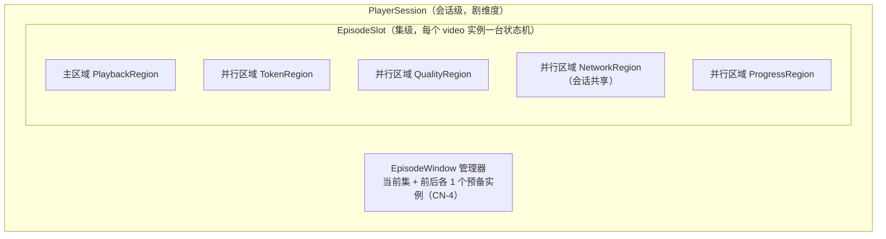
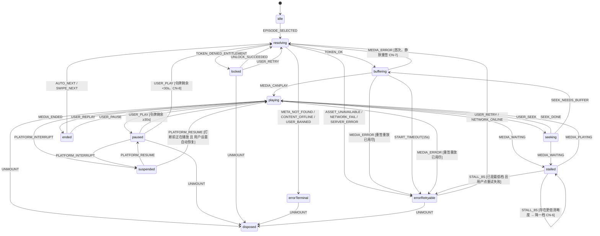
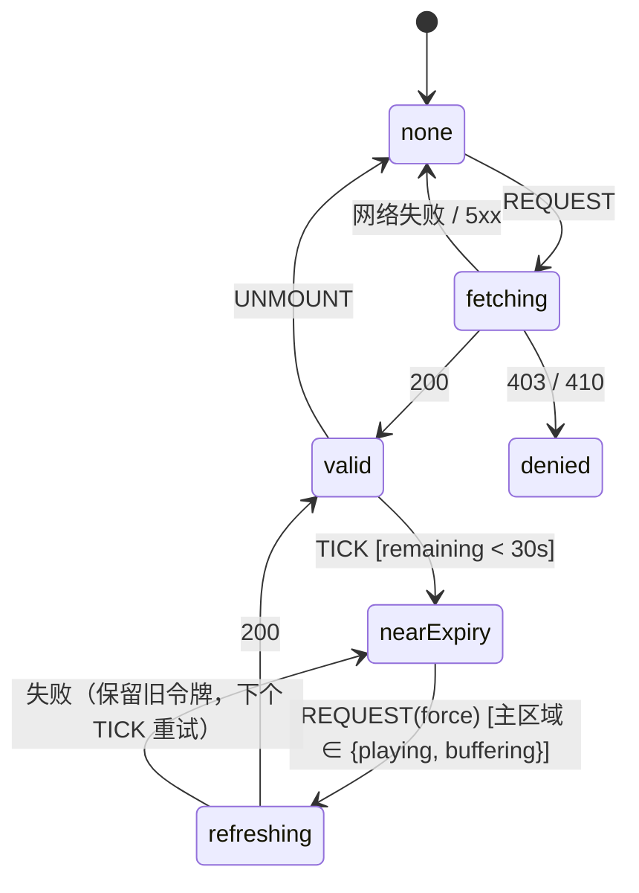

# 技术设计 — 播放器状态机（Player State Machine）

> Wave 1 · 工作槽 **W1 WORK SLOT 2**（技术设计文档）。分支：`cursor/w1-technical-design-docs-8a32`。
> 文档定位、基线来源、不确定性标注约定见 `docs/design/domain-model.md` §0。

## 0. 为什么需要这份文档

已有文档对播放器的描述分散在四处，且都停留在提及层面：

| 来源 | 已有内容 | 缺口 |
|---|---|---|
| `docs/03-tech-architecture.md` §3.1 | 一行状态列表 `idle→loading→playing→stalled→ended→error` | 无事件、无转移、无守卫 |
| `docs/03-stack-decision.md` D4 | 「Zustand + 显式 reducer 即可测，落选 XState」 | reducer 的形状未定义 |
| `docs/02-screen-inventory.md` SCR-05 | UI 特有态 S6（锁定）/ S7（卡顿） | 与技术状态的对应关系未定义 |
| `docs/02-user-journeys.md` J12 + `docs/02-information-architecture.md` §8.3 | 8 条失败分支 + 降级矩阵 | 是行为要求，不是状态规格 |
| `docs/14-test-plan.md` §1.1 | 要求「播放器状态机」单测 | 没有可被测试的状态定义 |

本文把上述要求合成为**一个可实现、可测试的形式化状态机规格**。它是 `docs/14-test-plan.md` §1.1 单测项的被测规格，也是 Wave 2 播放器（波次 W10/W11，`docs/00-wave-plan.md`）的实现依据。

**本文不改写上述任何文档的结论**；发现的差异登记于 §12，编号前缀 `PS-`。

---

## 1. 设计约束

来自上游文档，逐条是硬约束：

| # | 约束 | 来源 |
|---|---|---|
| CN-1 | 播放地址不随集详情下发，须单独换取短时效令牌（TTL ≤10min） | `docs/12-api-contracts.md` §4.4、`docs/14-security.md` §5.1 |
| CN-2 | 可看性**只由服务端**计算，客户端不得自行推导 | `docs/12-domain-model.md` §3.4 |
| CN-3 | iOS 走原生 HLS，Android 走 hls.js（MSE） | `docs/03-stack-decision.md` D3 |
| CN-4 | 竖屏沉浸流，至多 3 个 `<video>` 实例（当前/前/后） | `docs/03-tech-architecture.md` §3.2 |
| CN-5 | 切集用 `replace` 不入历史栈 | `docs/02-information-architecture.md` §6 B4 |
| CN-6 | 卡顿转圈 ≤8s → 自动降一档清晰度 → 重试入口 | `docs/02-user-journeys.md` J12-3 |
| CN-7 | CDN/内核错误先静默重签令牌重放一次，再失败才呈现错误态 | `docs/02-information-architecture.md` §8.3 |
| CN-8 | `playUrl` 剩余有效期 <30s 时恢复播放前静默重签 | 同上 |
| CN-9 | 进度心跳按 `/config` 的 `playback.progressHeartbeatSec`（默认 10s），失败本地入队 | `docs/12-api-contracts.md` §4.10、`docs/02-information-architecture.md` §8.2 |
| CN-10 | 切集遇弱网**不自动跳过集**，停留当前集尾帧 + 15s 超时后错误态 | `docs/02-user-journeys.md` J12-7 |
| CN-11 | 滑动切集到首帧 P90 ≤ 800ms（预取命中时）；点击到首帧 P90 ≤1.2s(WiFi)/2.5s(4G) | `docs/03-nonfunctional.md` §2 |
| CN-12 | 埋点落点：`PLAY_START` / `PLAY_COMPLETE` / `UNLOCK` | `docs/02-screen-inventory.md` SCR-05 |

---

## 2. 机器的边界与分解

一个「播放会话」= 用户在播放器内连续消费同一部剧的过程；会话内可切集多次。因此状态被拆为两层：



- **主区域**决定"用户此刻看到什么"，是唯一驱动 UI 的区域。
- **并行区域**是正交关注点，各自独立迁移，通过守卫（guard）影响主区域。把它们从主区域拆出，是为了避免状态爆炸：若把「令牌有效性 × 清晰度 × 网络」编进主状态，状态数是 12 × 3 × 4 × 3。
- `NetworkRegion` 是**会话级共享**的（网络是全局事实），其余为集级。

---

## 3. 主区域：PlaybackRegion

### 3.1 状态定义

| 状态 | 语义 | 是否已挂载媒体 | 对应 UI（`docs/02-screen-inventory.md`） |
|---|---|---|---|
| `idle` | 初始态，未选定集 | 否 | 封面占位 |
| `resolving` | 正在取集元数据 + 播放令牌（CN-1） | 否 | 加载态（≥300ms 才展示，`docs/02-information-architecture.md` §8.1） |
| `locked` | 服务端判定不可看（CN-2） | **否** | **S6 锁定态**：封面 + 自动弹 PNL-02 解锁面板 |
| `buffering` | 已有 `playUrl`，媒体首帧未就绪 | 是 | 加载态（封面占位不撤） |
| `playing` | 正在播放 | 是 | 内容态 |
| `paused` | 用户主动暂停 | 是 | 内容态 + 暂停指示 |
| `seeking` | 拖拽进度中 | 是 | 内容态 + 拖拽指示 |
| `stalled` | 播放中缓冲耗尽（CN-6） | 是 | **S7 卡顿态**：转圈；8s 后出重试/切清晰度入口 |
| `suspended` | 被平台能力打断（广告/支付面板/App 切后台） | 是（已暂停） | 无独立 UI，覆盖层由打断方渲染 |
| `ended` | 本集播放完毕 | 是 | 完播推荐 / 自动连播下一集 |
| `errorRetryable` | 可恢复失败（网络/5xx/429/CDN） | 否 | 可重试错误态：错误组件 + 重试按钮 |
| `errorTerminal` | 不可恢复失败（404/410/封禁） | 否 | 终态错误：语义说明 + 回首页出口，**不提供重试** |
| `disposed` | 实例被回收（滑出窗口/离开播放器） | 否 | — |

`errorRetryable` 与 `errorTerminal` **必须是两个状态而非一个带标志位的 `error`**：`docs/02-information-architecture.md` §8.1 对两者规定了不同的 UI 契约（是否提供重试按钮），用同一状态会让"不提供无意义的重试"这条验收项无法被静态保证。

### 3.2 状态图



> `SWIPE_NEXT` / `SWIPE_PREV` 不在单个 `EpisodeSlot` 内处理转移，而是由 `EpisodeWindow` 管理器接管（§7）：滑动时旧实例走 `disposed`，新实例从 `idle` 或预热好的 `buffering` 起步。

### 3.3 转移表（规范性）

守卫用 `[...]`，动作用 `/ ...`。同一 (状态, 事件) 至多匹配一条守卫为真的转移；全不匹配则事件被**丢弃并计数**（不得抛异常）。

| 当前状态 | 事件 | 守卫 | 目标状态 | 动作 |
|---|---|---|---|---|
| `idle` | `EPISODE_SELECTED` | — | `resolving` | `fetchMeta` + `requestToken` |
| `resolving` | `TOKEN_OK` | — | `buffering` | `attachMedia(playUrl)`、`seekTo(resumePositionSec)`、`resetRetry` |
| `resolving` | `TOKEN_DENIED_ENTITLEMENT` | — | `locked` | `openUnlockPanel(details)`（价格来自错误 `details`，**不再额外请求**） |
| `resolving` | `CONTENT_OFFLINE` | — | `errorTerminal` | `invalidateContinueWatchingCache`（J13） |
| `resolving` | `META_NOT_FOUND` / `USER_BANNED` | — | `errorTerminal` | `renderTerminal(code)` |
| `resolving` | `ASSET_UNAVAILABLE` | — | `errorRetryable` | 文案「视频准备中」 |
| `resolving` | `NETWORK_FAIL` / `SERVER_ERROR` | — | `errorRetryable` | 按 `retryAfterSec` 退避 |
| `resolving` | `AUTH_REQUIRED` | — | `resolving` | `silentLogin()` 后重试一次；再失败 → `errorRetryable` |
| `buffering` | `MEDIA_CANPLAY` | — | `playing` | `emitPlayStart`、`startHeartbeat`、`schedulePrefetchNext` |
| `buffering` | `MEDIA_ERROR` | `[retry.resign == 0]` | `resolving` | `retry.resign++`、`requestToken(force)`（CN-7） |
| `buffering` | `MEDIA_ERROR` | `[retry.resign ≥ 1]` | `errorRetryable` | 提供「切换清晰度」次级出口（J12-2） |
| `buffering` | `START_TIMEOUT` | 15s（CN-10） | `errorRetryable` | 停留尾帧/封面，**不跳过集** |
| `playing` | `MEDIA_WAITING` | — | `stalled` | `startStallTimer(8s)`、`emitStallBegin` |
| `playing` | `MEDIA_ENDED` | — | `ended` | `emitPlayComplete`、`flushProgress(completed)` |
| `playing` | `USER_PAUSE` | — | `paused` | `flushProgress` |
| `playing` | `PLATFORM_INTERRUPT` | — | `suspended` | `pauseMedia`、`flushProgress`、`stopHeartbeat` |
| `paused` | `USER_PLAY` | `[token.remainingSec ≥ 30]` | `playing` | `resumeMedia`、`startHeartbeat` |
| `paused` | `USER_PLAY` | `[token.remainingSec < 30]` | `resolving` | `requestToken(force)`（CN-8，用户无感） |
| `stalled` | `MEDIA_PLAYING` | — | `playing` | `clearStallTimer`、`emitStallEnd(durationMs)` |
| `stalled` | `STALL_8S` | `[quality.mode == AUTO 且 存在更低档]` | `stalled` | `degradeQuality()` + Toast（CN-6）、重置 8s 计时 |
| `stalled` | `STALL_8S` | `[已最低档 或 quality.mode == PINNED]` | `stalled` | 显示重试 / 切清晰度入口，**保持转圈**（J12-3 原文：保持转圈而非报错） |
| `stalled` | `USER_RETRY` | — | `resolving` | `requestToken(force)` |
| `locked` | `UNLOCK_SUCCEEDED` | — | `resolving` | 关闭解锁面板、`requestToken(force)`、`emitUnlock` |
| `ended` | `AUTO_NEXT` | `[存在下一集]` | `resolving` | 交由 `EpisodeWindow` 推进（§7） |
| `ended` | `AUTO_NEXT` | `[无下一集]` | `ended` | 渲染完播推荐（`GET /recommendations/feed?scene=PLAYER`） |
| `errorRetryable` | `USER_RETRY` / `NETWORK_ONLINE` | — | `resolving` | `requestToken(force)`；`NETWORK_ONLINE` 触发的自动重试每集至多 1 次 |
| 任意 | `UNMOUNT` | — | `disposed` | `flushProgress`、`detachMedia`、`releaseBuffers`、`clearTimers` |

**`errorTerminal` 无出边（除 `UNMOUNT`）** —— 这是"不提供无意义重试"在状态机层面的强制。

---

## 4. 并行区域

### 4.1 TokenRegion（播放令牌生命周期）

令牌是短时效凭证（CN-1），其生命周期与媒体播放正交。

| 状态 | 语义 |
|---|---|
| `none` | 未持有令牌 |
| `fetching` | 请求中 |
| `valid` | 持有且 `expiresAt` 未近临界 |
| `nearExpiry` | 剩余 <30s（CN-8） |
| `refreshing` | 后台静默重签中（播放不中断） |
| `denied` | 服务端拒绝（权益/下架），驱动主区域进 `locked` / `errorTerminal` |



设计要点：

- **重签失败不清空旧令牌**。旧令牌可能仍在有效期内且 CDN 仍接受它；提前作废会把一次可恢复的网络抖动升级成播放中断。
- 播放中的重签是**后台行为**，主区域停在 `playing`，用户无感（CN-8 的"无感"要求）。只有 `paused → USER_PLAY` 且已过临界时，才允许主区域回到 `resolving`（此时用户本就在等待，可接受一次加载）。
- `TICK` 由 1s 心跳定时器驱动，不依赖 `setTimeout(expiresIn)` —— WebView 切后台会冻结定时器，回前台时基于 `Date.now()` 与 `expiresAt` 重新计算是唯一可靠方式。
- **令牌值禁止进入日志、埋点、错误上报**（`docs/14-security.md`）。错误上报前对 URL 做 query 剥离。

### 4.2 QualityRegion（清晰度）

| 状态 | 语义 |
|---|---|
| `auto` | 自动档，允许卡顿降档（CN-6） |
| `pinned` | 用户在 PNL-05 手动锁定，**不再自动降档**（`docs/02-information-architecture.md` §8.3 原文） |

档位阶梯 `1080p → 720p → 480p`（`docs/12-domain-model.md` §3.3 的 `VideoAsset.quality` 枚举）。

- 起播档：由 `GET /config` 下发的默认值 + 网络类型探测决定；成本护栏要求「免费集限 720p 起播」（`docs/03-nonfunctional.md` §9），故起播档是**服务端可控参数**而非客户端硬编码。
- 降档动作：`degradeQuality()` 需要新 `playUrl`（不同 quality 是不同 assetKey），因此降档 = 一次 `requestToken(quality=下一档)` + 在**当前 `positionSec`** 重新 attach，不回到起点。
- 用户手动切档进入 `pinned` 后，本次播放会话内不再自动降档；离开播放器后重置为 `auto`。

### 4.3 NetworkRegion（会话共享）

| 状态 | 进入条件 | 影响 |
|---|---|---|
| `online` | 默认 | — |
| `degraded` | 连续 2 次请求超时/失败（`docs/02-information-architecture.md` §8.2） | 顶部弱网横幅 CMP-06；不阻断操作 |
| `offline` | 网络事件 + 请求连续失败 | 已缓冲部分继续播放（J12-5）；心跳与埋点入本地队列 |

`offline → online` 触发：横幅消失、补发进度队列与埋点队列、向当前 `EpisodeSlot` 发 `NETWORK_ONLINE`（若其在 `errorRetryable` 则自动重试一次，J12-6）。

### 4.4 ProgressRegion（进度上报）

| 状态 | 语义 |
|---|---|
| `stopped` | 未在播放 |
| `beating` | 每 `progressHeartbeatSec` 上报一次（CN-9） |
| `queued` | 上报失败，本地队列保留**每集仅最新一条**（`docs/02-information-architecture.md` §8.2） |

- 心跳**只在 `playing` 状态运行**。`paused`、`stalled`、`suspended`、`seeking` 一律停止心跳，但进入这些状态时各触发一次 `flushProgress`（立即上报当前位置）。这样既不虚增观看时长，又不丢断点。
- 上报语义天然幂等且容忍乱序（服务端 LWW，`docs/12-api-contracts.md` §4.7），故补报可以无脑重放。
- 最坏丢失量 = `progressHeartbeatSec` 秒（J12-8 已量化为可接受损失）。

---

## 5. 事件字典

| 事件 | 来源 | 载荷 |
|---|---|---|
| `EPISODE_SELECTED` | 路由 / 滑动 / 深链 | `{ episodeId, source: DEEPLINK\|LIST\|SWIPE\|CONTINUE }` |
| `TOKEN_OK` | `POST /episodes/{id}/playback-token` 200 | `{ playUrl, format, quality, expiresAt, resumePositionSec }` |
| `TOKEN_DENIED_ENTITLEMENT` | 403 `EPISODE_LOCKED` / `EPISODE_VIP_REQUIRED` | `details`（含 `unlockPolicy`、`priceCoins`） |
| `CONTENT_OFFLINE` | 410 | `{ resourceType, resourceId }` |
| `ASSET_UNAVAILABLE` | 503 `EPISODE_ASSET_UNAVAILABLE` | `{ episodeId }` |
| `AUTH_REQUIRED` | 401 | — |
| `MEDIA_CANPLAY` / `MEDIA_PLAYING` / `MEDIA_WAITING` / `MEDIA_ENDED` / `MEDIA_ERROR` | `<video>` 元素事件 或 hls.js 事件 | 归一化后的 `{ kind, fatal }` |
| `USER_PLAY` / `USER_PAUSE` / `USER_SEEK` / `USER_RETRY` / `USER_REPLAY` | UI | — |
| `USER_SWITCH_QUALITY` | PNL-05 | `{ quality }` |
| `UNLOCK_SUCCEEDED` | 解锁面板（含 `409 UNLOCK_ALREADY_UNLOCKED` 视为成功，`docs/12-error-catalog.md` §11） | `{ episodeId }` |
| `PLATFORM_INTERRUPT` / `PLATFORM_RESUME` | 平台桥接（广告/支付/前后台） | `{ cause }`，见 §8 |
| `STALL_8S` / `START_TIMEOUT` / `TICK` | 定时器 | — |
| `NETWORK_ONLINE` / `NETWORK_OFFLINE` | 网络事件 + 请求失败计数 | — |
| `SWIPE_NEXT` / `SWIPE_PREV` | 手势 | — |
| `UNMOUNT` | 生命周期 | — |

**归一化原则**：`<video>` 与 hls.js 的错误模型完全不同（前者 `MediaError.code`，后者 `Hls.ErrorTypes/ErrorDetails`）。二者必须在播放器适配层归一化为统一的 `MEDIA_ERROR{ kind, fatal }` 后才进状态机，**状态机不感知播放内核**。这是 CN-3 双内核方案可测试的前提。

---

## 6. 不变式（可执行断言，供单测与属性测试）

对应 `docs/14-test-plan.md` §1.1 的单测要求，每条应有对应用例：

| # | 不变式 | 违反的后果 |
|---|---|---|
| INV-P1 | `locked` 状态下**永不**调用 `attachMedia` | 越权播放（资损 + 版权） |
| INV-P2 | 处于 `playing` 时，`TokenRegion` ∈ `{valid, nearExpiry, refreshing}`；不可能是 `none`/`denied` | 播放不可能没有凭证 |
| INV-P3 | 同一 `episodeId` 的一次播放会话内，`PLAY_START` 至多发一次 | 播放量统计被卡顿/重签重复计数放大 |
| INV-P4 | `PLAY_COMPLETE` 只由 `MEDIA_ENDED` 触发，不由进度百分比触发 | 完播率失真 |
| INV-P5 | 心跳仅在 `playing` 运行；离开 `playing` 必先 `flushProgress` | 观看时长虚增 / 断点丢失 |
| INV-P6 | `errorTerminal` 除 `UNMOUNT` 外无出边 | UI 出现无意义的重试按钮 |
| INV-P7 | `quality.mode == PINNED` 时永不触发 `degradeQuality` | 违反用户显式选择 |
| INV-P8 | 任意时刻活跃 `<video>` 实例数 ≤ 3（CN-4） | 低端机内存溢出 / WebView 崩溃 |
| INV-P9 | `disposed` 后不再接收任何事件；所有定时器已清 | 内存泄漏、幽灵心跳 |
| INV-P10 | 令牌 URL 不出现在任何 `console`、埋点、Sentry 上报中 | 防盗链失效 |
| INV-P11 | 每个 (状态, 事件) 对要么有匹配转移，要么被计数丢弃 —— **不抛异常** | 一次意外事件白屏（白屏率预算 <0.1%，`docs/03-nonfunctional.md` §2） |

**属性测试建议**：以随机事件序列（长度 ≤200，从 §5 字典均匀采样）驱动状态机，断言 INV-P1/P2/P6/P8/P9/P11 恒成立。这类"模糊事件序列"测试对播放器这种事件密集组件的收益远高于逐条用例。

---

## 7. EpisodeWindow：切集与实例管理

### 7.1 窗口模型

```text
             ┌──────────┬──────────┬──────────┐
 集序列  ...  │  prev    │ current  │  next    │  ...
             │ slot[-1] │ slot[0]  │ slot[+1] │
             └──────────┴──────────┴──────────┘
                  ↑ 三个 <video> 实例循环复用（CN-4）
```

滑动一集时**不新建实例**，而是角色轮转（`next` 变 `current`，原 `prev` 被回收并重新初始化为新的 `next`）。新建/销毁 `<video>` 在低端 Android WebView 上是主要卡顿源，轮转复用是 CN-11 的 800ms 预算能否达成的关键。

### 7.2 预备实例的状态限制

`prev` / `next` 实例**最多推进到 `buffering` 且只缓冲首片**，绝不进入 `playing`：

| 预备实例条件 | 允许的预热程度 |
|---|---|
| 下一集 `viewerAccess.playable == true` | 预取令牌 + 预取 m3u8 + 缓冲首个分片 |
| 下一集 `playable == false`（锁定集） | **只预取元数据，不取令牌、不取媒体** |
| `NetworkRegion == degraded` 或 `offline` | 全部预热暂停，只保留当前集 |
| 用户开启省流量模式 `[待验证：Minis 是否暴露该信号]` | 全部预热暂停 |

锁定集不预热有三重理由：请求必然 403（浪费一次往返并污染错误率指标）、无谓消耗用户流量、避免服务端产生大量 `EPISODE_LOCKED` 噪声掩盖真实异常。`docs/02-screen-inventory.md` SCR-05 的「仅 `playable=true` 的下一集预取令牌」与此一致。

### 7.3 切集时序

```text
SWIPE_NEXT
  → slot[0].flushProgress() 并转 disposed（或降级为 prev）
  → slot[+1] 角色升为 current
     ├─ 若已 buffering 且首片就绪 → 直接 MEDIA_CANPLAY → playing（命中预取，≤800ms）
     └─ 若未预热（弱网/锁定集）→ 走完整 resolving（未命中，走 CN-10 的 15s 超时规则）
  → 新的 slot[+1] 初始化并按 §7.2 决定是否预热
  → 路由 replace（CN-5），不入历史栈
```

**CN-10 的实现落点**：未命中预取时停留在旧实例的尾帧 + 加载指示，而不是清空画面。这要求 `disposed` 前保留最后一帧作为新实例的封面占位 —— 实现上用 `poster` 或截帧，属实现细节，此处只规定行为约束。

---

## 8. 平台打断：`suspended` 状态

这是本文相对上游文档新增的状态，因为 TikTok Minis 的三类平台能力都会打断播放，而现有文档未定义播放器应如何响应：

| 打断源 | 触发 | 期望行为 |
|---|---|---|
| 激励视频广告（`TTMinis.createRewardedVideoAd`） | 用户在锁定集选择"看广告解锁"（J5） | 播放器本就处于 `locked`（未播放），无需 `suspended`；但若在 `playing` 中弹广告（未来玩法），必须先 `PLATFORM_INTERRUPT` |
| 插屏广告（`createInterstitialAd`） | 运营配置的时机 | `playing → suspended`，广告结束 `PLATFORM_RESUME` |
| 支付面板（`TTMinis.pay`） | 解锁路径充值（J2/J11） | 同上；支付期间**必须停止心跳**，否则支付停留时间被计入观看时长 |
| App 切后台 / TikTok 内导航离开 | 平台生命周期事件 `[未知]` | `playing → suspended` + `flushProgress` |

**关键不确定项**：TikTok Minis 是否提供可靠的前后台生命周期回调，官方公开文档未见明确说明 —— 标记 `[未知]`，登记为 `PS-3`。降级方案：用标准 Web 的 `visibilitychange` + `pagehide` 事件，二者在 WebView 内的可靠性 `[待验证]`，需在 Playground/真机实测（`docs/11-official-onboarding-checklist.md` D11/D12）。**在验证前，实现必须同时监听平台事件与 Web 事件，取先到者**，且 `flushProgress` 必须能在 `pagehide` 的同步窗口内完成（用 `navigator.sendBeacon` 或 `fetch(keepalive)`）。

---

## 9. 错误码到状态的映射（规范性）

以 `docs/12-error-catalog.md` 为底表，本表是播放链路的完整映射，与 `docs/02-information-architecture.md` §8.3 降级矩阵一致：

| 错误码 | HTTP | 目标状态 | 附加动作 |
|---|---|---|---|
| `EPISODE_LOCKED` | 403 | `locked` | 用 `details.priceCoins` / `unlockPolicy` 直接渲染解锁面板，不再请求 |
| `EPISODE_VIP_REQUIRED` | 403 | `locked` | 解锁面板只展示 VIP 通道 |
| `CONTENT_OFFLINE` | 410 | `errorTerminal` | 失效本地"继续观看"缓存（J13） |
| `CONTENT_NOT_FOUND` | 404 | `errorTerminal` | — |
| `AUTH_USER_BANNED` | 403 | `errorTerminal` | 清会话，进匿名只读（J14） |
| `EPISODE_ASSET_UNAVAILABLE` | 503 | `errorRetryable` | 文案「视频准备中」 |
| `AUTH_REQUIRED` | 401 | `resolving`（自愈） | 触发静默登录后重试一次 |
| `AUTH_TOKEN_EXPIRED` | 401 | 不进播放器状态机 | 由全局拦截器静默刷新并重放（`docs/12-error-catalog.md` §11），播放器无感 |
| `COMMON_RATE_LIMITED` | 429 | `errorRetryable` | 按 `details.retryAfterSec` 退避 |
| `COMMON_SERVICE_UNAVAILABLE` / `COMMON_INTERNAL_ERROR` | 503/500 | `errorRetryable` | 指数退避 |
| 网络超时（15s，CN-10） | — | `errorRetryable` | 不跳过集 |
| `MEDIA_ERROR`（CDN/内核） | — | 首次 `resolving`（静默重签），再次 `errorRetryable` | CN-7 |

> `AUTH_TOKEN_EXPIRED` **刻意不进入播放器状态机**：会话刷新是全局横切关注点，若让它污染播放状态，每个业务组件都要处理刷新态。这是 `docs/02-information-architecture.md` §8.2「全局拦截器实现，业务层无感」的直接落点。

---

## 10. 媒体侧缓存与预取策略

> 接口/数据缓存见 `docs/design/api-contracts.md` §4；本节只管媒体与播放器本地缓存。

| 层 | 内容 | 策略 |
|---|---|---|
| 令牌缓存（内存） | `playUrl` + `expiresAt` per (episode, quality) | 仅内存，**禁止持久化**（`docs/14-security.md` 防盗链）；`expiresAt` 到期即弃 |
| m3u8 清单 | 当前集 + 下一集（仅 `playable=true`） | 内存，随集切换淘汰 |
| 媒体分片缓冲 | hls.js `maxBufferLength` | 建议 30s / `maxMaxBufferLength` 60s；低端机（4GB RAM 基线，`docs/03-nonfunctional.md` §2）下调至 20s，防 WebView OOM |
| 预取首片 | 下一集首个分片 | 只取 1 片；CN-11 的 800ms 预算主要由这一片决定 |
| HTTP 缓存 | HLS 分片 | 由 CDN `Cache-Control` 控制；分片可长缓存（内容不可变），**m3u8 与密钥不可缓存** |
| AES-128 密钥 | 付费内容解密密钥 | 每次播放向密钥接口鉴权获取，**内存态、不缓存、不落盘**（`docs/14-security.md` §5.1） |
| 进度本地队列 | 每集最新一条 | `localStorage`，容量极小；启动时补报 |
| 埋点本地队列 | ≤200 条，溢出丢最旧 | `docs/02-information-architecture.md` §8.2 |

**离线缓存明确不做**：`docs/01-product-scope.md` §3 已将"下载/离线缓存剧集"排除（防盗链与版权风险）。因此播放器**不得**使用 Service Worker 缓存媒体分片，也不得使用 Cache Storage 持久化任何媒体数据 —— 这条是版权红线，列入代码评审检查项。

---

## 11. 测试矩阵（对应 `docs/14-test-plan.md` §1.1）

| 层 | 用例集 | 判定 |
|---|---|---|
| 单测 · 转移 | §3.3 转移表逐行 | 给定状态 + 事件 + 守卫，断言目标状态与动作调用 |
| 单测 · 守卫 | 令牌剩余 30s 边界、8s 卡顿边界、15s 起播超时边界、最低档边界 | 边界值 ±1 |
| 单测 · 不变式 | §6 INV-P1…P11 | 随机事件序列属性测试 |
| 单测 · 错误映射 | §9 映射表逐行 | 错误码 → 目标状态 |
| 集成 | 与 MSW mock 的令牌接口联动（`docs/design/api-contracts.md` §7） | 403/410/503/超时四类分支各一条 |
| E2E | J12 的 8 条分支 + J2 黄金路径的播放段 | Playwright（`docs/03-stack-decision.md` D16） |
| 真机 | MSE/EME 可用性探测、前后台生命周期、广告打断恢复 | 依赖 D11/D12 真机链路，**目前阻塞** |

播放器状态机建议纳入变异测试范围：其分支密度高，行覆盖率容易虚高。是否列入 90% 核心模块清单由 W1D 裁决（P3 已把「播放令牌签发」列为建议增补的第 5 项，客户端侧状态机是其对偶面）。

---

## 12. 差异登记与开放问题

### 12.1 差异登记（不改写上游）

| # | 事项 | 涉及文档 | 建议 | 建议裁决人 |
|---|---|---|---|---|
| PS-1 | 架构文档的状态列表 `idle→loading→playing→stalled→ended→error` 缺 `locked` / `suspended` / `paused` / `seeking`，且未区分可重试与终态错误 | `docs/03-tech-architecture.md` §3.1 | 引用本文 §3.1 为准，架构文档保留一行摘要并链接本文 | P3 |
| PS-2 | UI 态 S6/S7 与技术状态的对应关系未定义 | `docs/02-screen-inventory.md` SCR-05 | 采纳本文 §3.1 的映射列（S6=`locked`，S7=`stalled`） | P2 |
| PS-3 | 平台前后台生命周期事件未在官方能力清单中确认，播放打断/恢复无契约依据 `[未知]` | `docs/11-api-and-bridge.md` §3、P2 差距 `G6` | 与 `G6`（launch options）合并向 TikTok 对接人确认；在此之前用 Web 事件兜底并双监听 | W1A |
| PS-4 | 起播默认清晰度是客户端决策还是服务端下发未定义，而成本护栏要求「免费集限 720p 起播」 | `docs/12-api-contracts.md` §4.10、`docs/03-nonfunctional.md` §9 | `GET /config` 的 `playback` 增 `defaultQuality` 与 `freeEpisodeMaxQuality` | W1B |
| PS-5 | 自动连播（`ended → AUTO_NEXT`）是否默认开启、是否可关闭，产品未定义 | `docs/01-product-scope.md` §4.3 | 建议默认开启 + 设置项可关；作为 `/config` 开关下发 | 产品槽 |

### 12.2 开放问题

| # | 问题 | 状态 | 影响 |
|---|---|---|---|
| Q-PS-1 | TikTok WebView 内 MSE 可用性与 EME 上限 | `[未知]`，P3 阻塞 `B-3` / 风险 `RK-2` | 若 Android WebView 不支持 MSE，hls.js 方案失效，需退回 `mp4` 单档或平台原生能力。**AES-128 为已定下限，不阻塞开工** |
| Q-PS-2 | WebView 自动播放策略（是否需要用户手势解锁音频/视频） | `[待验证]` | 若需手势，深链冷启动直接起播不成立，`resolving → buffering` 后需插入"点击播放"引导态。设计上已用 `buffering` 吸收该等待，改动可控 |
| Q-PS-3 | 平台是否暴露网络类型/省流量信号 | `[未知]` | 影响 §7.2 预热策略与起播档选择；缺失时退化为仅用 `navigator.connection`（WebView 支持度 `[待验证]`） |
| Q-PS-4 | 插屏广告的展示时机（是否会打断播放中） | `[待验证]`，取决于运营配置 | 决定 `suspended` 是否为高频路径；当前设计已覆盖，无返工 |

---

## 13. 交叉引用

| 主题 | 文档 |
|---|---|
| `viewerAccess` 计算规格（`locked` 的服务端依据） | `docs/design/domain-model.md` §3.6 |
| 播放令牌端点、错误信封、缓存契约 | `docs/design/api-contracts.md` §4/§5 |
| 平台桥接与打断事件来源 | `docs/design/minis-integration.md` §4/§5 |
| 用户视角的播放失败旅程 | `docs/02-user-journeys.md` J12 |
| 播放链路降级矩阵 | `docs/02-information-architecture.md` §8.3 |
