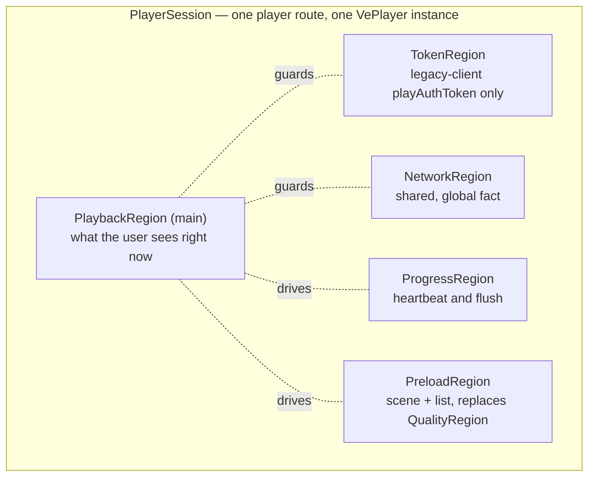
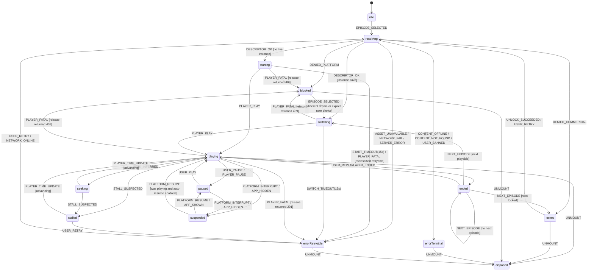

# Technical Design — Player State Machine (VePlayer)

> **Wave 2 · work slot A**, task `PLY-020`. Branch `cursor/w2-work-a-71b2`, based on `cursor/w2-plan-p1-0453`
> (`fc39e3e`). Date 2026-08-27.
>
> **This is a restatement, not an edit.** The Wave 1 version of this file specified a `<video>` element with native
> HLS and an `hls.js` fallback, a signed-URL token lifecycle and a client-driven quality ladder. Corrections `COR-1`
> and `COR-2` (`docs/architecture/system-overview.md` §1.1) removed all three. The restatement is carried as
> conflict `X-14` in `docs/plan/w1-conflict-register.md` §6.2 and queued as `PLY-020` in
> `docs/plan/w2-ready-queue.md` §4.1.
>
> **Nothing is silently deleted.** §13 lists every section, constraint and state of the Wave 1 version with its
> status and its successor, so a reader arriving from a citation of the old text can find where that text went.
>
> **Why it could not simply be marked superseded:** this document is the specification that
> `docs/14-test-plan.md` §1.1's player-state-machine unit tests are written against. Marking it superseded without a
> replacement would delete the only formal specification the test plan has (`docs/plan/w1-conflict-register.md`
> §3.1).
>
> **Companion:** `docs/design/playback-contract.md` (same slot, same wave) owns the contract this machine consumes.
> This file owns what the client does with it.
>
> **Language:** English, matching `docs/architecture/`, `docs/product/`, `docs/research/` and the Wave 2 plan set.
> The Wave 1 version was Chinese; the terminology map is in `docs/architecture/system-overview.md` §14 and the
> Chinese identifiers (`CN-n`, `INV-Pn`, `PS-n`, `S6`/`S7`) are preserved unchanged so every existing citation still
> resolves.

---

## 0. What survives, and what does not

The Wave 1 document was a careful specification of the wrong player. The parts that were about the *player kernel*
are gone. The parts that were about **user-visible outcomes and engineering discipline** were never about the kernel
at all, and they are retained:

| Retained, because it is kernel-independent | Removed, because it described work the platform now does |
|---|---|
| The `locked` / `suspended` / `errorRetryable` / `errorTerminal` distinctions | The two-kernel normalization design (`CN-3`) |
| Eleven invariants `INV-P1 … INV-P11`, each either verbatim or restated with a stated reason (§6) | `QualityRegion` and the definition ladder (`CN-6`) |
| `errorTerminal` has no outgoing edge — "no meaningless retry button" enforced structurally | The signed-URL token lifecycle: `nearExpiry`, silent re-signing, `expiresAt` arithmetic (`CN-1`, `CN-7`, `CN-8`) |
| Heartbeat only while playing, with a flush on every exit | The three-instance `EpisodeWindow` and instance role rotation (`CN-4`) |
| Unmatched events are counted and dropped, never thrown | The media-cache and AES-128 key table (§10 of the Wave 1 version) |
| Property testing over random event sequences | `<video>` element lifecycle, `attachMedia`, manifest prefetching |

Three things are genuinely **new**, and each closes a registered gap:

1. A `blocked` state, distinct from `locked`, for content the platform will not play (`IAG-9`, `AC-PB-1`).
2. Preload expressed as the platform's two scenes with an explicit transition rule (`IAG-12`).
3. A specification for observing states the player does not report — stall and seek — because the VePlayer event
   list has no buffering event (§4.3).

---

## 1. Design constraints

The Wave 1 numbering is preserved so that citations of `CN-n` resolve to a row that states its own status.

| # | Constraint | Status | Source / replacement |
|---|---|---|---|
| CN-1 | Playback address is not delivered with episode detail; a short-lived token must be exchanged for it | **Superseded** by `COR-4`. There is no address and, on modern clients, no token. What is exchanged is a **descriptor** | `docs/design/playback-contract.md` §1 |
| CN-2 | Playability is computed **server-side only**; the client never derives it | **Retained, and strengthened.** Two authorities are in series: ours can deny but cannot grant (`COR-3`) | `docs/design/playback-contract.md` §5.1 |
| CN-3 | iOS native HLS, Android `hls.js` (MSE) | **Superseded** by `COR-1`. One kernel: VePlayer via `TTMinis.getPlayer()`. Third-party players and native HTML video are replaced by TikTok with a blocked UI | `docs/research/tiktok-minis-official.md` §4 |
| CN-4 | Immersive vertical feed, at most three `<video>` instances | **Superseded** by `COR-1`. **One** retained VePlayer instance per player route, switched with `playNext` | §7 |
| CN-5 | Episode switching uses route `replace`, not a history push | **Superseded** by `docs/product/sitemap-and-ia.md` §12. Episode switching is not a navigation at all; the URL is updated in place without a screen teardown | §7.1 |
| CN-6 | Stall ≥ 8 s → automatically drop one definition step → offer retry | **Mechanism superseded** by `COR-1`; **budget retained.** The 8 s figure survives as the UI budget for offering a retry affordance; the definition change is deleted, because definition is plugin-owned | §4.3, `AC-PL-7` |
| CN-7 | On a CDN or kernel error, silently re-sign the token and replay once before showing an error | **Restated with the same shape and a different reason.** On a fatal player error, re-request the **descriptor** once and let the server classify the failure. We are not refreshing a credential; we are asking the authority whether the content is blocked | §4.4, `docs/design/playback-contract.md` §5.2 |
| CN-8 | Re-sign silently when the remaining validity is under 30 s | **Superseded** by `COR-4`. Nothing in the descriptor expires on a modern client; on a legacy client the descriptor is re-requested per episode rather than refreshed | §5.1 |
| CN-9 | Progress heartbeat at `/config`'s `playback.progressHeartbeatSec` (default 10 s); queue locally on failure | **Retained verbatim.** The source of position changes from the media element's `timeupdate` to the player's `TIME_UPDATE` | §5.3 |
| CN-10 | On a weak network do **not** auto-skip the episode; hold the current frame, error after a 15 s timeout | **Retained, and now cheaper to implement.** With one retained instance the previous final frame is already on screen during a switch — there is nothing to preserve deliberately | §3.1 `switching`, §3.3 |
| CN-11 | Swipe-to-first-frame P90 ≤ 800 ms on a preload hit; tap-to-first-frame P90 ≤ 1.2 s Wi-Fi / 2.5 s 4G | **Budgets retained; mechanism superseded.** The mechanism is the platform's preload module, not our own prefetching | §8, `AC-PF-1` |
| CN-12 | Analytics landmarks `PLAY_START` / `PLAY_COMPLETE` / `UNLOCK` | **Retained**, plus playback-quality events derived from the player (`docs/architecture/system-overview.md` §9) | §5.3 |
| CN-13 | **New.** One retained player instance per player route; `destroy()` on route exit; `destroy()` is idempotent because a React StrictMode cleanup runs twice | new | `AC-PL-3`, `AC-PL-4` |
| CN-14 | **New.** The player kernel is created asynchronously: `player.player` is `null` immediately after construction and must be obtained inside the `READY` event. Kernel access is what provides `currentTime`, `paused`, `ended` | new | `docs/research/tiktok-minis-official.md` §4.1 |
| CN-15 | **New.** The app renders no control for state a plugin owns — definition, subtitle track, playback rate — and calls no definition-changing API | new | `AC-PL-6`, `docs/product/sitemap-and-ia.md` §4.1 |
| CN-16 | **New.** Preload requires `enableMp4MSE: true` and MP4, and works on PC, Android WebView and iOS 17.1+. Where MSE is unavailable, **playback still works and preload does not** | new | `AC-PF-3`, risk `M-3` |
| CN-17 | **New.** The documented event set has **no buffering or waiting event**. Stall is inferred (§4.3), not reported | new | `docs/research/tiktok-minis-official.md` §4.1 |
| CN-18 | **New.** No platform foreground/background callback is confirmed. Listen to the platform lifecycle hook **and** `visibilitychange`/`pagehide`, and take whichever fires first | `PS-3` promoted to a constraint | §9, `BRG-004` |

---

## 2. Boundary and decomposition

A **playback session** is one visit to the player route: the user consumes one drama continuously and may switch
episodes many times without leaving. Under `CN-13` that session owns exactly one player instance, so the Wave 1
two-level model (session → three episode slots) collapses to one level:



- **The main region is the only region that drives UI.** Every other region influences it through guards.
- Parallel regions exist to prevent state explosion: folding token, network, progress and preload into the main
  state would multiply 14 states by 3 × 3 × 3 × 2.
- `NetworkRegion` is session-shared. The rest are per-session too, now that there is one instance — which is
  itself a simplification worth naming: the Wave 1 design needed per-slot regions because it had three players.

---

## 3. Main region: `PlaybackRegion`

### 3.1 States

The last column closes delta `PS-2`: it maps every technical state to a screen-inventory state, which is what
`IA-001` (or `IA-003` at W3) needs in order to amend `docs/02-screen-inventory.md`.

| State | Meaning | Player instance | Screen-inventory state (`docs/02-screen-inventory.md` §2, SCR-05) |
|---|---|---|---|
| `idle` | On the surface, no episode chosen yet | not constructed | loading — cover placeholder |
| `resolving` | Requesting the playback descriptor | not constructed | loading, shown only after 300 ms (`docs/02-information-architecture.md` §8.1) |
| `locked` | **Our** commercial gate refused | constructed but not advanced | **S6 locked** — cover + unlock panel PNL-02 |
| `blocked` | **The platform** refuses this album version | alive, not advanced | **terminal error, reason `BLOCKED`** — new variant; exits to `#/fallback?reason=BLOCKED` |
| `starting` | First episode of this surface: instance constructed, awaiting `READY` then `PLAY` | constructed | loading — cover placeholder retained |
| `switching` | Later episode: `playNext` called on the retained instance, awaiting `READY`/`PLAY` | alive | content — **previous final frame stays on screen** plus a loading indicator |
| `playing` | Playing | alive | content |
| `paused` | Paused by the user | alive | content + pause affordance |
| `seeking` | Position discontinuity in progress (§4.3) | alive | content + scrub affordance (plugin-owned) |
| `stalled` | Playing, but position has stopped advancing | alive | **S7 stalled** — indicator, then a retry affordance at 8 s. **No definition change** (`AC-PL-7`) |
| `suspended` | Interrupted by a platform surface (ad, payment sheet, app backgrounded) | alive, paused | content; the overlay belongs to whoever interrupted |
| `ended` | This episode finished | alive | content — completion recommendations or auto-next |
| `errorRetryable` | Recoverable failure: network, 5xx, 429, unclassifiable player error | may be alive | retryable error — message + retry |
| `errorTerminal` | Unrecoverable: 404, 410, ban | may be alive | terminal error — explanation + exit home, **no retry** |
| `disposed` | Surface torn down | destroyed | — |

Three notes on the state set:

- **The Wave 1 `buffering` state split into `starting` and `switching`.** They have different UI contracts (cover
  placeholder versus previous final frame), different budgets (`AC-PF-1` measures the switch, not the cold start),
  and different failure handling. Merging them would have made `AC-PL-3` — no second instance, no route teardown —
  unverifiable from the state machine alone.
- **`locked` and `blocked` are two states, not one with a flag.** `AC-PB-1` is release-blocking and requires them
  to differ in code, copy and metrics; a single state with a reason field makes "we never showed a price for an
  incident" an assertion about a UI branch instead of a property of the machine.
- **`errorRetryable` and `errorTerminal` remain two states**, for the reason the Wave 1 document gave and which is
  unchanged: they carry different UI contracts, and one state with a flag makes "no meaningless retry button" a
  convention rather than something statically checkable.

### 3.2 State diagram



Self-transitions are omitted from the diagram for readability — `PLAYER_READY` in `starting`, and
`PLAYER_TIME_UPDATE` while advancing in `playing` — and `PREV_EPISODE` behaves exactly as `NEXT_EPISODE` with the
episode pointer reversed. §3.3 is the normative form.

`SWIPE_NEXT` / `SWIPE_PREV` from the Wave 1 version are gone as machine-level events: a swipe is a gesture that
produces `NEXT_EPISODE` / `PREV_EPISODE`, and there is no window manager to intercept it (§7).

### 3.3 Transition table (normative)

Guards in `[...]`, actions after `/`. For any `(state, event)` pair at most one guard may be true; if none matches
the event is **counted and dropped, never thrown** (`INV-P11`).

| State | Event | Guard | Target | Actions |
|---|---|---|---|---|
| `idle` | `EPISODE_SELECTED` | — | `resolving` | `requestDescriptor(episodeId)`; `setPreloadScene(1, {prevCount:1, nextCount:2})`; `setPreloadList(orderedEpisodes)` (§8) |
| `resolving` | `DESCRIPTOR_OK` | `[no live instance]` | `starting` | `constructPlayer(descriptor)` (`docs/design/playback-contract.md` §6); `startTimeout(15s)` |
| `resolving` | `DESCRIPTOR_OK` | `[instance alive]` | `switching` | `playNext({albumId, episodeId, vid, getVideoByToken})`; `switchTimeout(15s)`; **do not** construct, **do not** change route |
| `resolving` | `DENIED_COMMERCIAL` | — | `locked` | `openUnlockPanel(details)` — price and policy come from the error `details`, with **no second request** |
| `resolving` | `DENIED_PLATFORM` | — | `blocked` | `reportBlocked(...)` (`docs/design/playback-contract.md` §5.3); `renderBlocked()`; **no retry affordance** |
| `resolving` | `CONTENT_OFFLINE` | — | `errorTerminal` | `invalidateContinueWatchingCache()` (journey J13) |
| `resolving` | `CONTENT_NOT_FOUND` / `USER_BANNED` | — | `errorTerminal` | `renderTerminal(code)` |
| `resolving` | `ASSET_UNAVAILABLE` | — | `errorRetryable` | copy: "preparing" |
| `resolving` | `NETWORK_FAIL` / `SERVER_ERROR` | — | `errorRetryable` | back off by `details.retryAfterSec` |
| `resolving` | `AUTH_REQUIRED` | `[silent login not yet tried]` | `resolving` | `silentLogin()` then retry once; a second failure → `errorRetryable` |
| `starting` | `PLAYER_READY` | — | `starting` | `captureKernel()` (`CN-14`); `startStallWatchdog()` |
| `starting` | `PLAYER_PLAY` | — | `playing` | `emitPlayStart()`; `startHeartbeat()`; `clearTimeout` |
| `starting` | `START_TIMEOUT` | — | `errorRetryable` | keep the cover; **never** skip to another episode (`CN-10`) |
| `switching` | `PLAYER_PLAY` | — | `playing` | `emitPlayStart()`; `emitSwitchLatency()` (`AC-PF-1`); `startHeartbeat()` |
| `switching` | `SWITCH_TIMEOUT` | — | `errorRetryable` | hold the previous final frame; **never** skip (`CN-10`) |
| `starting` / `switching` / `playing` | `PLAYER_FATAL` | `[reissue == 409]` | `blocked` | `reportBlocked(...)` (§4.4) |
| `starting` / `switching` / `playing` | `PLAYER_FATAL` | `[reissue == 201 and attempts == 1]` | `switching` | `playNext(freshDescriptor)` — the retry-once discipline inherited from `CN-7` |
| `starting` / `switching` / `playing` | `PLAYER_FATAL` | `[reissue == 201 and attempts > 1]` | `errorRetryable` | `reportPlayerFatal(...)` |
| `playing` | `PLAYER_TIME_UPDATE` | `[advancing]` | `playing` | `resetStallWatchdog()`; throttled `reportProgress()` |
| `playing` | `STALL_SUSPECTED` | — | `stalled` | `emitStallBegin()`; `showStallIndicator()` after 1.5 s; `showRetry()` at 8 s (`CN-6` budget); **no definition change** |
| `playing` | `SEEK_INFERRED` | — | `seeking` | `flushProgress()`; `stopHeartbeat()` |
| `playing` | `PLAYER_ENDED` | — | `ended` | `emitPlayComplete()`; `flushProgress(completed)`; `stopHeartbeat()` |
| `playing` | `USER_PAUSE` / `PLAYER_PAUSE` | — | `paused` | `flushProgress()`; `stopHeartbeat()` |
| `playing` / `paused` | `PLATFORM_INTERRUPT` / `APP_HIDDEN` | — | `suspended` | `pause()`; `flushProgress()` via `sendBeacon`/`fetch(keepalive)`; `stopHeartbeat()` |
| `paused` | `USER_PLAY` | — | `playing` | `play()`; `startHeartbeat()` — **no token check**: there is nothing to refresh (`CN-8` superseded) |
| `seeking` | `PLAYER_TIME_UPDATE` | `[advancing]` | `playing` | `startHeartbeat()`; **no** `emitPlayStart` (`INV-P3`) |
| `stalled` | `PLAYER_TIME_UPDATE` | `[advancing]` | `playing` | `emitStallEnd(durationMs)`; `startHeartbeat()` |
| `stalled` | `USER_RETRY` | — | `errorRetryable` | `reportStallGaveUp()` — the user asked to stop waiting; the retry then runs through `resolving` |
| `locked` | `UNLOCK_SUCCEEDED` | — | `resolving` | `closeUnlockPanel()`; `requestDescriptor(pendingEpisodeId)`; `emitUnlock()` |
| `ended` | `NEXT_EPISODE` | `[next playable]` | `switching` | `requestDescriptor` first on the legacy cohort (`PT-4`), otherwise the prefetched descriptor; then `playNext` |
| `ended` | `NEXT_EPISODE` | `[next locked]` | `locked` | hold the final frame; `openUnlockPanel()`; **do not** call `playNext` (`AC-PL-5`, `INV-P1`) |
| `ended` | `NEXT_EPISODE` | `[no next episode]` | `ended` | render completion recommendations (`GET /recommendations/feed?scene=PLAYER`) |
| `errorRetryable` | `USER_RETRY` / `NETWORK_ONLINE` | — | `resolving` | `requestDescriptor(force)`; a `NETWORK_ONLINE`-triggered automatic retry runs at most once per episode |
| `blocked` | `EPISODE_SELECTED` | `[user chose another target]` | `resolving` | leaving a blocked episode is allowed; retrying it is not |
| any | `UNMOUNT` | — | `disposed` | `flushProgress()`; `clearPreload()`; `destroy()`; `clearTimers()` |

**`errorTerminal` and `blocked` have no retry edge.** For `errorTerminal` this is the Wave 1 rule unchanged. For
`blocked` it is new and load-bearing: a platform block cannot be cleared by the client, so a retry button would
offer the user an action that is guaranteed to fail while generating a second operations alert.

---

## 4. Observing a player we do not own

### 4.1 The event surface

The player is imperative, owns its DOM, and is the source of truth for playback — no React state mirrors it
(`docs/architecture/tech-stack.md` §2). We subscribe. The documented events we use are `READY`, `PLAY`,
`TIME_UPDATE` (payload `{ currentTime }`), `ERROR` and `PRELOAD_INFO`
(`docs/research/tiktok-minis-official.md` §4.1).

The facade translates them into internal events before the machine sees anything:

| Internal event | Origin | Payload |
|---|---|---|
| `PLAYER_READY` | `READY` | — (the kernel handle is captured here, `CN-14`) |
| `PLAYER_PLAY` / `PLAYER_PAUSE` | `PLAY` / kernel `paused` | — |
| `PLAYER_TIME_UPDATE` | `TIME_UPDATE` | `{ currentTimeSec }` |
| `PLAYER_ENDED` | `ENDED` / kernel `ended` | — |
| `PLAYER_FATAL` | `ERROR` | `{ summary: string }` — a **stringified, truncated** summary, never a destructured SDK object |
| `PLAYER_PRELOAD_INFO` | `PRELOAD_INFO` and `player.preLoadData` | preload metrics (§8) |
| `STALL_SUSPECTED`, `SEEK_INFERRED`, `START_TIMEOUT`, `SWITCH_TIMEOUT`, `TICK` | our timers (§4.3) | — |
| `DESCRIPTOR_OK`, `DENIED_COMMERCIAL`, `DENIED_PLATFORM`, `CONTENT_OFFLINE`, `CONTENT_NOT_FOUND`, `ASSET_UNAVAILABLE`, `AUTH_REQUIRED`, `NETWORK_FAIL`, `SERVER_ERROR` | the playback endpoint | per `docs/design/playback-contract.md` §1 |
| `EPISODE_SELECTED`, `NEXT_EPISODE`, `PREV_EPISODE`, `USER_PLAY`, `USER_PAUSE`, `USER_RETRY`, `USER_REPLAY`, `UNLOCK_SUCCEEDED` | UI | — |
| `PLATFORM_INTERRUPT`, `PLATFORM_RESUME`, `APP_HIDDEN`, `APP_SHOWN` | bridge, dual-listened (§9) | `{ cause }` |
| `NETWORK_ONLINE`, `NETWORK_OFFLINE` | network events + failure counting | — |
| `UNMOUNT` | route lifecycle | — |

**The state machine never sees an SDK object.** The Wave 1 version normalized two kernels' error models into one;
this version normalizes **one** kernel's *undocumented* error model into an opaque summary. The discipline is the
same and the reason is the one `docs/design/minis-integration.md` §5.2 gives for the SDK generally: the error shape
is undocumented (`U-05`), so `err.code`-style access is a silent breakage waiting for an SDK update.

`[to verify on device]` — the exact event names and casing (`READY` versus `ready`), and whether `PAUSE`, `ENDED`
and a seek event are emitted at all. The facade in the Wave 1 skeleton subscribes to lowercase names
(`app/src/player/veplayer-types.ts` on `cursor/w1-repo-skeleton-e7c9`); the public documentation writes them
uppercase. This is a facade-level mapping table, so the machine is unaffected either way — which is precisely why
the mapping exists.

### 4.2 What the kernel gives us that events do not

From `READY` onward, `player.player` exposes `currentTime`, `paused` and `ended` (`CN-14`). Those three are what
make §4.3 possible: they let us distinguish "not advancing because it is buffering" from "not advancing because it
is paused or finished", which no event tells us.

### 4.3 Stall and seek are inferred, not reported

The documented event set has **no waiting or buffering event** (`CN-17`). So:

**Stall detection.** While in `playing`, a watchdog expects a `PLAYER_TIME_UPDATE` at least every
`stallWatchdogMs` (default 2000 ms; the real `TIME_UPDATE` cadence is `[to verify]`). If none arrives and the
kernel reports `paused === false && ended === false`, emit `STALL_SUSPECTED`.

| Elapsed in `stalled` | Behaviour | Source |
|---|---|---|
| 0 ms | enter `stalled`, emit `stallBegin` | — |
| 1500 ms | show the stall indicator (spinner) | `docs/02-information-architecture.md` §8.1 — do not flash an indicator for a 200 ms hiccup |
| 8000 ms | additionally show a retry affordance | `CN-6`'s budget, `AC-PL-7` |
| any | **never** change definition, and never render a definition control | `CN-15`, `AC-PL-6`, `AC-PL-7` |

Exit is a `PLAYER_TIME_UPDATE` whose `currentTimeSec` has advanced. The watchdog is driven by a 1 s tick rather
than a single `setTimeout`, because a backgrounded WebView freezes timers and only a wall-clock comparison on return
is reliable — the one piece of Wave 1 `TokenRegion` engineering that was never about tokens.

**Seek inference.** The progress bar is a kept plugin, so the user can seek through UI we do not own and may not be
notified. A seek is inferred from a `PLAYER_TIME_UPDATE` discontinuity: forward by more than 1.5 × the wall-clock
interval, or backward by more than 1 s. The state exists for exactly two obligations — suppress the heartbeat and
flush progress at the new position — and it must not emit a second `PLAY_START` (`INV-P3`). If a real seek event
turns out to exist, it replaces the inference and the state's contract is unchanged.

### 4.4 Fatal player errors: ask the server, do not guess

On `PLAYER_FATAL` the client re-requests the descriptor **once** and lets the answer classify the failure:

```text
PLAYER_FATAL
  → POST /v1/playback/sessions (once)
      ├─ 409 EPISODE_PLATFORM_BLOCKED → blocked      (report, no retry)
      ├─ 201 and this is the first attempt → playNext(fresh descriptor)
      ├─ 201 and we already retried      → errorRetryable
      └─ 403 / 410 / 404                 → locked / errorTerminal per §10
```

This is `CN-7`'s retry-once discipline with a new purpose, and it is what makes the release-blocking `AC-PB-1`
satisfiable **without** depending on an undocumented error payload. The rationale in full is in
`docs/design/playback-contract.md` §5.2.

---

## 5. Parallel regions

### 5.1 `TokenRegion` — reduced to legacy-client acquisition

Under `COR-4` there is nothing to refresh. What remains is narrow enough to be a two-state region:

| State | Meaning |
|---|---|
| `notRequired` | The client is at or above TikTok 44.5.0. **The default.** No token is ever fetched, held or passed |
| `perEpisode` | The client is below 44.5.0. Each descriptor carries its own `playAuthToken`, used at construction or at `playNext`, then dropped |

Rules, from `docs/design/playback-contract.md` §4: the cohort comes from the boot capability object and never from
a user-agent string (`PT-1`); the token is fetched server-side during the issuance that returns it (`PT-2`); it is
memory-only and never logged (`PT-3`, `INV-P10`); and **no descriptor is prefetched on this cohort** (`PT-4`,
`INV-P13`), because a prefetched token may be dead by the time the user taps.

Deleted with reasons recorded in §13: `nearExpiry`, `refreshing`, "a failed re-sign must not discard the old
token", and the `expiresAt` tick arithmetic.

### 5.2 `NetworkRegion` — session-shared

| State | Entry | Effect |
|---|---|---|
| `online` | default | — |
| `degraded` | two consecutive request timeouts or failures | weak-network banner CMP-06; nothing is blocked; **preload is paused** (§8) |
| `offline` | network event plus consecutive failures | already-buffered content keeps playing; heartbeats and analytics queue locally |

`offline → online` clears the banner, replays the progress and analytics queues, and emits `NETWORK_ONLINE`, which
triggers at most one automatic retry per episode.

### 5.3 `ProgressRegion`

| State | Meaning |
|---|---|
| `stopped` | not playing |
| `beating` | reporting every `playback.progressHeartbeatSec` (default 10 s, `CN-9`) |
| `queued` | reporting failed; the local queue keeps **only the latest entry per episode** |

- Position comes from `PLAYER_TIME_UPDATE`, throttled to the heartbeat interval. The player emits far more often
  than we report; throttling in the facade keeps the machine's action count independent of the player's cadence.
- The heartbeat runs **only in `playing`**. Entering `paused`, `stalled`, `seeking`, `suspended`, `ended` or
  `switching` stops it and triggers one `flushProgress` (`INV-P5`, `AC-PL-8`). This is what keeps watch time from
  inflating while a payment sheet is open, and what bounds worst-case loss to one heartbeat interval.
- `flushProgress` on `APP_HIDDEN`/`pagehide` must complete inside the synchronous window, so it uses
  `navigator.sendBeacon` or `fetch(keepalive)`.
- Reporting is idempotent and order-tolerant server-side (last-write-wins), so replaying a queue needs no
  reconciliation.

### 5.4 `PreloadRegion` — what replaced `QualityRegion`

| State | Meaning |
|---|---|
| `manual` | list screens: scene `0`, at most one candidate drama warming (`AC-DISC-4`) |
| `feed` | the player route: scene `1`, `{ prevCount: 1, nextCount: 2 }`, list maintained by us and scheduled by the player |
| `paused` | `NetworkRegion ∈ {degraded, offline}`, or the app is backgrounded |
| `unavailable` | MSE not available on this device. **Not an error state** (`CN-16`, `INV-P14`) |

There is no `QualityRegion` because there is no client-side definition decision to model (`CN-15`). Definition
appears exactly once in this design, as the server-configured `defaultDefinition` construction parameter, and its
purpose is cache-key correctness rather than quality policy (`docs/design/playback-contract.md` §8).

---

## 6. Invariants (executable assertions)

These are the unit-test and property-test targets for `docs/14-test-plan.md` §1.1. The Wave 1 numbering is kept;
each row states whether it is verbatim or restated, and a restatement gives its reason.

| # | Invariant | Status | Violation costs |
|---|---|---|---|
| INV-P1 | In `locked` and `blocked`, the player is **never** advanced: no construction with those identifiers, no `playNext` | restated — the old wording named `attachMedia`, which no longer exists | Unpaid or unauthorized playback: revenue and rights |
| INV-P2 | While `playing` on the legacy cohort, the token in use came from the issuance that produced the current descriptor, and is never reused across episodes | restated — `TokenRegion` reduced to acquisition | A silent failure on the oldest client cohort |
| INV-P3 | `PLAY_START` is emitted at most once per playback attempt of an episode | verbatim | Play counts inflated by stalls, seeks and retries |
| INV-P4 | `PLAY_COMPLETE` is emitted only by `PLAYER_ENDED`, never by a progress percentage | verbatim | Completion rate becomes unfalsifiable |
| INV-P5 | The heartbeat runs only in `playing`; every exit from `playing` flushes first | verbatim | Inflated watch time, or a lost resume point |
| INV-P6 | `errorTerminal` has no outgoing edge except `UNMOUNT`; `blocked` has only `UNMOUNT` and an explicit change of target, and **never** a retry | extended — `blocked` added | A retry button on something that cannot succeed |
| INV-P7 | The app never calls a definition-changing API and renders no control for plugin-owned state | restated — replaces the `PINNED`-quality rule, which had no subject after `COR-1` | Two competing controls for one state: a guaranteed product bug (`AC-PL-6`) |
| INV-P8 | Exactly **one** player instance exists per player surface, and the bundle contains **zero** `<video>` elements and no third-party player | restated — replaces "at most three `<video>` instances" | Platform replaces our player with a blocked UI; `AC-PL-1` is release-blocking |
| INV-P9 | After `disposed`: no event is accepted, every timer is cleared, `destroy()` has run and is idempotent, and preload lists and tasks are cleared | extended — preload clearing added (`AC-PL-4`) | Leaks, ghost heartbeats, preload competing with the next screen |
| INV-P10 | `playAuthToken` never appears in a log, an analytics event or an error report. There is no media URL that could leak. `vid` **may** appear in a report and is not a credential | restated — the old rule protected a signed URL | Credential leakage on the legacy cohort |
| INV-P11 | Every `(state, event)` pair either matches exactly one transition or is counted and dropped — **never throws** | verbatim | One unexpected event white-screens the player; the white-screen budget is < 0.1 % |
| INV-P12 | `locked` and `blocked` never share an error code, a copy key or a metric name | **new** — `AC-PB-1`, release-blocking | An incident hidden inside conversion metrics |
| INV-P13 | On the legacy cohort no descriptor request is issued before a switch begins | **new** — `PT-4`, `AC-CAP-5` | A dead token, presenting as an unexplained player failure |
| INV-P14 | The absence of MSE changes no state and produces no user-visible message; it changes only the preload-hit metric | **new** — `AC-PF-3`, risk `M-3` | A whole OS cohort shown an error for a performance feature |
| INV-P15 | Leaving the player route destroys the instance before the route unmounts | **new** — `AC-PL-4` | Audio continuing over another screen; the classic WebView player leak |
| INV-P16 | Inside the player route, `playNext` is the **only** episode-change mechanism: no route change, no second instance | **new** — `AC-PL-3` | Back-stack growth over an 80-episode series, and preload thrashing |

**Property testing** (retained from Wave 1, and still the highest-value test here): drive the machine with random
event sequences of length ≤ 200 sampled from §4.1's dictionary and assert `INV-P1`, `INV-P6`, `INV-P8`, `INV-P9`,
`INV-P11`, `INV-P12` and `INV-P16` hold throughout. For an event-dense component, fuzzed sequences find the
transitions a case-by-case suite never enumerates.

---

## 7. Episode switching

### 7.1 One instance, `playNext`

```text
NEXT_EPISODE
  → flushProgress() for the current episode
  → legacy cohort?  ── yes ──► requestDescriptor(next)          [PT-4: not before now]
  │                  └─ no ──► use the prefetched descriptor    [PT-5]
  → playNext({ albumId, episodeId, vid, getVideoByToken })      [one instance, CN-13]
  → state: switching — previous final frame stays on screen     [CN-10]
  → PLAYER_PLAY → playing; emit switch latency                  [AC-PF-1]
  → update the URL in place; no route push, no teardown         [supersedes CN-5]
```

What this deletes, and why the deletion is a simplification rather than a loss:

| Wave 1 mechanism | Why it is gone |
|---|---|
| Three `<video>` instances with role rotation (`prev`/`current`/`next`) | There is one instance. Instance churn was the main jank source the rotation existed to avoid; `playNext` on a retained instance is the platform's own answer to the same problem |
| "Preserve the final frame as the next instance's poster" | Nothing is torn down, so the frame is already there |
| Per-slot state machines and a window manager | One machine per surface |
| "Do not warm a locked episode: the request would 403" | Still true, and now cheaper: on the modern cohort the *descriptor* is what we withhold, and the platform's preload list is filtered to playable episodes (§8) |

### 7.2 The next episode is locked

`AC-PL-5`: the player does **not** switch. It holds the final frame of the current episode and presents `locked`
with the unlock panel. `playNext` is not called, so no platform request is made for content the viewer cannot watch
(`INV-P1`). On unlock success the machine goes `locked → resolving → switching`, which is the same path a first
play takes — one path, not two.

### 7.3 Leaving

Route exit destroys the instance and clears preload before unmounting (`INV-P9`, `INV-P15`, `AC-PL-4`). `destroy()`
is idempotent because a React StrictMode cleanup runs twice (`CN-13`).

---

## 8. Preload: two scenes and one transition rule

This section closes gap `IAG-12`. All numbers are from `docs/research/tiktok-minis-official.md` §4.2 (source
`S-PD-2`).

| Property | Value |
|---|---|
| Format | MP4 only |
| Prerequisite | `enableMp4MSE: true` at construction, or preloaded bytes cannot be used |
| Environments | PC, Android WebView, iOS 17.1+ (`ManagedMediaSource`) |
| Initialization | `await VePlayer.prepare({ strategies: { preload: true } })` |
| Scenes | `0` manual (default), `1` feed stream (player-scheduled) |
| Feed window | `prevCount: 1`, `nextCount: 2` |
| Per-video budget | `preloadTime` 5 s |
| Cache | `preloadMaxCacheCount` 15, LRU |
| Media-info cache | `VePlayer.setMediaInfoCacheConfig({ enable: true })`, off by default, keyed by `episodeId + defaultDefinition` |
| Measurement | `player.preLoadData` and `PRELOAD_INFO` |

### 8.1 Scene per screen, and the transition

| Screen | Scene | Behaviour |
|---|---|---|
| Home / Browse / Detail | `0` manual | Warm **one** candidate drama's first episode, on card exposure or intent-to-tap. Never on scroll velocity alone (`AC-DISC-4`) |
| Player route | `1` feed | `setPreloadScene(1, { prevCount: 1, nextCount: 2 })` + `setPreloadList(orderedEpisodes)`; the player schedules neighbours and we only maintain the list |
| **Entering the player** | `0 → 1` | **Clear the manual list and its tasks first, then switch scene.** Otherwise home-page warming competes for bandwidth with the episode the user actually opened |
| **Leaving the player (back navigation)** | `1 → 0` | Clear the feed list, `destroy()` the instance, restore the manual scene. A feed list left behind keeps warming episodes of a drama the user has left |
| Paging deeper into a series | `1` | `addPreloadList` for the newly known episodes; do not re-send the whole list |

Two rules that follow from documented failure modes rather than from taste:

- **The preload list contains only episodes the viewer can play.** Warming a locked episode spends the user's
  bandwidth on bytes that will not be played, and — on the legacy cohort — cannot help anyway, since the token is
  fetched at switch time.
- **`defaultDefinition` must match what is actually played**, or the media-info cache and the preload cache both
  miss. It is a construction parameter from `/config`, not a per-episode choice
  (`docs/design/playback-contract.md` §8).

### 8.2 MSE affects preload only

This is the correction that `COR-1` made to the meaning of the MSE question, and it is worth stating in the state
machine because the Wave 1 design had the opposite conclusion. Under `<video>` + `hls.js`, no MSE meant **no
playback** on Android. Under VePlayer, MSE availability decides only whether **preloaded bytes can be used**: an
incompatible video or a device without MSE degrades the player to native video and loses preload, and playback
proceeds (`docs/research/tiktok-minis-official.md` §9, `U-16`).

Therefore: a device without MSE has no state of its own, no message, and no degraded UI — only a lower preload-hit
rate (`INV-P14`, `AC-PF-3`). The hit rate is reported **segmented by OS version**, so the no-MSE cohort is a
measured number rather than an assumption (`AC-PF-2`). Blocker `B-8` (formerly the P3 register's `B-3`) is restated
in exactly these terms: it is a preload-scope question, not a playback-feasibility question.

---

## 9. Platform interruption: `suspended`

| Source | Trigger | Required behaviour |
|---|---|---|
| Rewarded video ad | The viewer chooses "watch an ad to unlock" on a locked episode (journey J5) | The machine is already in `locked`, so nothing is playing and `suspended` is not entered |
| Interstitial ad | Operations-configured placement | `AC-MON-10` forbids an interstitial interrupting playback. If one is shown outside playback, a `PLATFORM_INTERRUPT`/`PLATFORM_RESUME` pair is still required so the machine cannot be left in `playing` behind an overlay |
| Payment sheet (`TTMinis.pay`) | Unlock or recharge (J2, J11) | `playing → suspended`; the heartbeat **must** stop, or the time the user spends in the payment sheet is counted as watch time |
| App backgrounded / navigation away inside TikTok | Platform lifecycle event, unconfirmed (`CN-18`) | `playing → suspended` plus a `flushProgress` that survives page hide |

**Dual listening is mandatory** until the platform hook is confirmed: subscribe to the platform lifecycle event
**and** to `visibilitychange`/`pagehide`, and act on whichever fires first, idempotently (`CN-18`, delta `PS-3`).
The interface contract for this lives in `docs/11-api-and-bridge.md` §5.2 and is `BRG-004`'s to reconcile; this
document only states the player's requirement.

Platform-native panels carry **no client timeout** (`MI-5`, `docs/design/minis-integration.md` §5.5). A timeout on
a sheet the user is actively using produces the worst class of inconsistency — the client believes it failed while
the platform believes it succeeded — and the server's order state is the only truth.

---

## 10. Outcome → state mapping (normative)

Base table is `docs/12-error-catalog.md`; this is the playback path in full, and it is consistent with the
degradation matrix in `docs/02-information-architecture.md` §8.3 as amended by `docs/product/sitemap-and-ia.md` §12.

| Outcome | HTTP | Target state | Additional action |
|---|---|---|---|
| `EPISODE_LOCKED` | 403 | `locked` | Render the panel from `details.priceCoins` / `unlockPolicy`; no second request |
| `EPISODE_VIP_REQUIRED` | 403 | `locked` | Panel shows the VIP channel only |
| `EPISODE_PLATFORM_BLOCKED` | **409** | **`blocked`** | Report per `docs/design/playback-contract.md` §5.3; exit to `#/fallback?reason=BLOCKED`; **treat the whole drama as unplayable**, not just this episode (§5.4 there) |
| `CONTENT_OFFLINE` | 410 | `errorTerminal` | Invalidate the local continue-watching entry (J13) |
| `CONTENT_NOT_FOUND` | 404 | `errorTerminal` | — |
| `AUTH_USER_BANNED` | 403 | `errorTerminal` | Clear the session, enter anonymous read-only (J14) |
| `EPISODE_ASSET_UNAVAILABLE` | 503 | `errorRetryable` | Copy: "preparing" |
| `AUTH_REQUIRED` | 401 | `resolving` (self-healing) | Silent login, then retry once |
| `AUTH_TOKEN_EXPIRED` | 401 | **not a player state** | The global interceptor re-logs-in silently and replays; the player never sees it |
| `COMMON_RATE_LIMITED` | 429 | `errorRetryable` | Back off by `details.retryAfterSec` |
| `COMMON_SERVICE_UNAVAILABLE` / `COMMON_INTERNAL_ERROR` | 503 / 500 | `errorRetryable` | Exponential backoff |
| Start or switch timeout (15 s) | — | `errorRetryable` | Never skip the episode (`CN-10`) |
| `PLAYER_FATAL`, re-issue returns 409 | — | `blocked` | §4.4 |
| `PLAYER_FATAL`, re-issue returns 201, first attempt | — | `switching` | One `playNext` with a fresh descriptor (`CN-7`'s discipline) |
| `PLAYER_FATAL`, re-issue returns 201, later attempt | — | `errorRetryable` | Report with the opaque summary |

`AUTH_TOKEN_EXPIRED` deliberately stays outside the machine: session refresh is a cross-cutting concern, and letting
it into the player state would force every feature to model a refreshing state.

---

## 11. Test matrix

| Layer | Cases | Pass condition |
|---|---|---|
| Unit · transitions | Every row of §3.3 | Given state + event + guard, assert the target state and the actions invoked |
| Unit · guards | Boundaries: 1.5 s and 8 s stall, 15 s start and switch timeouts, seek thresholds, `attempts == 1` | Boundary values ±1 |
| Unit · invariants | `INV-P1 … INV-P16` | Property tests over random event sequences (§6) |
| Unit · outcome mapping | Every row of §10 | Outcome → target state |
| Unit · classification | `locked` vs `blocked` vs `errorRetryable` | Distinct code, distinct copy key, distinct metric name (`INV-P12`, `AC-PB-1`) |
| Unit · legacy cohort | `PT-1 … PT-5` | One `play_token` fetch per issuance; no descriptor request before a switch (`INV-P13`) |
| Integration | MSW-mocked endpoint: 201, 403, 409, 410, 503, timeout | One test per branch, including the §4.4 re-issue path |
| Integration · player | `MockVePlayer` driving `READY`/`PLAY`/`TIME_UPDATE`/`ERROR`, plus a `TIME_UPDATE` gap to trigger the stall watchdog | The mock renders a placeholder `div`; a mock built on `<video>` would normalize the forbidden thing |
| E2E | J12's failure branches, J15 platform-blocked, J16 continuity | Playwright with `MockBridge` |
| Device | Real event names and casing, `TIME_UPDATE` cadence, whether a seek event exists, lifecycle callbacks, ad and payment interruption, preload hit rate by OS version | Blocked on the Android test client (`G-R18`); iOS via Portal QR preview |

The state machine belongs in the mutation-testing scope: its branch density makes line coverage flattering. The
core-module list is slot C's to freeze (`QA-003`), whose amended item 5 is "playback descriptor issuance and
entitlement enforcement" — this machine is its client-side dual.

---

## 12. Deltas and open questions

### 12.1 Wave 1 deltas `PS-1 … PS-5`, resolved

| # | Item | Resolution |
|---|---|---|
| PS-1 | `docs/03-tech-architecture.md` §3.1's one-line state list lacks `locked`, `suspended`, `paused`, `seeking` and does not separate retryable from terminal errors | Now compounded: that document's player section is superseded wholesale by `COR-1`. §3.1 of this file is the state list. **P3 writes back** a one-line summary plus a link, as part of `INF-009` / the W6 consolidation |
| PS-2 | Screen states S6/S7 have no mapping to technical states | **Closed here.** §3.1's last column maps all fourteen states. S6 = `locked`, S7 = `stalled`. Two amendments for P2: S7's definition must drop the auto-downgrade (it is now indicator + retry, `AC-PL-7`), and SCR-05 needs the new terminal variant `reason=BLOCKED`. Carrier `IA-001`, or `IA-003` at W3 |
| PS-3 | No confirmed platform lifecycle callback | **Promoted to constraint `CN-18`.** Dual-listen, take whichever fires first. Interface reconciliation is `BRG-004` |
| PS-4 | Add `defaultQuality` and `freeEpisodeMaxQuality` to `GET /config` | **Stays rejected** (`docs/plan/w1-conflict-register.md` §4.2). `defaultDefinition` does exist as a server-configured construction parameter, but it is a cache-correctness parameter, not a per-viewer quality ceiling; the distinction is spelled out in `docs/design/playback-contract.md` §8 as input to `GOV-007` |
| PS-5 | Whether auto-play-next is default-on and user-disableable | Product decision, carrier `IA-002`. This machine treats it as a `/config` flag read at the `ended → NEXT_EPISODE` transition, so either answer is a configuration change and not a code change |

### 12.2 Open questions

| # | Question | Marking | Effect | Resolved by |
|---|---|---|---|---|
| Q-PS-1 | Real event names, casing, and whether `PAUSE`, `ENDED` and a seek event are emitted | `[to verify]` | Facade mapping only; the machine is unaffected | Device testing, `G-R18` |
| Q-PS-2 | `TIME_UPDATE` cadence | `[to verify]` | The stall watchdog's 2 s default; too tight and it false-positives, too loose and stalls surface late | Device testing |
| Q-PS-3 | Does the WebView require a user gesture before playback? | `[to verify]` | If it does, `starting` absorbs the wait and a "tap to play" prompt is added inside it. Contained by design |
| Q-PS-4 | Does the player expose a buffering or waiting event after all? | `[unknown]` | Would replace §4.3's inference with a report; the state contract is unchanged | Device testing, or `S-OP-1`/`S-OP-2` |
| Q-PS-5 | Interstitial ad timing — can it fire during playback? | `[to verify]` | `AC-MON-10` says it must not. If the platform can fire one anyway, `suspended` becomes a high-frequency path; already covered, no rework |
| Q-PS-6 | **Is our organisation in the BytePlus/VePlayer pilot at launch?** | `[unknown]`, gap `G-R1` | The largest question touching this document. If we launch outside the pilot, `CN-3`'s supersession is premature for the launch build and a second kernel returns. **The facade boundary is what contains it**: the machine consumes internal events and never SDK objects, so a kernel change is a facade rewrite rather than a state-machine rewrite. It must be answered before `PLY-001` at W14 | Business, via the account manager and `S-OP-1` |

---

## 13. What this document supersedes

Every part of the Wave 1 version, with its status. Nothing here was deleted without a successor.

| Wave 1 section | Status | Successor |
|---|---|---|
| §1 constraints `CN-1 … CN-12` | Row by row | §1, with a status column per row |
| §2 two-level decomposition (`PlayerSession` → three `EpisodeSlot`s) | Superseded (`COR-1`) | §2, one level |
| §3.1 state table | Restated | §3.1. `buffering` split into `starting` and `switching`; `blocked` added |
| §3.2 state diagram | Restated | §3.2 |
| §3.3 transition table | Restated | §3.3 |
| §4.1 `TokenRegion` (six states, re-signing) | Reduced to two states | §5.1 |
| §4.2 `QualityRegion` | **Deleted** (`COR-1`) | §5.4 `PreloadRegion` occupies the slot; definition policy is in `docs/design/playback-contract.md` §8 |
| §4.3 `NetworkRegion` | Retained | §5.2, plus preload pausing |
| §4.4 `ProgressRegion` | Retained | §5.3, source changed to `TIME_UPDATE` |
| §5 event dictionary and two-kernel normalization | Restated | §4.1; one kernel, opaque errors |
| §6 invariants `INV-P1 … INV-P11` | All eleven kept; five restated | §6, plus `INV-P12 … INV-P16` |
| §7 `EpisodeWindow` | Superseded (`COR-1`) | §7, `playNext` on one instance |
| §8 platform interruption | Retained, expanded | §9 |
| §9 error-code mapping | Retained, extended with `409` and the re-issue paths | §10 |
| §10 media cache and AES-128 key table | **Deleted** (`COR-2`) | §8 preload replaces the useful half; token caching is `docs/design/playback-contract.md` §4; the "no offline media caching" copyright red line moves to §13.1 below |
| §11 test matrix | Restated | §11 |
| §12 deltas and open questions | Resolved | §12 |

### 13.1 The one rule rescued from the deleted §10

The Wave 1 §10 ended with a copyright red line that is still in force and would otherwise have been lost with the
table around it:

> **Offline caching is explicitly out of scope** (`docs/01-product-scope.md` §2.2 item 7 — the Wave 1 version of
> this file cited §3, which is the scenario table; corrected here). The client must not use a Service Worker or
> Cache Storage to persist media data.

Under VePlayer this is nearly moot — we never hold media bytes — but it stays as a code-review item, and it is
reinforced by `docs/architecture/tech-stack.md` §8, which excludes service workers outright.

---

## 14. Cross-references

| Topic | Document |
|---|---|
| The contract this machine consumes; descriptor fields, `playAuthToken` rules, `blocked` detection and reporting | `docs/design/playback-contract.md` |
| `viewerAccess` computation — the server-side basis for `locked` | `docs/design/domain-model.md` §3.6 |
| Bridge interface, error normalization, timeouts, capability gating, lifecycle listeners | `docs/11-api-and-bridge.md` §5.2, `docs/design/minis-integration.md` §5, reconciled by `BRG-004` |
| Player plugin policy and the deletion of PNL-05 | `docs/product/sitemap-and-ia.md` §4.1 |
| Preload-aware IA per screen | `docs/product/sitemap-and-ia.md` §4.4 |
| Playback acceptance criteria | `docs/product/acceptance-criteria.md` §4 (`AC-PL-*`, `AC-PB-*`, `AC-PF-*`) |
| Primary platform facts, with sources | `docs/research/tiktok-minis-official.md` §4, `docs/research/gaps.md` `G-R1` |
| Running facade this specification must stay consistent with | `app/src/player/player-facade.ts` on `cursor/w1-repo-skeleton-e7c9` (`322bf9b`) |

---

## 15. Change log

| Date | Wave · slot | Change |
|---|---|---|
| 2026-08-27 | W2 · A (`PLY-020`) | Restated against the VePlayer surface. Marked `CN-1`, `CN-3`, `CN-4`, `CN-5`, `CN-6`, `CN-8` and `CN-11`'s mechanism superseded with the replacing correction cited, and added `CN-13 … CN-18`; deleted `QualityRegion` and the media-cache table, rescuing the offline-caching red line; reduced `TokenRegion` to legacy-client acquisition; split `buffering` into `starting` and `switching`; added `blocked` (`IAG-9`, `AC-PB-1`); replaced the three-instance `EpisodeWindow` with `playNext` on one retained instance; specified stall and seek inference, since the documented event set reports neither; expressed preload as the two platform scenes with transition rules in both directions (`IAG-12`); mapped all fourteen states to screen-inventory states (`PS-2`); kept `INV-P1 … INV-P11` and added `INV-P12 … INV-P16`; recorded that MSE affects preload only (`B-8`, `AC-PF-3`) |
