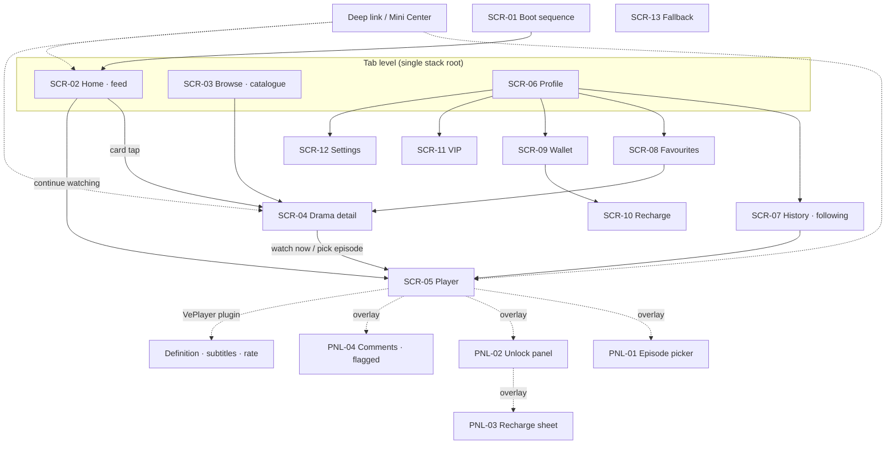

# Sitemap and Information Architecture

> **Slot:** Wave 1 · product IA / journeys / compliance (branch `cursor/w1-product-ia-9cd1`, continued from
> `cursor/w1-architecture-bed5`).
> **Status:** canonical product IA. This document is the entry point for the product set:
> `docs/product/sitemap-and-ia.md` (this file) → `docs/product/user-journeys.md` →
> `docs/product/compliance-tiktok-minis.md` → `docs/product/acceptance-criteria.md`.
> **Relationship to earlier documents:** `docs/02-information-architecture.md` (Chinese, "IA") and
> `docs/02-screen-inventory.md` remain the detailed per-screen reference and are **adopted, not replaced**. This file
> supersedes them only where §12 says so, and every supersession follows from the architecture corrections A1–A6 in
> `docs/architecture/system-overview.md` §1.1 or from the official One Page (`docs/product/compliance-tiktok-minis.md`).
> **Language:** English, matching `docs/architecture/`; terminology maps 1:1 to the Chinese documents (see §13).

---

## 1. The one structural fact that drives this IA

Most of this product's screens are ours. **The most important screen is not.**

The playback surface is a VePlayer instance obtained from `TTMinis.getPlayer()`, rendered into a container we
provide, with its own plugin-based UI, its own definition and subtitle controls, its own error UI and its own
gesture handling. Native HTML `video` and third-party players are not allowed anywhere in the bundle — TikTok
replaces them with a blocked UI ([TikTok Minis Player](https://developers.tiktok.com/docs/en/minis-player)).

An information architecture that treats the player as "a page we build" produces two competing control sets for
the same state, which is the most reliable way to ship a product bug. So the first section of this IA is not a
sitemap; it is a **surface ownership map**.

---

## 2. Surface ownership map

| Surface | Owner | What that means for product design |
|---|---|---|
| App loading page, with Terms of Service and Privacy Policy links | **TikTok** | We do not design a first-run legal screen; we supply the URLs in the Developer Portal and they must be live and reachable before submission |
| Capsule / menu button, top right | **TikTok** | Every screen reserves the safe area; we read `getMenuButtonBoundingClientRect()` and set the bar colour per route. We never place a tappable element under the capsule |
| Navigation bar colour | Ours, via platform API | One colour decision per route, declared in the route table (§5) |
| Video rendering, playback controls, progress bar, definition switch, subtitle track picker, playback-rate control, player error UI | **VePlayer** | We choose which plugins to keep and which to `ignores`; we never build our own equivalent (§4) |
| Immersive overlay chrome: episode title, right-hand action rail (favourite, comments, episode picker), lock state, unlock entry, next-episode affordance | Ours | Rendered *over* the player container; must not duplicate a plugin we kept |
| Rewarded and interstitial ad presentation | **TikTok** | Full-screen, takes over the WebView; our back-stack rules do not apply while it is up |
| Payment sheet and subscription sheet | **TikTok** | We render the tier list and the confirming state; the sheet itself is not ours, and its success callback grants nothing |
| Everything else: feed, catalogue, detail, wallet, VIP, profile, history, favourites, settings, fallback | Ours | Standard SPA screens |

**Design rule O-1 (ownership):** if a piece of state has a VePlayer plugin, that plugin is the single control for
it. Our chrome may *read* the state (for analytics or layout) but must not offer a second way to change it.

**Design rule O-2 (no video element):** there is no `<video>` in the bundle, including trailers, previews and
marketing loops. A trailer is either an episode-like asset played through VePlayer or a poster image.

---

## 3. Sitemap



Three levels, and no fourth is permitted:

1. **Tab level** — Home, Browse, Profile. Switching between them is a `replace`; stack depth stays at 1.
2. **Page level** — detail, player, profile sub-pages. `push` / `pop`, symmetric.
3. **Overlay level** — panels and dialogs. No route of their own; back closes the topmost panel first.

VePlayer's own plugin UI (definition, subtitles, rate) is drawn *inside* the player container. It is not an
overlay in our sense: our back-stack rules do not manage it, and it does not consume one of our overlay levels.

---

## 4. Player surface anatomy

The player screen (SCR-05) is a stack of three layers in one route:

```text
┌──────────────────────────────────────────────────────────┐
│ our overlay chrome                                       │  ← ours
│  · episode title + index          · action rail          │
│  · lock state + unlock CTA        · panel launchers      │
├──────────────────────────────────────────────────────────┤
│ VePlayer plugin UI (kept plugins only)                   │  ← platform
│  · progress bar   · subtitles   · definition   · errors  │
├──────────────────────────────────────────────────────────┤
│ VePlayer video surface (single retained instance)        │  ← platform
└──────────────────────────────────────────────────────────┘
```

### 4.1 Plugin policy

The player exposes a rich plugin set that is wrong for an immersive vertical drama, so the default posture is
"ignore, then add back deliberately". Starting position, derived from the immersive configuration in the platform
documentation:

| Plugin | Decision | Reason |
|---|---|---|
| `fullscreen`, `pip`, `enter`, `volume`, `replay`, `moreButtonPlugin` | **ignored** | The app is already full-bleed vertical; these controls only create dead ends |
| `play` | **ignored** as a persistent control; tap-to-pause behaviour is configured via `closeVideoClick` / `closeVideoDblclick` | An always-visible play button competes with immersive gesture play/pause |
| `playbackrate` | **ignored for launch** | No evidence that speed control matters for a 60–90 s episode; can be un-ignored later without an IA change |
| `sdkDefinitionPlugin` | **kept when a drama has more than one definition, ignored otherwise** | Definition is platform state; if we expose it at all it is through this plugin, never through our own panel |
| `Subtitle` (with `autoSubtitle: true`) | **kept whenever the launch locale set requires it** | Subtitles are platform assets; the plugin is the only correct control (§4.3) |
| `sdkErrorPlugin` | **kept, refresh button suppressed** | Our chrome owns recovery so the retry path is consistent with the rest of the app |
| progress bar | **kept** | Scrubbing is core to the format and reimplementing it would mean reimplementing seek |

**PNL-05 (the quality / playback-rate panel in `docs/02-screen-inventory.md`) is deleted from the product.** It
duplicated `sdkDefinitionPlugin` and `playbackrate`.

### 4.2 Instance discipline

- **One retained VePlayer instance per player route.** Episode switching calls `playNext({ albumId, episodeId,
  vid, getVideoByToken })`; it never creates a second instance and never changes route.
- Leaving the player route destroys the instance (`destroy()`), which is also what releases preload scheduling.
- Because episode switching is not a navigation, an 80-episode series never grows the back stack (rule B4 in
  `docs/02-information-architecture.md` §6 still holds, restated in player terms).

### 4.3 Subtitles

Subtitles are uploaded per language through the media-asset APIs and bound to the video; the player discovers them
from media info when `autoSubtitle: true` and a `Subtitle` plugin is registered. Product owns exactly one decision:
**which track is selected by default.** The rule is device/app language first, then English, then the first
available track — implemented through `formatAutoSubtitleItem`, not through a UI of ours.

Consequence for content operations: a language is either complete for a drama or it is not offered. Half-subtitled
catalogues are a publishing precondition failure, not a runtime fallback (see `docs/product/user-journeys.md` J20).

### 4.4 Preload-aware IA

Time to first frame is the retention metric for this format, and the platform's preload module is scene-based.
That makes preload an **IA concern**, because the scene depends on which screen the user is on:

| Screen | Preload scene | Behaviour |
|---|---|---|
| Home / Browse / Detail | `setPreloadScene(0)` — manual | On card exposure or intent-to-tap, warm episode 1 of the candidate drama only |
| Player | `setPreloadScene(1, { prevCount: 1, nextCount: 2 })` — feed | The player schedules neighbours from the ordered episode list; we only maintain the list |
| Transition into the player | Clear the manual list and tasks, then switch scene | Prevents home-page warming from competing with the episode the user actually opened |

Product limits that follow: warm **one** candidate at a time on list screens, and never warm on scroll velocity
alone. Preload competes for bandwidth with the episode that is playing, and the platform's own guidance is to
bound the task count by user path and click probability.

---

## 5. Route table

Hash routing. Unchanged from `docs/02-information-architecture.md` §5 except where marked.

| Route | Screen | Params | Entry | Anonymous | Nav bar |
|---|---|---|---|---|---|
| — | SCR-01 boot | launch params | cold start | yes | brand |
| `#/home` | SCR-02 feed | — | tab `replace` | yes | dark |
| `#/browse` | SCR-03 catalogue | `?category=&tag=&sort=` | tab `replace` | yes | dark |
| `#/me` | SCR-06 profile | — | tab `replace` | yes (assets show a sign-in nudge) | dark |
| `#/drama/:dramaId` | SCR-04 detail | `?autoplay=1` | `push` | yes | transparent over hero |
| `#/play/:episodeId` | SCR-05 player | `?from=` | `push` in, `replace` never used for episode switch (**changed**: switching is `playNext`, not a route change) | yes for free episodes | black |
| `#/history` | SCR-07 | — | `push` | no | dark |
| `#/favorites` | SCR-08 | — | `push` | no | dark |
| `#/wallet` | SCR-09 | — | `push` | no | dark |
| `#/recharge` | SCR-10 | `?intent=` | `push` | no | dark |
| `#/vip` | SCR-11 | — | `push` | no | dark |
| `#/settings` | SCR-12 | — | `push` | yes | dark |
| `#/fallback` | SCR-13 | `?reason=NOT_FOUND\|OFFLINE\|BLOCKED\|MAINTENANCE` | `replace` | yes | dark |

Two changes to call out:

- `#/play/:episodeId` no longer re-routes on episode switch. The URL is updated in place for share/deep-link
  correctness, but the router does not tear down the screen and the player instance survives.
- `#/fallback` gains `reason=BLOCKED`, for content the platform will not play even though our catalogue thinks it
  is live (moderation withdrawn, listing removed, album authorization revoked). This is operationally distinct from
  `OFFLINE`, which is our own takedown. See `docs/product/user-journeys.md` J15.

---

## 6. Navigation and back stack

Rules B1–B8 in `docs/02-information-architecture.md` §6 are adopted verbatim. Two clarifications and one addition:

| # | Rule | Note |
|---|---|---|
| B4 | Episode switching does not grow the stack | **Clarified**: it is not a route operation at all; `playNext` on the retained instance |
| B7 | Back is not handled while an ad is on screen | **Clarified**: this includes interstitials, not only rewarded video |
| **B9** | Back while a VePlayer plugin panel is open (definition, subtitle list) closes that plugin panel first | The plugin owns its own dismissal; our handler must not steal the gesture and must not also close one of our overlays in the same gesture |

---

## 7. Entry points

| Entry | Parameters | Landing | Notes |
|---|---|---|---|
| TikTok video anchor / mount | `episodeId` + campaign tracking | Player, on that episode | The paid-acquisition path; landing on a locked episode is a valid outcome, not an error |
| Share return | `episodeId` or `dramaId` | Player or detail | |
| Mini Center / saved minis | none | Home | |
| In-app operations placement | `dramaId` / `episodeId` | Corresponding screen | |
| Cold boot with no parameters | none | Home | |

All of them run one resolver, defined in `docs/02-information-architecture.md` §7.2, over the bridge's
`getLaunchParams()` abstraction. The hard rule survives unchanged: **a deep link never white-screens and never dead
ends**; the worst case is equivalent to a plain cold start on Home.

Deep-link landing on a locked episode opens the player in its locked state with the unlock panel already up. That
is the conversion moment the acquisition spend paid for, and bouncing the user to Home first destroys it.

---

## 8. Catalogue information architecture

The consumer-facing taxonomy is ours; the underlying identity is the platform's, and the two must not be conflated.

| Concept | Ours | Platform | Rule |
|---|---|---|---|
| Drama | `dramaId`, merchandising metadata, category, tags | `album_id`, versioned | Storefront reads **our** metadata but only ever for the album's **online version** |
| Episode | `episodeId`, index, price, unlock policy | `episode_id`, `byteplus_vid` | Both IDs are stored; never overloaded into one column |
| Availability | our `publishStatus` | `review_status`, `online_version`, listing status, `client_key` authorization | Ours can hide; only the platform's can *permit*. A drama is browsable only when both agree |
| Subtitle track | language offered in the UI | per-language uploaded asset bound to a video | A language appears in the UI only when every episode in the launch scope has it |

Navigation facets on `#/browse`: category (single-select), tag (multi-select), sort (`HOT` / `NEW`). Free-text
search stays hidden behind a flag until a search contract exists (gap G5, unchanged).

---

## 9. Operations console IA

The One Page makes it explicit that onboarding is a multi-gate workflow with platform-side state that operations
staff must see and act on. None of that has a home in the existing screen inventory, which covers only the consumer
app. The console (internal, not part of the reviewed bundle) needs these areas:

| Area | Purpose | Platform state it mirrors |
|---|---|---|
| Onboarding tracker | Business verification, industry qualification, EIS review, USDS/US approval, contract signature, monetization enablement | Portal statuses, per `docs/product/compliance-tiktok-minis.md` §3 |
| Title workspace | Album version editor, episode list, poster and master upload, ingest job status | `album/create`, `album/update`, `job_id` polling, `byteplus_vid` |
| Subtitle manager | Per-language upload and binding, completeness per drama | subtitle upload + bind APIs |
| Moderation desk | Submit, track the eight-state review machine, withdraw, appeal with attachments, **remaining urgent-priority quota** | `album/review/*`, priority quota (35 / organization / day) |
| Publishing | Set online version, list / delist, `client_key` authorization | `album/online_version`, `album/status`, `album/authorize` |
| Drift monitor | Catalogue vs `album/query` reconciliation, alerts | reconciler, `docs/architecture/system-overview.md` §6.3 |
| Incident switchboard | Emergency delist and its propagation, kill switches, config flags | our config service + `album/status` |
| User reports desk | Triage and resolve inbound reports within the platform's 72-hour window, payment appeals first | Portal → Operations → User reports |
| Revenue desk | Settlement confirmation, invoice upload | Portal → Revenue |

Two IA properties matter more than the layout:

1. **Version is a first-class object, not a save button.** Every editing action names the album version it applies
   to, because editing creates a new version and publishing the wrong one either ships unmoderated content or
   reverts an approved one.
2. **The urgent-moderation quota is displayed wherever a submission can be made.** It is a shared, capped, daily
   organization resource; hiding it guarantees it gets spent on the wrong title.

---

## 10. Localization IA

| Layer | Decision |
|---|---|
| Default locale | English. The app must be compatible with English to pass review, so English is bundled and complete, never a fallback-to-key |
| Locale source | Device / app language, overridable in Settings; the same value drives VePlayer `lang` (`en`, `zh-cn`, `jp`) and the default subtitle track |
| Store listing | Localized per launch region in the Portal, version-controlled next to the code so listing and app cannot drift |
| Content language | Album metadata language plus per-language subtitle assets; the UI offers a language only when the assets exist for the whole launch scope |
| RTL | Layout uses logical CSS properties from the start; if Saudi Arabia is in the launch set, Arabic implies RTL and retrofitting is far more expensive |
| Prices | Rendered from the platform tier payload (`price`, `currency`, `symbol`); never hard-coded, never locally converted |

---

## 11. Gap register (continuing `docs/02-information-architecture.md` §10, G1–G8)

| # | Gap | Impact | Suggested owner |
|---|---|---|---|
| G9 | No screen or state exists for *platform-blocked* playback as distinct from our own takedown | Users see a generic error for an operational incident; ops loses the signal | Product + contract slot (`reason=BLOCKED`, error code) |
| G10 | No product surface for the operations console (§9) although the publishing workflow requires one | Content operations is undesignable, and moderation state cannot be acted on | Content-ops slot, Wave 2 |
| G11 | Legacy TikTok clients (below 44.5.0) need `play_auth_token`, and clients below the configured minimum library version are prompted to upgrade. Neither has product copy or a defined experience | A silent cohort failure on older devices | Product + frontend |
| G12 | Preload scene transitions are undefined at the IA level for back-navigation and for the browse→detail→player path | Wasted bandwidth, or a cold first frame on the most common path | Frontend, against §4.4 |
| G13 | Share is still unconfirmed as a platform capability (was G7); with no share API there is no share entry, but the deep-link resolver already accepts share parameters | Growth loop unspecified | Business / platform contact |
| G14 | The user-report desk (72-hour platform SLA) has no owner, no rota and no tooling | An SLA breach is visible to the platform and to users | Operations |

---

## 12. What this document supersedes

| Earlier statement | Location | Replacement |
|---|---|---|
| PNL-05 quality / playback-rate panel | `docs/02-screen-inventory.md` §1, §3 | Deleted. VePlayer plugins own definition and rate (§4.1) |
| Episode switch is a route `replace` | `docs/02-information-architecture.md` §5–§6 | Episode switch is `playNext` on a retained instance; the URL is updated without a screen teardown (§4.2, §5) |
| Player auto-downgrades definition on stall, with a toast | `docs/02-information-architecture.md` §8.3 | Adaptive behaviour belongs to the player kernel; our chrome does not drive definition (§4.1) |
| `playUrl` expiry, re-signing, quality ladder | `docs/02-information-architecture.md` §8.3, `docs/02-screen-inventory.md` SCR-05 | There is no signed URL. Playback is `{ albumId, episodeId, vid, playAuthToken? }`, and the token is only needed below TikTok 44.5.0 (architecture correction A4) |
| Fallback reasons are `NOT_FOUND` / `OFFLINE` / `MAINTENANCE` | `docs/02-information-architecture.md` §5 | Adds `BLOCKED` (§5, G9) |

Everything else in `docs/02-*.md` stands.

---

## 13. Terminology map

| This document | Chinese Wave 1 documents |
|---|---|
| Sitemap and IA | `docs/02-information-architecture.md` |
| Screen / panel inventory | `docs/02-screen-inventory.md` |
| Journeys | `docs/02-user-journeys.md` → superseded and extended by `docs/product/user-journeys.md` |
| Onboarding and compliance | `docs/11-official-onboarding-checklist.md`, `docs/01-tiktok-minis-requirements.md` → extended by `docs/product/compliance-tiktok-minis.md` |
| Acceptance criteria | new; the closest prior artefacts are `docs/14-quality-gates.md` and `docs/02-user-journeys.md` §15 |

---

## 14. Sources

- Official One Page (Feishu wiki), *小程序短剧接入One Page // Mini Drama Onboarding One Page*, retrieved 2026-08-27.
  Retrieval method, coverage and the extracted content are in `docs/product/compliance-tiktok-minis.md` §2 and
  Appendix A.
- [TikTok Minis Player](https://developers.tiktok.com/docs/en/minis-player) — mandatory VePlayer, plugin set,
  `playNext`, preload scenes, subtitles, media-info cache.
- [Develop Your Mini Drama](https://developers.tiktok.com/docs/en/tiktok-minis-develop-your-mini-app) — required
  capabilities, H5 runtime model.
- [Media Asset Management](https://developers.tiktok.com/docs/en/media-asset-management) — album versioning,
  moderation states, subtitles, listing and authorization.
- `docs/architecture/system-overview.md`, `docs/architecture/risks.md` — the architecture baseline this IA is
  written against.
